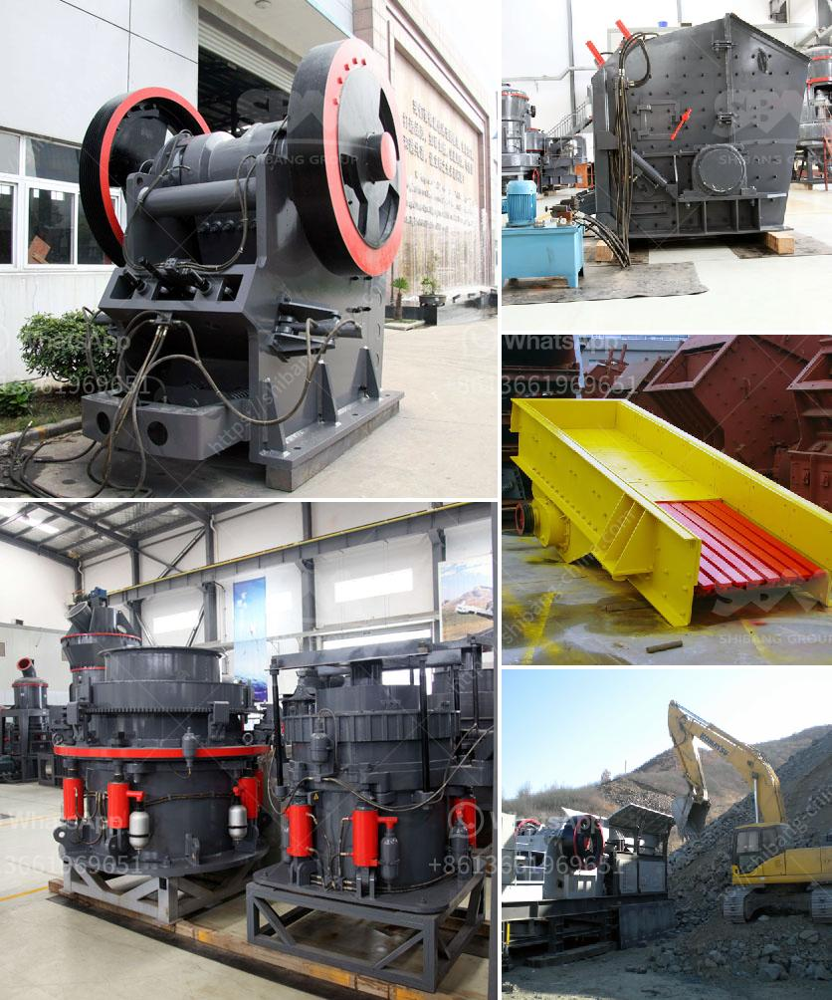

<h3>slag vertical mill</h3>
In recent years, the utilization of industrial waste resources has become an important topic of discussion among industries aiming for sustainable development. One such waste material is slag, a by-product generated during the smelting or refining process in many industries, including steel, copper, and coal mining. Slag is mostly disposed of in landfills or slag ponds, leading to environmental pollution. However, advancements in technology have paved the way for the utilization and reutilization of slag, turning it into a valuable resource.

The slag vertical mill is a grinding machine specifically designed to process slags. It was born out of the need to efficiently and economically grind granulated blast furnace slag (GBFS). Since its introduction, the slag vertical mill has successfully helped countless industries achieve substantial cost savings, reduce environmental impact, and improve overall product quality.

One of the key advantages of the slag vertical mill is its ability to grind the GBFS into fine powder during the grinding process. This results in a high-quality final product with excellent performance characteristics. The finely ground slag is highly reactive, offering industries the opportunity to use it in a variety of applications such as cement production, concrete mixing, and soil stabilization. By utilizing slag, industries can reduce their reliance on traditional raw materials, decrease carbon emissions, and contribute to a more sustainable future.

In addition to its eco-friendly benefits, the slag vertical mill also stands out due to its high grinding efficiency. Equipped with advanced grinding technology, the mill can achieve high production capacity while consuming less energy compared to traditional grinding mills. This translates into significant cost savings for industries as they can produce more with fewer resources, improving their overall economic viability. Furthermore, the slag vertical mill features a low noise level during operation, contributing to a more comfortable and safe working environment for operators.

The slag vertical mill's reliability is another key factor contributing to its popularity in various industries. Designed with a robust structure and high-quality components, the mill offers exceptional durability and minimal downtime. This ensures uninterrupted production flow, preventing costly disruptions that can significantly impact a company's bottom line. With proper maintenance and regular servicing, the slag vertical mill can provide many years of reliable service, delivering a strong return on investment for businesses.

As the demand for sustainable practices continues to grow, industries must adapt and find innovative solutions to deal with industrial waste. The utilization of slag has proven to be an effective and environmentally friendly approach. The slag vertical mill offers a high-quality grinding solution for granulated blast furnace slag, enabling industries to reduce waste generation, increase productivity, and contribute to a greener future.

In conclusion, the slag vertical mill is a game-changer for industries dealing with slag waste. Its ability to grind GBFS into fine powder, high grinding efficiency, reliability, and eco-friendly advantages make it a valuable asset for any industry aiming for sustainability. As the drive towards a circular economy intensifies, the slag vertical mill will continue to play a crucial role in transforming industrial waste into valuable resources, ensuring a brighter future for both industries and the environment.
<h3>Contact us</h3><ul><li><strong>Whatsapp:&nbsp;<a href="https://wa.me/8613661969651">+8613661969651</a></strong></li><li><a href="https://swt.shibang-china.com/?git&amp;zhl&amp;slag vertical mill"><strong>Online Service(chat now)</strong></a></li></ul><h3>Related</h3><ul><li><a href='coal mine wash plants mpumalanga south africa.md'>coal mine wash plants mpumalanga south africa</a></li><li><a href='mobile crushers and screens.md'>mobile crushers and screens</a></li><li><a href='vibrating screens price in south africa.md'>vibrating screens price in south africa</a></li><li><a href='limestone grinding mill unit.md'>limestone grinding mill unit</a></li><li><a href='small scale cement plants in india.md'>small scale cement plants in india</a></li></ul>