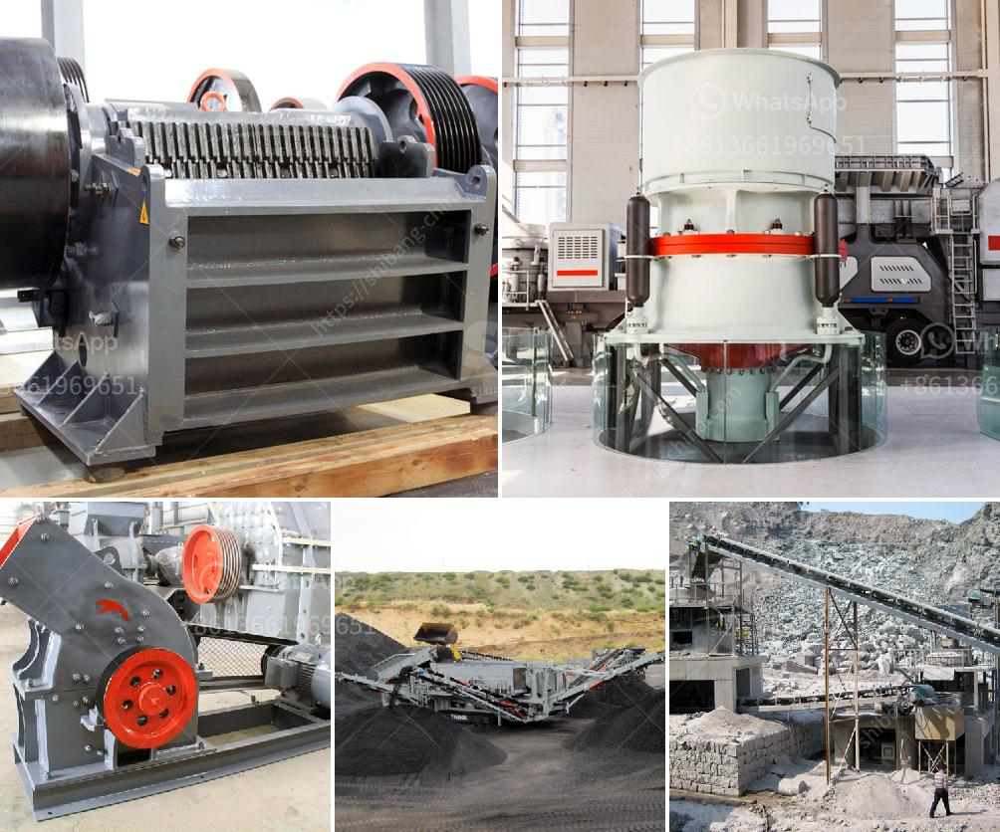

<h3>small capacity double roller crusher for sale</h3>
Roller crusher, also known as double roller crusher, belongs to traditional crushing equipment. It is mainly used for fine processing of material particles. As the main working part, the two cylindrical rollers rotate oppositely to achieve the purpose of crushing. Due to its simple structure, low noise, and low energy consumption, it has been widely used in various industries.

The small capacity double roller crusher is available for sale with a large variety of specifications. The roller crusher uses a pair of parallel cylindrical rollers, which are horizontally mounted and rotate in opposite directions to crush materials. Usually, roller crushers can be divided into single roller crusher, double roller crusher, and multiple roller crusher.

1. Compact structure: Due to the small size and simple structure, the double roller crusher takes up smaller space and is easier to install and transport.

2. Energy-saving and environmental protection: The roller crusher uses relatively low speed and low power consumption to crush materials, which reduces the overall energy consumption and environmental impact.

3. Adjustable particle size: The clearance between the two rollers can be adjusted, allowing for the crushing of materials with different particle sizes. This allows for greater flexibility and control in the final product.

4. High efficiency: The roller crusher has a high crushing efficiency and a large crushing ratio. It can crush materials into uniform size particles, which greatly improves the production capacity and reduces the over-crushing phenomenon.

5. Easy maintenance: The roller crusher is designed with an easy-to-maintain structure. The gap between the rollers can be adjusted, and the roller shells can be easily replaced, prolonging the service life of the machine.

The small capacity double roller crusher for sale is equipped with a dust-proof sealing device, which effectively prevents dust and harmful gases from entering the crushing chamber, and keeps the internal environment clean and hygienic. Additionally, the roller crusher is equipped with a safety device that automatically detects and adjusts the crushing force to avoid damage caused by excessive crushing.

The small capacity double roller crusher is widely used in mining, building materials, chemical industry, metallurgy, and other industries. It is suitable for crushing medium-hard and soft materials, such as limestone, coal, and coke, with compressive strength less than 250MPa and moisture content less than 10%. It is especially suitable for crushing materials with high moisture content and high viscosity.

In conclusion, the small capacity double roller crusher for sale provides a cost-effective solution for crushing materials efficiently and effectively. With its compact structure, adjustable particle size, and high efficiency, it has become a popular choice for various industries. If you are in need of a roller crusher, do not hesitate to consider the small capacity double roller crusher.
<h3>Contact us</h3><ul><li><strong>Whatsapp:&nbsp;<a href="https://wa.me/8613661969651">+8613661969651</a></strong></li><li><a href="https://swt.shibang-china.com/?git&amp;zhl&amp;small capacity double roller crusher for sale"><strong>Online Service(chat now)</strong></a></li></ul><h3>Related</h3><ul><li><a href='conveyor belt kazakhstan.md'>conveyor belt kazakhstan</a></li><li><a href='ton crusher plant price.md'>ton crusher plant price</a></li><li><a href='feldspar crusher cost.md'>feldspar crusher cost</a></li><li><a href='coal mill price 5 tph.md'>coal mill price 5 tph</a></li><li><a href='stone quarries in mpumalanga.md'>stone quarries in mpumalanga</a></li></ul>