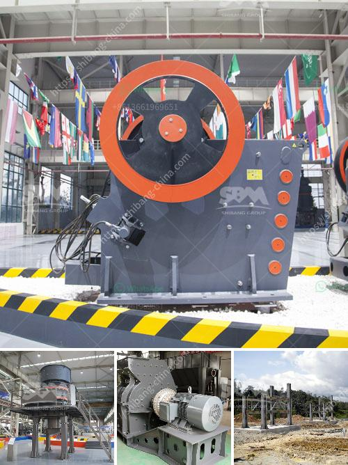

<h3>small jaw crusher</h3>
A small jaw crusher is a compact piece of equipment that is used to reduce the size of hard rock materials. These machines are commonly used in mining, metallurgy, building materials, highways, and chemical industries. Due to their small size and simple structure, they are easily portable and can be used for both laboratory and field applications.

One of the main advantages of a small jaw crusher is its versatility. It can be used for a variety of materials, including rocks, ores, and even construction waste. The crusher uses a jaw-like crushing mechanism that articulates, allowing it to crush hard materials efficiently. It has a strong and sturdy structure that ensures its durability and long lifespan.

Another advantage of a small jaw crusher is its low energy consumption. Since it operates by crushing materials through squeezing and grinding, it requires less energy compared to other crushing machines. This not only helps in reducing operational costs but also minimizes the environmental impact.

The small jaw crusher is very easy to operate and maintain. It comes with a user-friendly control panel that allows operators to adjust the crushing size and control the flow of materials. The crusher is also designed with safety features such as a protective enclosure and emergency stop buttons, ensuring the safety of the operator.

In conclusion, a small jaw crusher is a versatile and efficient piece of equipment that is ideal for reducing the size of hard rock materials. Its compact size, low energy consumption, and easy operation make it a popular choice for various industries. Whether used in a laboratory or in the field, a small jaw crusher is a reliable tool for crushing materials efficiently.
<h3>Contact us</h3><ul><li><strong>Whatsapp:&nbsp;<a href="https://wa.me/8613661969651">+8613661969651</a></strong></li><li><a href="https://swt.shibang-china.com/?git&amp;zhl&amp;small jaw crusher"><strong>Online Service(chat now)</strong></a></li></ul><h3>Related</h3><ul><li><a href='second hand german jaw crusher for sale.md'>second hand german jaw crusher for sale</a></li><li><a href='the roller grinding mill.md'>the roller grinding mill</a></li><li><a href='materials used to make a talcum powder.md'>materials used to make a talcum powder</a></li><li><a href='crusher machine sale.md'>crusher machine sale</a></li><li><a href='tons a hour wash plant.md'>tons a hour wash plant</a></li></ul>