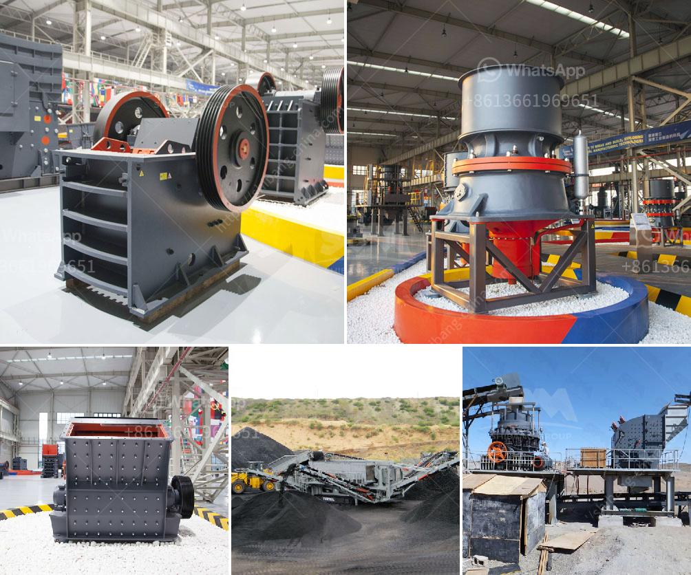

<h3>small mobile rock pulverizer</h3>
In today's fast-paced world, compactness and efficiency are the key attributes that drive technological advancements. One such innovation in the field of mining and construction is the small mobile rock pulverizer. Designed to tackle various types of rocks, this device combines affordability, convenience, and versatility, making it a valuable asset for any project.

The small mobile rock pulverizer is specifically engineered to fit into tight spaces, ensuring easy transportation and maneuverability on diverse terrains. Its lightweight construction allows it to be transported on a trailer or even in the bed of a pickup truck, making it suitable for both large-scale operations and smaller construction sites.

Despite its small size, this versatile machine delivers powerful performance. Equipped with a robust jaw crusher or hammer mill, it can effectively break down any type of rock material, whether it is hard granite, limestone, or even volcanic rock. The adjustable settings allow for precise control over the final size of the pulverized material, catering to specific project requirements.

The small mobile rock pulverizer is designed for quick setup and user-friendly operation. With minimal training, operators can easily start crushing rocks within minutes. Additionally, regular maintenance is straightforward, thanks to its simplified design. The pulverizer's key components are easily accessible, reducing downtime and maximizing productivity.

Benefiting construction companies, mining operations, and even individual contractors, the small mobile rock pulverizer offers a cost-effective alternative to larger, stationary pulverizers. Its compact size translates into reduced transportation costs, while the efficient operation minimizes downtime, resulting in increased overall efficiency and profitability.

In the realm of rock crushing and pulverizing, size does not dictate performance. The small mobile rock pulverizer has proven to be a valuable asset, offering convenience, efficiency, and affordability. With its compact design, versatility, and effortless maintenance, it is a reliable solution for various projects, regardless of size or complexity. As the demand for compact and efficient machinery continues to rise, this technological breakthrough reigns supreme in the pursuit of cost-effective and streamlined rock crushing operations.
<h3>Contact us</h3><ul><li><strong>Whatsapp:&nbsp;<a href="https://wa.me/8613661969651">+8613661969651</a></strong></li><li><a href="https://swt.shibang-china.com/?git&amp;zhl&amp;small mobile rock pulverizer"><strong>Online Service(chat now)</strong></a></li></ul><h3>Related</h3><ul><li><a href='quartz mining process in andhra pradesh types prices.md'>quartz mining process in andhra pradesh types prices</a></li><li><a href='processing of zirconium sand milling.md'>processing of zirconium sand milling</a></li><li><a href='chrome washing plant in south africa.md'>chrome washing plant in south africa</a></li><li><a href='stone crusher second.md'>stone crusher second</a></li><li><a href='used stone crusher in ontario.md'>used stone crusher in ontario</a></li></ul>