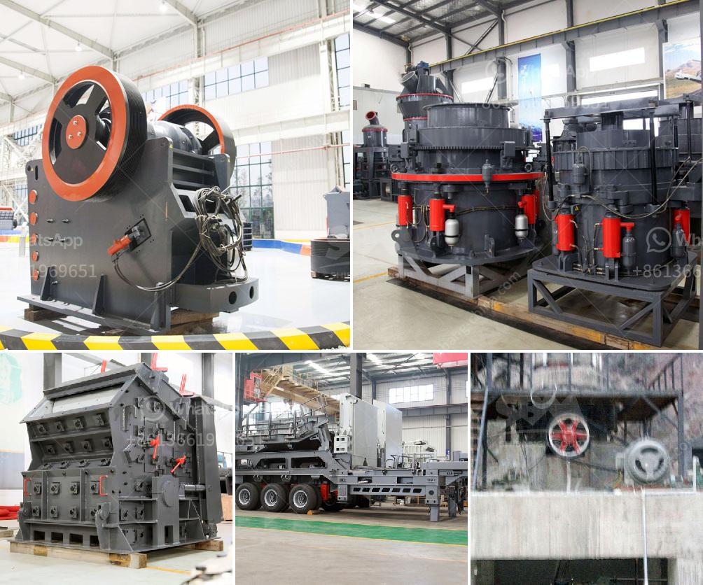

<h3>small mobile wash plants for sale</h3>
In today's fast-paced world, convenience is king. Whether you're a construction contractor, landscaper, or even a homeowner, having the ability to quickly and effectively clean equipment or materials onsite is essential. That's where small mobile wash plants come into the picture.

Small mobile wash plants are compact, portable devices that allow for efficient cleaning of various items, including construction equipment, vehicles, and outdoor furniture. These machines are designed to be easily moved from one location to another, making them perfect for use in different job sites or even at home.

One of the key advantages of these wash plants is their versatility. With adjustable water pressure and temperature controls, you can adapt them to suit different cleaning tasks. Whether you need to remove dirt, grease, or even stubborn stains, these wash plants deliver exceptional cleaning power while being gentle on the surfaces.

Moreover, small mobile wash plants are incredibly user-friendly. Equipped with user-friendly interfaces and intuitive controls, operators can quickly and easily navigate through different settings, ensuring an efficient and hassle-free cleaning process. Additionally, these wash plants typically require minimal maintenance, saving both time and effort.

Another significant advantage of investing in a small mobile wash plant is the cost-effectiveness. With efficient water and energy consumption, these machines help reduce operational expenses while still delivering outstanding results. Additionally, the portability aspect eliminates the need for transporting equipment to external cleaning facilities, saving transportation costs.

Given the growing demand for cleanliness and hygiene, small mobile wash plants are becoming an essential tool for various industries. Compact, versatile, and efficient, these wash plants offer the convenience of onsite cleaning, helping businesses and individuals save time, effort, and money.

In conclusion, small mobile wash plants have emerged as a convenient and cost-effective solution for onsite cleaning needs. Offering versatility, user-friendliness, and exceptional cleaning power, these machines are perfect for contractors, landscapers, and homeowners alike. By investing in a small mobile wash plant, you can ensure efficient cleaning while enjoying the convenience of onsite washing.
<h3>Contact us</h3><ul><li><strong>Whatsapp:&nbsp;<a href="https://wa.me/8613661969651">+8613661969651</a></strong></li><li><a href="https://swt.shibang-china.com/?git&amp;zhl&amp;small mobile wash plants for sale"><strong>Online Service(chat now)</strong></a></li></ul><h3>Related</h3><ul><li><a href='mini cement plant in west bengal.md'>mini cement plant in west bengal</a></li><li><a href='talc grinding mill plants.md'>talc grinding mill plants</a></li><li><a href='conveyor belts kenya.md'>conveyor belts kenya</a></li><li><a href='complete gold mining equipment for small scale mines.md'>complete gold mining equipment for small scale mines</a></li><li><a href='small mobile wash plants for sale.md'>small mobile wash plants for sale</a></li></ul>