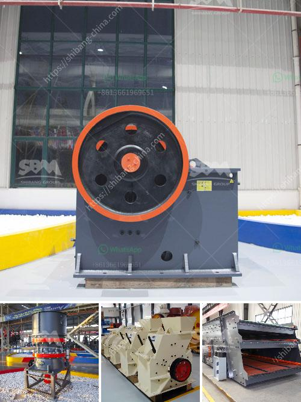

<h3>small ore grinding mill with 50 tpd for sale</h3>
The mining industry plays a crucial role in the economic development of countries around the world. It is the backbone of several industries, including manufacturing, infrastructure, and energy. However, mining operations require a range of equipment to extract, process, and refine minerals efficiently. One such essential equipment is the ore grinding mill. In this article, we will explore the significance of a small ore grinding mill with 50 TPD (tonnes per day) capacity for sale and how it can revolutionize the mining industry.

Firstly, let us understand the functionality of an ore grinding mill. The primary purpose of a grinding mill is to reduce large-sized ore into smaller particles, facilitating further processing. It achieves this by utilizing the mechanical force of grinding media such as steel balls, rods, or pebbles, which continuously impact and grind the ore. This process results in the liberation of valuable minerals and the removal of unwanted gangue. Consequently, finely ground ore allows for efficient extraction of metals through subsequent processes like leaching or flotation.

The small ore grinding mill with 50 TPD capacity is significant for several reasons. Firstly, its size ensures that it can be easily incorporated into existing mining operations, even in regions with space constraints. This makes it highly accessible for small and medium-scale mining enterprises looking to expand their production capabilities. Such mills are versatile and can handle various types of ores, including gold, silver, copper, and iron, making them suitable for a wide range of mining operations worldwide.

Moreover, this small ore grinding mill is equipped with advanced technology to optimize the grinding process. It ensures maximum efficiency by controlling variables such as speed, feed rate, and media size. This precision and control increase productivity, reduce energy consumption, and decrease overall operational costs. Additionally, it minimizes the generation of fine particles, which can lead to losses of valuable minerals and environmental concerns.

The availability of a small ore grinding mill with a 50 TPD capacity for sale opens up new possibilities for mining operations globally. It offers a cost-effective solution for processing lower-grade ores that were previously uneconomical to extract. This not only extends the lifespan of existing mines but also encourages the development of previously untapped mineral deposits, stimulating economic growth in resource-rich regions.

Investing in a small ore grinding mill with 50 TPD capacity is a wise decision for mining companies seeking long-term sustainability. It allows them to maximize their output while minimizing costs, thereby enhancing profitability. Furthermore, the high-quality end product obtained through efficient grinding enhances the market value of the extracted minerals, further augmenting financial returns.

In conclusion, the availability of a small ore grinding mill with 50 TPD capacity for sale is a game-changer in the mining industry. Its compact size, advanced technology, and cost-effectiveness make it a valuable addition to mining operations. As mining companies strive to optimize their processes and increase their competitiveness, investing in such mills becomes imperative. This advancement has the potential to revolutionize the mining industry, paving the way for sustainable and efficient mineral extraction.
<h3>Contact us</h3><ul><li><strong>Whatsapp:&nbsp;<a href="https://wa.me/8613661969651">+8613661969651</a></strong></li><li><a href="https://swt.shibang-china.com/?git&amp;zhl&amp;small ore grinding mill with 50 tpd for sale"><strong>Online Service(chat now)</strong></a></li></ul><h3>Related</h3><ul><li><a href='cement clinker grinding ball mill manufacturer india.md'>cement clinker grinding ball mill manufacturer india</a></li><li><a href='silica quartz grinding mill 400 mash.md'>silica quartz grinding mill 400 mash</a></li><li><a href='types of vibratory screens.md'>types of vibratory screens</a></li><li><a href='price of crusher machine.md'>price of crusher machine</a></li><li><a href='500mm vertical mill stones price.md'>500mm vertical mill stones price</a></li></ul>