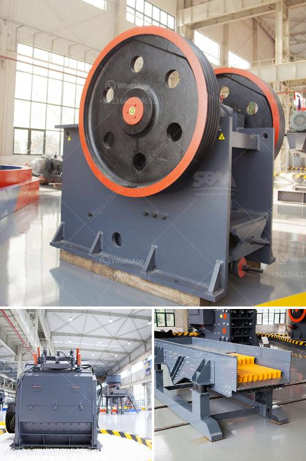

<h3>small portable rock crushers for sale africa</h3>
Small portable rock crushers are very convenient for users' transportation and installation. The price of small portable rock crushers in the market is relatively low. They also have a wide range of applications. Small portable rock crushers have unparalleled advantages in ore crushing, mineral processing, building materials and other industries. 

According to different types of rock crushers, small portable rock crushers are divided into those with tire driving and crawler driving. Tire portable rock crushers are mainly used in some areas with limited or unstable electricity supply, and they are well received by users due to their low energy consumption, small volume, easy installation and convenient operation. 

Crawler portable rock crushers use diesel fuel for on-site operation and electricity for crushing and processing. Although the initial investment cost is relatively high, the production cost in the later stage is low, and the operation and maintenance are simple. Crawler portable rock crushers have a good crushing effect on materials with different hardness levels.

Africa is rich in mineral resources. The small portable rock crushers produced by our company have various types and models, so that customers can choose the suitable rock crusher according to their actual needs. With the increasing scale of mining operations in Africa, the demand for advanced mine crushing equipment is increasing. That is why we have developed and produced a series of small portable rock crushers.

Compared with traditional crushers, our small portable rock crushers are more efficient and environmentally friendly. They adopt advanced technology and are characterized by low energy consumption and high output. They can bring considerable economic benefits to users. In addition, our small portable rock crushers can work in any harsh environment and are suitable for various applications such as crushing granite, basalt, iron ore, limestone, quartz stone, coal gangue, and construction waste.

The small portable rock crushers produced by our company have a wide range of applications in crushing sites, such as construction waste disposal, quarrying, mining, and crushing of cement materials. By recycling concrete waste, brick waste, and construction waste, users can obtain sustainable economic benefits.

At present, there are many small portable rock crusher manufacturers in Africa, which has attracted a lot of investors. Small portable rock crushers can have various kinds of configurations, users can also equip them according to their own needs. As in all other crusher types, the principle of crushing with impact can be used with a small portable rock crusher. 

The advantages of small portable rock crushers are simple and reasonable structure, good crushing effect, energy saving and environmental protection, and uniform crushed material size. Small portable rock crushers can be used not only in domestic areas such as construction waste treatment, road construction, coal mining, and stone crushing plants, but also in Africa. 

As an emerging market, Africa is attracting more and more international investors and customers to do business here. The development prospects of small portable rock crushers in Africa are very bright. So, if you are interested in the small portable rock crushers in the market of Africa, please contact us, we will be happy to serve you!
<h3>Contact us</h3><ul><li><strong>Whatsapp:&nbsp;<a href="https://wa.me/8613661969651">+8613661969651</a></strong></li><li><a href="https://swt.shibang-china.com/?git&amp;zhl&amp;small portable rock crushers for sale africa"><strong>Online Service(chat now)</strong></a></li></ul><h3>Related</h3><ul><li><a href='quote for stone crusher.md'>quote for stone crusher</a></li><li><a href='price of crusher of stone in peru.md'>price of crusher of stone in peru</a></li><li><a href='crusher dimensions crusher conica.md'>crusher dimensions crusher conica</a></li><li><a href='crusher for aggregate.md'>crusher for aggregate</a></li><li><a href='caco3 carbonate calcium line production.md'>caco3 carbonate calcium line production</a></li></ul>