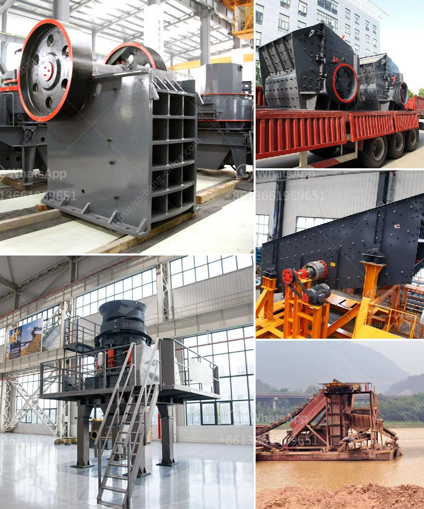

<h3>small quarry crusher for sale</h3>
Small quarry crusher for sale, as the name implies, is a machine designed to crush large-sized rocks into smaller stones. It is primarily used for mining operations but can also be utilized in different industrial sectors. With the increasing demand for smaller stone sizes, quarry crushers have become an essential tool for contractors, builders, and suppliers.

One of the main advantages of small quarry crushers is their versatility. They can handle various types of materials, including limestone, granite, and basalt, among others. This enables them to be used in different projects, from road construction to building foundations. Additionally, they can also crush recycled materials, such as concrete and asphalt.

In terms of size, small quarry crushers are compact and easy to transport. They can be transported to different sites without the need for specialized equipment. This is particularly beneficial for short-term projects or for contractors who need to move the crusher frequently. Furthermore, the compact size allows them to be used in confined spaces, making them suitable for urban areas or sites with limited space.

Small quarry crushers are also designed to be efficient and cost-effective. They are equipped with powerful motors and robust components that ensure high productivity, minimal downtime, and reduced maintenance costs. Additionally, many models are now equipped with energy-saving features, making them environmentally friendly and helping businesses reduce their carbon footprint.

Another advantage of small quarry crushers is their ease of operation. Most models are equipped with user-friendly controls, allowing operators to quickly and easily adjust settings according to the desired stone size. Some crushers even come with remote control options, enabling operators to operate the machine from a safe distance.

When considering the purchase of a small quarry crusher, it is essential to choose a reputable manufacturer or supplier. Look for a company that has a proven track record in the industry, and that offers reliable products and excellent customer service. Additionally, consider the specific requirements of your project and choose a crusher that meets those needs, such as output capacity, stone size range, and power source options.

In conclusion, the small quarry crusher for sale is a versatile and efficient machine that can handle various materials and projects. Its compact size, ease of operation, and cost-effectiveness make it a valuable tool for contractors and suppliers. When looking to purchase a small quarry crusher, take into consideration reputable manufacturers and specific project requirements. By making an informed decision, businesses can benefit from increased productivity, reduced costs, and a sustainable approach to their operations.
<h3>Contact us</h3><ul><li><strong>Whatsapp:&nbsp;<a href="https://wa.me/8613661969651">+8613661969651</a></strong></li><li><a href="https://swt.shibang-china.com/?git&amp;zhl&amp;small quarry crusher for sale"><strong>Online Service(chat now)</strong></a></li></ul><h3>Related</h3><ul><li><a href='high efficiency 200tph jaw crusher with great price.md'>high efficiency 200tph jaw crusher with great price</a></li><li><a href='gypsum crushing machine price.md'>gypsum crushing machine price</a></li><li><a href='iron crusher manufacturer.md'>iron crusher manufacturer</a></li><li><a href='price of large jaw crusher.md'>price of large jaw crusher</a></li><li><a href='calcium oxide crusher.md'>calcium oxide crusher</a></li></ul>