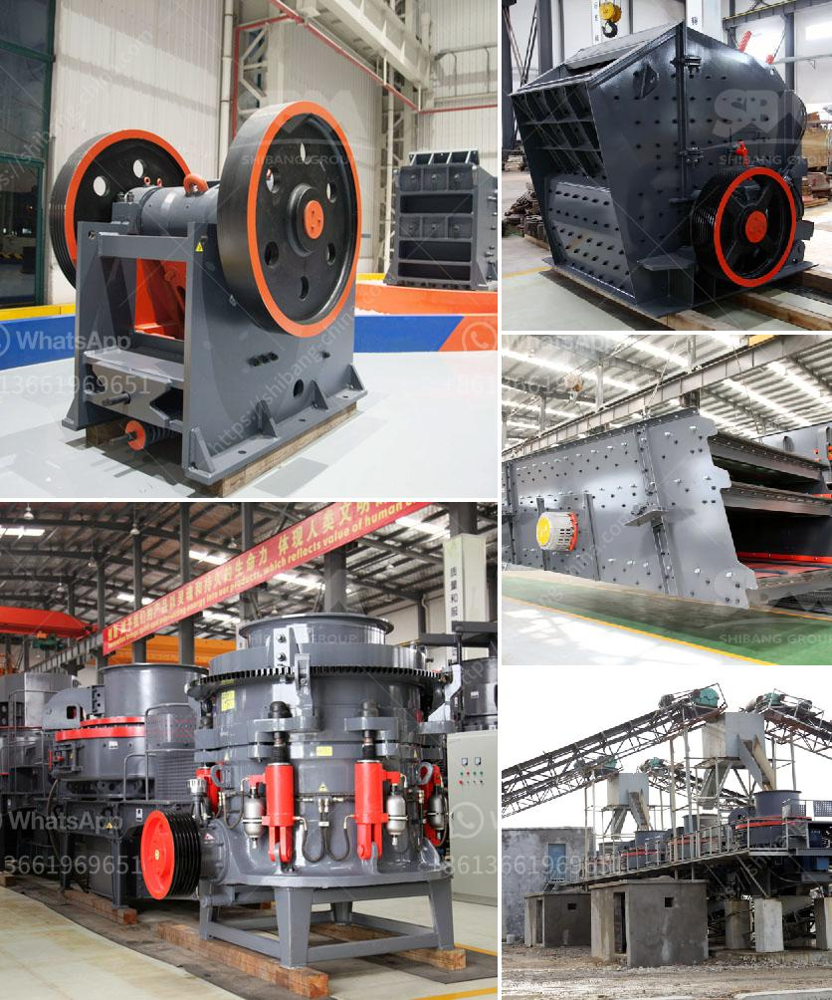

<h3>small rock crushers</h3>
Small rock crushers are widely used in mining, metallurgy, construction, chemistry, power plant and other industries. They can crush various ores and rocks with different hardness, such as granite, limestone, basalt, pebble, ore, river pebble and other materials. These small crushers are ideal for primary crushing or secondary crushing of small-scale crushing plants. Their advantages are in terms of capacity, reliability, energy consumption and maintenance.

Firstly, small rock crushers have large crushing capacity. The small rock crushers with a production capacity of 300 to 500 tons per hour can be used to crush rock at a maximum compression strength of 320MPa. In order to achieve this goal, a primary jaw crusher, fine jaw crusher and two sets of vibrating screens are required. The whole crushing and screening process is composed of a vibrating feeder, a jaw crusher, a vibrating screen, a fine jaw crusher and a belt conveyor.

Secondly, the energy consumption of small rock crushers is low and the power generated by the motor is transmitted to the eccentric shaft through the belt pulley. After the eccentric shaft rotates, it drives the movable jaw plate to move up and down. When the movable jaw plate moves up, the angle between it and the fixed jaw plate becomes larger, thus pushing the movable jaw plate closer to the fixed jaw plate. At the same time, the materials are crushed or split due to the squeezing and impact force. When the movable jaw plate moves down, the angle between it and the fixed jaw plate becomes smaller, and the materials are discharged through the lower outlet of the crushing chamber.

Thirdly, small rock crushers have stable performance, high processing capacity, low failure rate and long service life, which saves me a lot of operation and maintenance costs. Granularity and shape meet the requirements of national standard, excellent product quality. With the continuous improvement of technology and the increasing use of new materials, small rock crushers have high technical content, compact structure, reasonable layout, high level of automation and low operating costs.

Fourthly, small rock crushers fit the small to medium-sized operators because they can be transported on high-capacity highway trailers. Moreover, the flexible drive can be set to the right or the left, which adapts to various working conditions. The maintenance and overhaul of small rock crushers are also relatively easy, which saves a lot of maintenance costs for enterprises.

In conclusion, the choice of equipment in small rock crushers, crushing mode and installation method should be considered according to the actual situation of the site. Small-sized crushers with a production capacity ranging from 300 to 500 tons per hour are more popular. Some users would like to focus on the performance of the crusher, energy consumption and parts wear resistance, while some users prefer to build their own small rock crushers. Those who have plans to purchase small rock crushers should seriously consider its various factors, such as the power, energy consumption and wear resistance of various crushers. If necessary, users need to inform the manufacturer about their requirements and budget, and then the manufacturer can configure the appropriate small rock crushers for them.
<h3>Contact us</h3><ul><li><strong>Whatsapp:&nbsp;<a href="https://wa.me/8613661969651">+8613661969651</a></strong></li><li><a href="https://swt.shibang-china.com/?git&amp;zhl&amp;small rock crushers"><strong>Online Service(chat now)</strong></a></li></ul><h3>Related</h3><ul><li><a href='stone crusher machine pakistan.md'>stone crusher machine pakistan</a></li><li><a href='granite crusher machine.md'>granite crusher machine</a></li><li><a href='how to make a stone crusher.md'>how to make a stone crusher</a></li><li><a href='cement cement grinding ball mill.md'>cement cement grinding ball mill</a></li><li><a href='ton crusher plant price.md'>ton crusher plant price</a></li></ul>