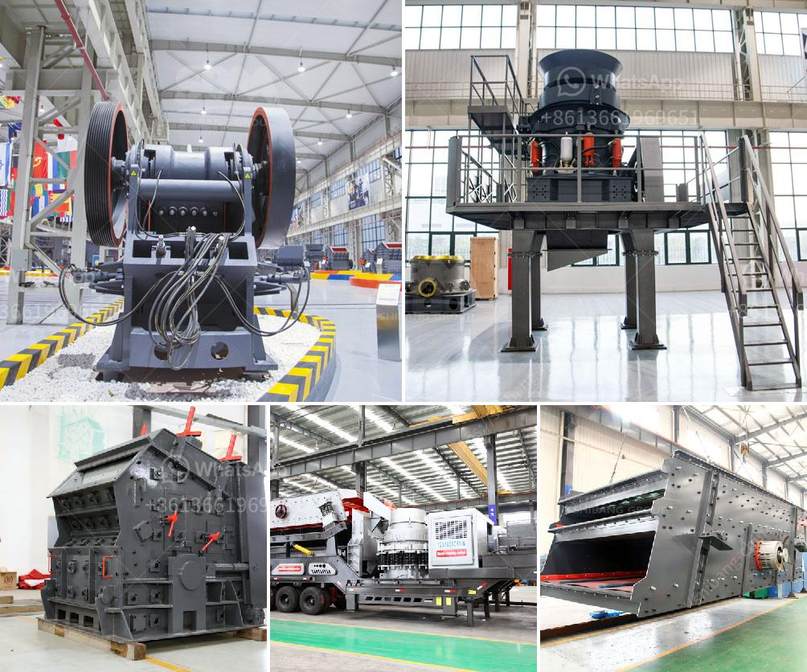

<h3>small sand washing machine</h3>
Sand washing machines are essential equipment in sandstone production lines and mining plants. Their main function is to wash and clean sand, removing impurities such as dust, silt, and debris, resulting in cleaner and higher-quality sand for construction, mining, and other industries. While there are various types of sand washing machines available in the market, small sand washing machines have become increasingly popular due to their compactness and efficiency.

A small sand washing machine is designed to be highly efficient while taking up minimal space. Typically, these machines can clean and wash a considerable amount of sand in a short period, making them ideal for small-scale sand washing tasks. They are compact and can be easily transported to different sites, providing flexibility and convenience to users.

One of the major advantages of small sand washing machines is their ability to effectively remove impurities from sand. These machines use a series of rotating spirals or paddles to scrub and agitate the sand, dislodging any trapped dirt or foreign particles. The washed sand is then thoroughly rinsed, ensuring that all impurities are eliminated. This results in cleaner sand, which is crucial for a wide range of applications, including concrete production and laying pipes.

Small sand washing machines are also known for their water-saving capabilities. They are equipped with advanced water recycling systems that allow for the efficient reuse of water. This not only helps in conserving water but also reduces the need for fresh water supply, making these machines environmentally friendly. In addition, the ability to recycle water reduces operating costs, making small sand washing machines a cost-effective solution for sand cleaning.

Another benefit of small sand washing machines is their versatility. They can handle various types of sand, including fine, coarse, and even heavily contaminated sand. This makes them suitable for a wide range of industries, from construction to mining. Additionally, they can be customized to meet specific requirements, such as adjusting the washing intensity and duration, ensuring efficient cleaning tailored to the sand type and condition.

Maintenance and operation of small sand washing machines are relatively simple. They are designed with user-friendly interfaces and controls, enabling operators to easily adjust settings and monitor the cleaning process. Regular maintenance, such as cleaning the spiral or paddle mechanisms and inspecting the machine for wear and tear, is important to ensure optimal performance and prolong its lifespan.

In conclusion, small sand washing machines are indispensable equipment for efficient cleaning of sand in various industries. Their compactness, efficiency, and versatility make them highly sought after for small-scale sand washing tasks. With the ability to remove impurities, recycle water, and handle different types of sand, these machines provide a cost-effective and environmentally friendly solution for sand cleaning. Whether it is for construction, mining, or other applications, a small sand washing machine is a must-have equipment for any operation that deals with sand.
<h3>Contact us</h3><ul><li><strong>Whatsapp:&nbsp;<a href="https://wa.me/8613661969651">+8613661969651</a></strong></li><li><a href="https://swt.shibang-china.com/?git&amp;zhl&amp;small sand washing machine"><strong>Online Service(chat now)</strong></a></li></ul><h3>Related</h3><ul><li><a href='ball mill modual continuous ball mill.md'>ball mill modual continuous ball mill</a></li><li><a href='mobile crusher china.md'>mobile crusher china</a></li><li><a href='hydraulic cone crusher.md'>hydraulic cone crusher</a></li><li><a href='crusher machines for granite in nigeria.md'>crusher machines for granite in nigeria</a></li><li><a href='how to make marble powder statues.md'>how to make marble powder statues</a></li></ul>