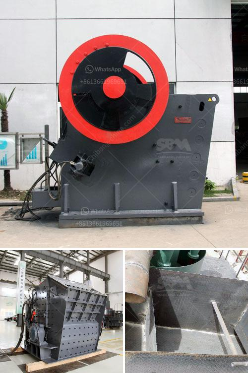

<h3>small scale cement plants in india</h3>
Cement, an essential construction material, plays a vital role in the growth and development of economies worldwide. In India, a rapidly developing country with a booming infrastructure sector, the demand for cement has been consistently increasing. Traditionally, large-scale cement plants have dominated the industry, but the emergence of small-scale cement plants has brought significant changes to the landscape.

Small-scale cement plants, also known as mini cement plants, are an excellent alternative for meeting local cement requirements. They are cost-effective and environmentally friendly, making them a viable solution for small and medium-sized communities in India.

One of the major advantages of small-scale cement plants is their localized production, eliminating the need for long-distance transportation of cement. Large cement plants are typically located far from smaller towns and rural areas, resulting in increased transportation costs and environmental pollution from excessive fuel consumption. Small-scale plants, however, can be strategically placed near the demand centers, reducing transportation costs and minimizing carbon emissions.

Moreover, small-scale cement plants contribute to local employment opportunities. The construction and operation of these plants require a significant workforce, which can help alleviate unemployment problems in rural areas. Additionally, with the presence of small-scale cement plants, there is a potential for the establishment of associated businesses such as construction material suppliers, transporters, and labor providers, further boosting the local economy.

Another noteworthy aspect of small-scale cement plants is their flexibility in production capacity. Unlike their larger counterparts, which typically have huge production capacities, small-scale plants can vary in size and output. This flexibility enables them to cater to the specific demands of the community they serve. Furthermore, it allows for gradual expansions based on market needs, reducing the risk of overproduction and wastage.

In terms of environmental impact, small-scale cement plants have a relatively low carbon footprint compared to large cement plants. They typically employ cleaner and more energy-efficient technologies, contributing to reduced emissions. Moreover, since these plants cater to localized demands, the need for long-distance transportation of cement is minimized, resulting in lower fuel consumption and decreased carbon emissions.

However, it is important to note that small-scale cement plants may face certain challenges. Limited access to technology, finance, and skilled labor can hinder their establishment and operation. Nonetheless, with proper support from the government and other stakeholders, these challenges can be overcome.

In conclusion, small-scale cement plants in India offer numerous benefits to local communities. Their localized production, reduced transportation costs, increased employment opportunities, flexibility in capacity, and lower carbon emissions make them an ideal solution for meeting cement requirements in small and medium-sized markets. While challenges exist, fostering the growth of small-scale cement plants through supportive policies and collaborations can lead to sustainable development and inclusive growth in the construction sector.
<h3>Contact us</h3><ul><li><strong>Whatsapp:&nbsp;<a href="https://wa.me/8613661969651">+8613661969651</a></strong></li><li><a href="https://swt.shibang-china.com/?git&amp;zhl&amp;small scale cement plants in india"><strong>Online Service(chat now)</strong></a></li></ul><h3>Related</h3><ul><li><a href='tons a hour wash plant.md'>tons a hour wash plant</a></li><li><a href='cement plant setup cost in philippines.md'>cement plant setup cost in philippines</a></li><li><a href='coal washing plants for rental in malaysia.md'>coal washing plants for rental in malaysia</a></li><li><a href='china coal mill grinder manufacturers china.md'>china coal mill grinder manufacturers china</a></li><li><a href='jaw crusher calculating.md'>jaw crusher calculating</a></li></ul>