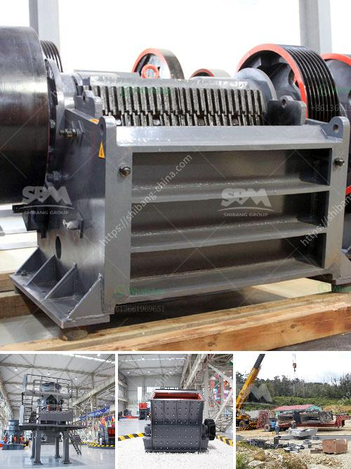

<h3>small scale miners tonnes hour crushing machines</h3>
Small-scale mining is an integral part of the mining sector, especially in developing countries. These miners often work in harsh conditions with limited resources, utilizing basic tools and equipment. One crucial machine used by small-scale miners is the tonnes hour crushing machine.

Crushing machines play an essential role in the mining process. They help break down large rocks into smaller, more manageable pieces, allowing miners to extract valuable minerals from the ore. However, small-scale miners do not have access to large, industrial-grade crushing machines typically used by larger mining operations. Instead, they rely on smaller, portable crushers that can be easily transported to remote mining sites.

One such machine is the tonnes hour crushing machine. As the name suggests, this machine has the capacity to crush multiple tonnes of rocks per hour. Its compact size and portability make it an ideal choice for small-scale miners who need to move from one location to another frequently.

The tonnes hour crushing machine is powered by either electricity or diesel, depending on the availability of resources in the mining area. Electric-powered machines are suitable for areas with a stable electricity supply, while diesel-powered machines are more suitable for remote locations where electricity is scarce.

These machines are designed to be efficient and user-friendly. They are equipped with strong jaws or hammers that can exert high pressure, effectively breaking down the rocks into smaller pieces. The crushed rocks are then further processed through other mining machinery to extract the valuable minerals.

One of the main advantages of using tonnes hour crushing machines is their affordability. Small-scale miners often operate on a tight budget and cannot afford expensive mining equipment. These machines are relatively cheaper compared to larger crushers, making them a practical choice for small-scale operations.

Moreover, tonnes hour crushing machines are built to withstand the rugged conditions encountered in small-scale mining. They are typically made from robust materials that can endure the wear and tear of frequent use in remote and challenging environments.

However, it is essential to note that small-scale miners must adhere to safety measures while operating these machines. Crushing rocks can be a hazardous task, and miners must follow proper protocols to prevent accidents or injuries. Protective gear, such as helmets, gloves, and safety glasses, should be worn at all times.

In conclusion, small-scale miners heavily rely on tonnes hour crushing machines to extract valuable minerals from rocks. These machines provide an affordable and portable solution for miners operating in remote locations with limited resources. Though compact in size, they are designed to be efficient and withstand harsh mining conditions. By utilizing these machines, small-scale miners can improve their mining operations and enhance their productivity, contributing to the overall growth of the mining sector.
<h3>Contact us</h3><ul><li><strong>Whatsapp:&nbsp;<a href="https://wa.me/8613661969651">+8613661969651</a></strong></li><li><a href="https://swt.shibang-china.com/?git&amp;zhl&amp;small scale miners tonnes hour crushing machines"><strong>Online Service(chat now)</strong></a></li></ul><h3>Related</h3><ul><li><a href='business plan for small scale gold processing plant.md'>business plan for small scale gold processing plant</a></li><li><a href='mobile sand making machine.md'>mobile sand making machine</a></li><li><a href='crusher plant in philippines.md'>crusher plant in philippines</a></li><li><a href='process of river rock crushing to make cement.md'>process of river rock crushing to make cement</a></li><li><a href='ore beneficiation equipment suppliers china.md'>ore beneficiation equipment suppliers china</a></li></ul>