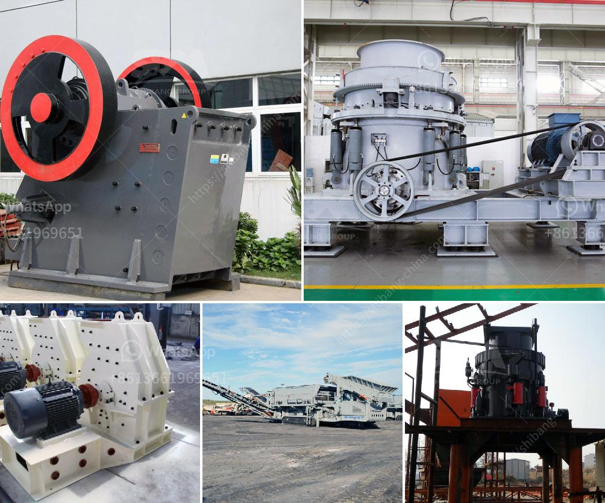

<h3>small scale mining plant layout</h3>
Mining has consistently been a crucial industry worldwide, providing essential raw materials for various sectors. While large-scale mining operations often dominate the headlines, it is important to recognize and embrace the significance of small-scale mining plants. These operations, although relatively modest in size, play a vital role in many communities by contributing to local economies and supporting livelihoods. In this article, we will explore the concept of small-scale mining plant layout and its potential in achieving sustainability goals.

When considering small-scale mining plant layout, several key factors come into play. One of the primary concerns is ensuring the efficient extraction of minerals while minimizing environmental impacts. A well-designed layout can facilitate this by optimizing the utilization of resources, reducing waste generation, and minimizing the carbon footprint of operations.

Firstly, it is crucial to define the zoning for different activities within the plant. This entails demarcating areas for mineral extraction, processing, waste disposal, and administrative functions. By clearly delineating these zones, potential risks can be identified, and appropriate measures can be implemented to control and mitigate them. For example, the separation of waste disposal areas from mineral processing facilities can prevent contamination and the release of harmful substances into the environment.

Another aspect to consider when designing a small-scale mining plant layout is the efficient flow of materials. This involves planning the placement and arrangement of equipment and infrastructure to minimize the distance traveled by minerals, waste, and water throughout the production process. A streamlined layout reduces energy consumption, increases productivity, and optimizes the use of available space.

Moreover, incorporating sustainable technologies is crucial for achieving long-term viability in small-scale mining operations. Utilizing energy-efficient equipment, such as low-energy crushers and grinders, can significantly reduce power consumption. Additionally, the integration of renewable energy sources, such as solar or wind, can further decrease the reliance on fossil fuels, ultimately reducing greenhouse gas emissions.

Furthermore, water management plays a critical role in the sustainability of small-scale mining plants. Implementing innovative water recycling systems can minimize water consumption and reduce the strain on local water sources. This can be achieved through the installation of sedimentation ponds, filtering systems, and closed-loop water circuits. An efficient water management system not only conserves resources but also helps prevent water pollution by ensuring proper treatment and containment of wastewater.

Engaging with stakeholders is also imperative for the success of small-scale mining plants. Collaboration with local communities, government agencies, and non-governmental organizations can help facilitate responsible mining practices and address any concerns or grievances. Open and transparent communication fosters trust and enables the implementation of sustainable practices that benefit all parties involved.

In conclusion, small-scale mining plants have a significant role to play in achieving sustainable mining practices. By prioritizing resource efficiency, waste reduction, and environmental stewardship, these operations can contribute to equitable economic development while minimizing ecological impacts. Well-designed layouts, incorporating advanced technologies and effective water management, are crucial for maximizing the potential of small-scale mining plants. Embracing sustainable practices and engaging with stakeholders can pave the way towards a more environmentally responsible and socially inclusive mining industry.
<h3>Contact us</h3><ul><li><strong>Whatsapp:&nbsp;<a href="https://wa.me/8613661969651">+8613661969651</a></strong></li><li><a href="https://swt.shibang-china.com/?git&amp;zhl&amp;small scale mining plant layout"><strong>Online Service(chat now)</strong></a></li></ul><h3>Related</h3><ul><li><a href='complete crushing plant 150 200t.md'>complete crushing plant 150 200t</a></li><li><a href='ball mill outpot capicity 180 tph.md'>ball mill outpot capicity 180 tph</a></li><li><a href='limestone mining process.md'>limestone mining process</a></li><li><a href='cement grinding machine.md'>cement grinding machine</a></li><li><a href='china processing plants for sale.md'>china processing plants for sale</a></li></ul>