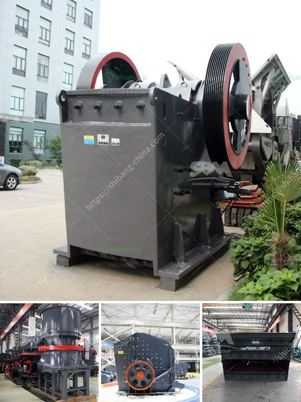

<h3>small stone brick crusher</h3>
Small stone brick crusher is one of the leading products of the company, which uses advanced manufacturing technology and high-quality materials to crush stones into smaller sizes. This machine is widely used in mining, construction, building materials, metallurgy, and chemical industries, making it perfect for crushing stones and rocks of various kinds.

The small stone brick crusher has several features that make it highly efficient and user-friendly. Firstly, it is equipped with a powerful motor that ensures smooth and consistent performance. This motor enables the crusher to deliver a high crushing ratio, making it capable of breaking down even the toughest stones and bricks.

Secondly, the small stone brick crusher is designed with an adjustable discharge size. This feature allows users to control the size of the final product according to their specific needs. Whether it's for building purposes, road construction, or landscaping, the crusher can produce stones of different sizes, ensuring versatility and flexibility in various applications.

Additionally, the small stone brick crusher is compact in size and easy to move. It can be conveniently transported from one job site to another, making it an ideal choice for contractors and construction companies that need a portable crushing solution. Moreover, its simple and robust design ensures low maintenance requirements, reducing downtime and maximizing productivity.

Furthermore, the small stone brick crusher is equipped with safety features to protect operators and prevent accidents. It includes a safety guard around the motor and a protective cover over the crushing chamber, ensuring the highest level of safety during operation.

In conclusion, the small stone brick crusher is a reliable and efficient machine that offers great value for money. Its powerful motor, adjustable discharge size, portability, and safety features make it an excellent choice for crushing stones and bricks. Whether you are a contractor, builder, or homeowner, this crusher will undoubtedly meet your crushing needs with utmost efficiency and precision.
<h3>Contact us</h3><ul><li><strong>Whatsapp:&nbsp;<a href="https://wa.me/8613661969651">+8613661969651</a></strong></li><li><a href="https://swt.shibang-china.com/?git&amp;zhl&amp;small stone brick crusher"><strong>Online Service(chat now)</strong></a></li></ul><h3>Related</h3><ul><li><a href='crusher for aggregate.md'>crusher for aggregate</a></li><li><a href='clay aggregate machinery product.md'>clay aggregate machinery product</a></li><li><a href='cost of conveyor belt system for coal loading.md'>cost of conveyor belt system for coal loading</a></li><li><a href='stone crusher plant video.md'>stone crusher plant video</a></li><li><a href='feldspar powder making machine in india.md'>feldspar powder making machine in india</a></li></ul>