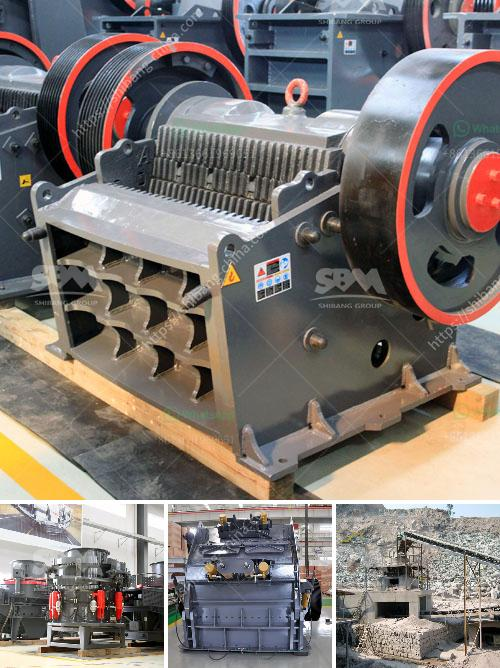

<h3>smallest gold crushing and washing plant</h3>
The gold industry has been booming for centuries, and it continues to attract investors and enthusiasts due to its high value and scarcity. In order to extract gold from its ores, miners have developed various techniques, ranging from traditional panning to highly mechanized processes. One of the essential steps in gold extraction is the crushing and washing of the ores, which helps remove impurities and leaves behind the precious metal.

When it comes to small-scale operations or individuals looking to process gold from their own mining efforts, a smaller and more efficient gold crushing and washing plant is often preferred. These compact plants are designed to be easily transported and set up in remote locations, making it ideal for smaller mining operations or those operating on a limited budget.

The smallest gold crushing and washing plant typically consists of a jaw crusher, which is commonly used as primary crushing equipment, as well as a cone crusher for secondary crushing processes. Both machines work together to break down the gold ores into smaller particles, allowing for easier processing and the recovery of gold.

In addition to the crushing process, a washing plant is integrated within the system to remove any impurities or unwanted materials. This step is crucial as it ensures that the final product is pure and ready for further refining. The washing plant typically consists of a rotating drum or scrubber that agitates the crushed material, along with water and chemicals, to remove any dirt, excess clay, or other impurities. The gold-bearing material is then passed through a series of screens to separate the larger rocks and debris before being collected.

While the smallest gold crushing and washing plant may have limited capacity compared to larger-scale operations, it still plays a crucial role in the gold extraction process for individual miners or smaller operations. These compact plants offer efficiency, convenience, and affordability, allowing miners to maximize their gold recovery while minimizing costs and environmental impact.

In conclusion, a smallest gold crushing and washing plant provides miners with a practical and cost-effective solution for processing their gold ores. These plants may be small in size, but they offer a big impact in terms of efficiency, convenience, and environmental sustainability. Whether used by individuals or smaller mining operations, these plants ensure that gold can be extracted and processed effectively, contributing to the continued success of the gold industry.
<h3>Contact us</h3><ul><li><strong>Whatsapp:&nbsp;<a href="https://wa.me/8613661969651">+8613661969651</a></strong></li><li><a href="https://swt.shibang-china.com/?git&amp;zhl&amp;smallest gold crushing and washing plant"><strong>Online Service(chat now)</strong></a></li></ul><h3>Related</h3><ul><li><a href='crusher stone sand making stone quarry.md'>crusher stone sand making stone quarry</a></li><li><a href='basalt rock crusher suppliers in dubai.md'>basalt rock crusher suppliers in dubai</a></li><li><a href='limestone processes of landscape.md'>limestone processes of landscape</a></li><li><a href='automatic terrazzo pressing machine.md'>automatic terrazzo pressing machine</a></li><li><a href='jaw crusher 150 250 para la venta.md'>jaw crusher 150 250 para la venta</a></li></ul>