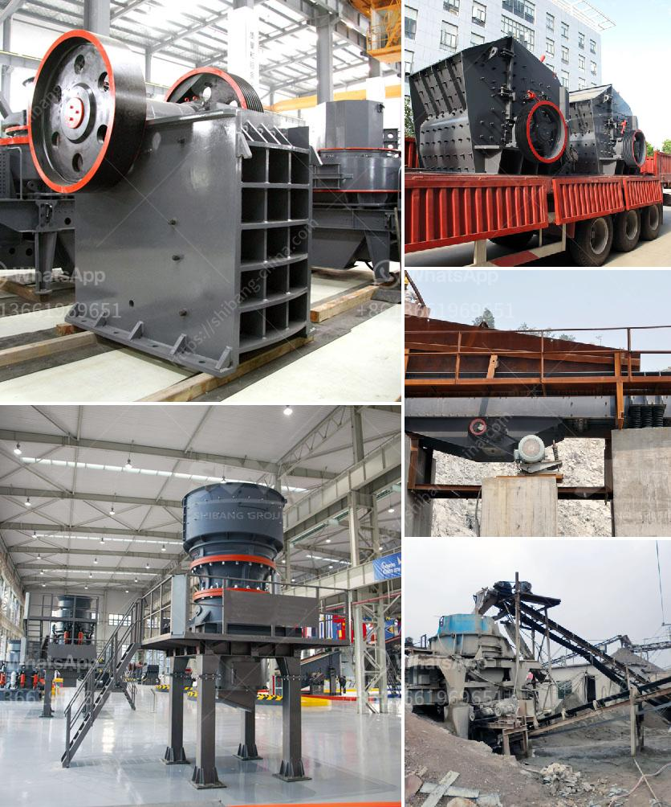

<h3>spare parts dealer of crusher plant in odisha</h3>
In today's highly competitive market, owners of crusher plants in Odisha understand the significance of ensuring smooth operation and achieving optimum performance. To meet these requirements, they rely on dependable spare parts dealers who offer high-quality components designed specifically for their crusher plants. These dealers play a crucial role in ensuring the uninterrupted functioning and longer lifespan of the machinery.

The availability of spare parts is of paramount importance for any crusher plant owner. Any breakdown or delay in machinery due to unavailability of spare parts can result in significant financial losses. Hence, it is vital to have a reliable spare parts dealer who can provide prompt and efficient service. They must have an extensive inventory of genuine spare parts suitable for different models and brands of crushers used in Odisha.

Choosing a reputable spare parts dealer is imperative as it guarantees the authenticity and durability of the components. These dealers should have a strong association with renowned manufacturers who specialize in producing high-quality parts for crusher plants. The genuine spare parts not only ensure the smooth functioning of the machinery but also enable the crusher plants to meet the required operational standards.

Apart from providing genuine spare parts, these dealers should also have a team of experienced technicians who can offer technical guidance, troubleshooting, and assistance in choosing the right spare parts. They must possess in-depth knowledge of the machinery and its components to help the crusher plant owners make informed decisions regarding the maintenance and replacement of parts.

Furthermore, a reliable dealer offers competitive pricing and efficient delivery services. Timely delivery of spare parts is crucial as it helps in minimizing downtime and maximizing productivity. A well-established dealer should also have a user-friendly website or online portal where the owners of crusher plants in Odisha can easily browse and order the required spare parts, thereby enhancing the overall convenience and efficiency of the process.

In conclusion, a spare parts dealer for crusher plants in Odisha plays a pivotal role in ensuring the smooth operation and optimum performance of the machinery. By providing genuine, high-quality components, along with technical expertise and efficient delivery services, they contribute significantly to the success and profitability of crusher plant owners in the region. Thus, investing in a reliable spare parts dealer is a wise decision for any crusher plant owner looking to achieve uninterrupted functioning and extend the lifespan of their equipment.
<h3>Contact us</h3><ul><li><strong>Whatsapp:&nbsp;<a href="https://wa.me/8613661969651">+8613661969651</a></strong></li><li><a href="https://swt.shibang-china.com/?git&amp;zhl&amp;spare parts dealer of crusher plant in odisha"><strong>Online Service(chat now)</strong></a></li></ul><h3>Related</h3><ul><li><a href='manufacturers of cement grinding units in india.md'>manufacturers of cement grinding units in india</a></li><li><a href='granite mining in zimbabwe.md'>granite mining in zimbabwe</a></li><li><a href='quartz manufacturing plant in tamilnadu.md'>quartz manufacturing plant in tamilnadu</a></li><li><a href='coal crusher machine in south africa.md'>coal crusher machine in south africa</a></li><li><a href='how to make a stone crusher.md'>how to make a stone crusher</a></li></ul>