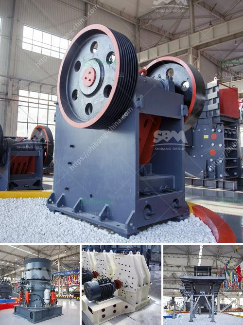

<h3>spare parts for raymond mill</h3>
Raymond Mill is a widely used grinding equipment in the market. Its production efficiency and stable performance make it widely recognized by customers. However, as a heavy-duty equipment, spare parts for Raymond Mill are a big investment. In the long run, good quality spare parts ensure the continuous and stable operation of equipment, ensuring the efficient production of materials. Therefore, the selection and use of high-quality spare parts is vital for Raymond Mill.

Firstly, it is crucial to understand the importance of spare parts in Raymond Mill. Spare parts refer to components that are used to replace damaged or worn-out parts in the equipment during its operation. They can be divided into three types according to their functional purposes: wearing parts, structural parts, and auxiliary equipment accessories. Each type plays a critical role in the Raymond Mill's normal operation and performance.

Wearing parts are the most frequently replaced components in Raymond Mill. They are prone to wear and tear due to the continuous grinding of materials. Common wearing parts for Raymond Mill include grinding rollers, grinding rings, blades, and shovel plates. These parts are responsible for directly contacting the materials and grinding them into finer particles. Over time, the wearing parts will gradually be worn out and need to be replaced. Therefore, choosing durable and wear-resistant wearing parts is crucial to reduce maintenance costs and ensure the normal operation and high efficiency of Raymond Mill.

Meanwhile, structural parts are essential for maintaining the stability and integrity of Raymond Mill. They include chassis, bearings, bearing caps, transmission systems, and seals. These components are responsible for supporting the Raymond Mill's body, ensuring its stable operation and preventing any structural damage. High-quality structural parts can effectively improve the equipment's service life and reduce the frequency of maintenance and repairs.

In addition to wearing and structural parts, auxiliary equipment accessories also play a significant role in Raymond Mill's operation. They mainly include fans, dust collectors, and electrical control systems. These accessories are responsible for ensuring the Raymond Mill operates in a clean and safe environment, effectively controlling the temperature, humidity, and dust generated during the grinding process. Choosing efficient and reliable auxiliary equipment accessories can not only improve the equipment's overall performance but also ensure the safety and environmental protection of the production site.

When selecting spare parts for Raymond Mill, it is essential to consider their quality. High-quality spare parts not only ensure the normal operation of Raymond Mill but also reduce downtime, maintenance costs, and improve productivity. Therefore, it is recommended to choose spare parts from reputable manufacturers with a good reputation and a guarantee of product quality. It is also essential to pay attention to the compatibility between spare parts and Raymond Mill models to ensure a perfect fit and effective performance.

In conclusion, spare parts for Raymond Mill are an indispensable component for its efficient and stable operation. They play a crucial role in maintaining the equipment's performance and extending its service life. Therefore, it is essential to choose high-quality spare parts from reputable manufacturers to avoid unnecessary maintenance costs and maximize the productivity of Raymond Mill. Investing in spare parts is an investment in the long-term success of Raymond Mill.
<h3>Contact us</h3><ul><li><strong>Whatsapp:&nbsp;<a href="https://wa.me/8613661969651">+8613661969651</a></strong></li><li><a href="https://swt.shibang-china.com/?git&amp;zhl&amp;spare parts for raymond mill"><strong>Online Service(chat now)</strong></a></li></ul><h3>Related</h3><ul><li><a href='sand wash plant for sale in india.md'>sand wash plant for sale in india</a></li><li><a href='powder mill rollers machine.md'>powder mill rollers machine</a></li><li><a href='stone crusher price in zambia.md'>stone crusher price in zambia</a></li><li><a href='mini cement plant in west bengal.md'>mini cement plant in west bengal</a></li><li><a href='vertical roller mill.md'>vertical roller mill</a></li></ul>