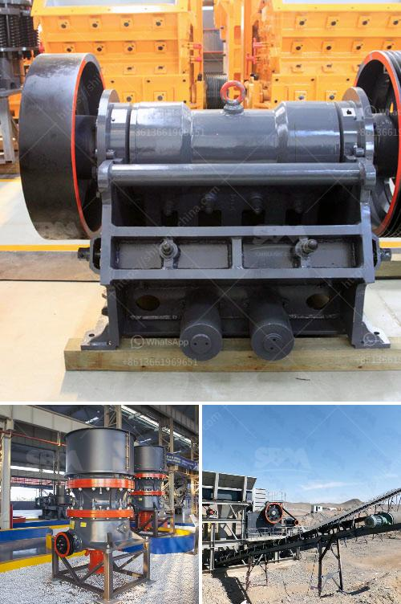

<h3>special electrodes for ball mill</h3>
Special electrodes for ball mills are crucial components that contribute to the efficient operation of these industrial grinding machines. Ball mills are used for grinding and crushing materials, which requires a great amount of energy. To ensure the optimal performance of the ball mill and to prevent wear and tear, special electrodes are used for their maintenance.

One of the main challenges in maintaining a ball mill is the constant abrasion and impact that occurs as materials are being crushed or ground. Abrasion occurs when sharp particles or fragments of the material being ground rub against the metal surfaces, causing them to wear down over time. Impact, on the other hand, happens when the materials being processed collide with the metal surface of the mill, resulting in damage. These issues can be mitigated with the use of special electrodes.

Special electrodes for ball mills are usually made of high-quality alloys that are resistant to wear and tear. These electrodes are specifically designed to withstand the harsh conditions encountered during the grinding process. They are capable of withstanding a combination of abrasion and impact, ensuring a longer lifespan for the mill and reducing the frequency of maintenance and replacements.

The electrodes used for ball mill maintenance are typically coated with a protective layer or a hardfacing material. These coatings act as a shield against the abrasive materials and impacts, as well as reducing friction between the material being processed and the metal surface. Special coatings are selected based on the specific application and the materials being processed in the mill.

In addition to the protective coatings, special electrodes for ball mills are also designed with specific geometries to optimize their performance. The shape of the electrode can enhance the grinding process and improve overall efficiency. For example, some electrodes are designed with grooves or ridges to increase the contact surface area with the material being processed, resulting in higher grinding capacity.

Choosing the right type of electrode for a ball mill is crucial for achieving optimal performance. Different materials require different types of electrodes. For example, when grinding abrasive materials such as minerals or ores, high chromium electrodes are often used due to their excellent resistance to wear and tear. On the other hand, when grinding softer materials like coal or limestone, electrodes with tungsten carbide coatings are commonly used.

Regular inspection and maintenance of the electrodes are essential to prevent any potential issues. Over time, the protective coatings on the electrodes may wear off, reducing their effectiveness. It is important to monitor the condition of the electrodes and replace them when necessary to maintain the mill's performance.

In conclusion, special electrodes play a critical role in the maintenance of ball mills. They are designed to withstand the harsh conditions of grinding and crushing materials, providing protection against abrasion and impact. By selecting the right type of electrode and ensuring regular maintenance, the lifespan and efficiency of ball mills can be significantly improved.
<h3>Contact us</h3><ul><li><strong>Whatsapp:&nbsp;<a href="https://wa.me/8613661969651">+8613661969651</a></strong></li><li><a href="https://swt.shibang-china.com/?git&amp;zhl&amp;special electrodes for ball mill"><strong>Online Service(chat now)</strong></a></li></ul><h3>Related</h3><ul><li><a href='cement plant in brazil.md'>cement plant in brazil</a></li><li><a href='used stone crushers for sale germany.md'>used stone crushers for sale germany</a></li><li><a href='difference between ball mill and roller mill.md'>difference between ball mill and roller mill</a></li><li><a href='price of large jaw crusher.md'>price of large jaw crusher</a></li><li><a href='crusher suppliers in kenya.md'>crusher suppliers in kenya</a></li></ul>