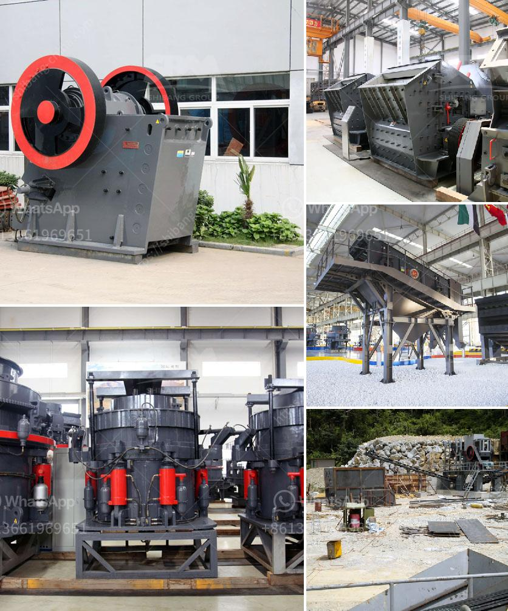

<h3>specification for pe 250x400 jaw crusher</h3>
The pe 250x400 jaw crusher is a popular model among small crushing equipment. It has a wide range of applications, and can be used for crushing various kinds of stone materials, such as pebble, granite, limestone, basalt, quartz, river pebbles, etc. In addition, it can crush materials with different particle sizes, which makes it an essential machine in mining, construction, and other industries.

The pe 250x400 jaw crusher is designed with a deep V-shaped crushing chamber, which allows for a larger feed size and higher crushing ratio. The optimized design of the jaw plates increases the squeezing and splitting force of the material, ensuring efficient crushing performance. This jaw crusher is also equipped with a wedge adjustment system, which allows for quick and easy adjustment of the discharge opening.

The pe 250x400 jaw crusher has a simple structure, reliable operation, and low operating costs. It is equipped with a high-quality and wear-resistant jaw plate, which ensures the long service life of the machine. The machine is also easy to maintain, as it is equipped with a centralized lubrication system that reduces the need for manual greasing.

This jaw crusher is powered by an electric motor, which provides a stable and reliable power source. It is also designed with a safety device, such as a flywheel guard, which provides protection for both the operator and the machine. The machine is easy to operate, with simple and clear control buttons that are user-friendly.

With a production capacity of 5-20 tons per hour, the pe 250x400 jaw crusher is suitable for small-scale crushing applications. It is widely used in small mining operations, building materials, metallurgy, and various other industries. Its compact size and easy transportation make it a perfect choice for contractors who need to move the equipment between different work sites.

In summary, the pe 250x400 jaw crusher is a versatile and reliable machine that is ideal for small scale crushing operations. Its efficient design, high crushing ratio, and low operating costs make it a popular choice among users. Whether you need to crush pebbles, granite, limestone, or any other stone material, this jaw crusher will provide you with excellent performance and reliable operation.
<h3>Contact us</h3><ul><li><strong>Whatsapp:&nbsp;<a href="https://wa.me/8613661969651">+8613661969651</a></strong></li><li><a href="https://swt.shibang-china.com/?git&amp;zhl&amp;specification for pe 250x400 jaw crusher"><strong>Online Service(chat now)</strong></a></li></ul><h3>Related</h3><ul><li><a href='portable gold rock crushing machine.md'>portable gold rock crushing machine</a></li><li><a href='jual raymond mill bekas.md'>jual raymond mill bekas</a></li><li><a href='gold processing machinery in china.md'>gold processing machinery in china</a></li><li><a href='fine powder milling machines.md'>fine powder milling machines</a></li><li><a href='america stone crusher price.md'>america stone crusher price</a></li></ul>