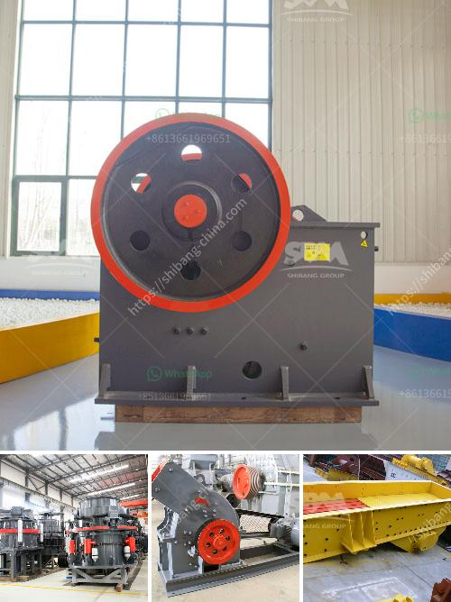

<h3>specification of a ball mill</h3>
A ball mill is a grinding machine used to grind, blend, and sometimes for mixing of materials for use in geology, ceramics, metallurgy, electronics, pharmacy, construction material, and light industry, etc. Ball mills are classified as attritor, planetary ball mill, high energy ball mill, horizontal ball mill, or shaker mill.

The working principle is simple; impact and attrition size reduction take place as the ball drops from near the top of a rotating hollow cylindrical shell. The shell is usually made of steel lined with rubber or polyurethane. The inner surface of the cylindrical shell is usually lined with an abrasion-resistant material such as manganese steel or rubber. The length of the shell is approximately equal to its diameter.

Ball mills come in various sizes and specifications, with different power and speed requirements to cater to various industrial needs. Load capacity is an important factor, as it determines the amount of material that can be processed at a time. Different ball mills have different specifications, so it is important to consider the capacity and dimensions of the specific ball mill in question.

The external dimensions of the ball mill will largely determine its load capacity and how many pieces of the material that needs to be crushed can be held at a time. For instance, a large ball mill with a length of 3.6 meters and a diameter of 5 meters will have a load capacity of 12,000 tons when fully loaded, which is around 20 times the capacity of the ball mill with the same specifications categorized as low energy consumption. On the other hand, small ball mills with a length of 2.7 meters and a diameter of 2.1 meters will have a load capacity of about 8 tons, accounting for about 11% (approximately one-ninth) of the ball mill's productivity.

Ball mills are typically designed with a single or double chamber, whereby a separate slot is used for the grinding media and material to be processed. Different forms of lining plates are used to accommodate different grinding media and material requirements. Lining plates can be made from various materials, such as high manganese steel, high chromium cast iron, wear-resistant rubber, and ceramic, to protect the inner surface of the ball mill from abrasion and erosion.

The rotation speed of the ball mill also plays a crucial role in determining the retention time of the material inside the mill and the time required for grinding. Generally, the optimum rotation speed of a ball mill is between 65-75% of the critical speed. However, different materials have different ideal rotation speeds, and this can be determined through experiment or consultation with industry experts.

In summary, the specification of a ball mill is crucial in determining its performance and capacity. Factors such as ball mill size, Power capacity, recommendations for the grinding media, load level, revolution speed, and geometry all come into play when designing a ball mill. Achieving the optimal grinding efficiency is dependent on using the right combination of these specifications to optimize the grinding process for the specific material being processed.
<h3>Contact us</h3><ul><li><strong>Whatsapp:&nbsp;<a href="https://wa.me/8613661969651">+8613661969651</a></strong></li><li><a href="https://swt.shibang-china.com/?git&amp;zhl&amp;specification of a ball mill"><strong>Online Service(chat now)</strong></a></li></ul><h3>Related</h3><ul><li><a href='vibrating screens price in south africa.md'>vibrating screens price in south africa</a></li><li><a href='quartz crusher plant.md'>quartz crusher plant</a></li><li><a href='stone crusher machinery list in india.md'>stone crusher machinery list in india</a></li><li><a href='clinker production process.md'>clinker production process</a></li><li><a href='price of stone crush machine in pakistan.md'>price of stone crush machine in pakistan</a></li></ul>