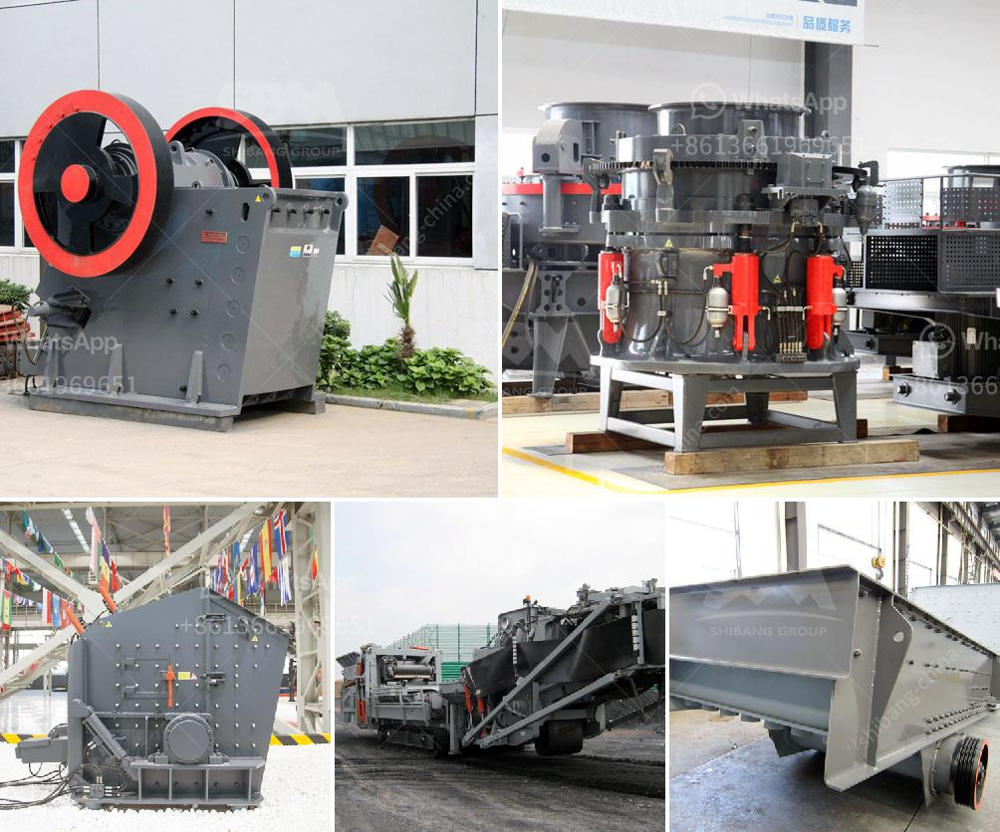

<h3>sri lanka sand washing machine prices</h3>
Sri Lanka is a beautiful island nation located in South Asia. It is known for its stunning beaches, rich wildlife, and ancient Buddhist ruins. But amidst the natural beauty, there is also a deeply rooted issue of sand scarcity.

Sand is an essential raw material for construction activities such as building houses, roads, and bridges. Sri Lanka, being in the midst of a development boom, requires a significant amount of sand. However, the traditional methods of sand extraction, such as river sand mining, have had a detrimental impact on the environment.

To counter the environmental damage caused by unsustainable sand extraction, the Sri Lankan government has encouraged the use of manufactured sand or M-sand. This artificial sand is produced by crushing rocks and quarry stones to the desired size. M-sand provides an eco-friendly alternative as it minimizes the need for river sand extraction.

The process of manufacturing M-sand involves several steps, with one crucial step being washing. Washing is essential to remove impurities and ensure that the sand meets the required quality standards. This is where sand washing machines come into play.

Sand washing machines are used to clean and separate the dust and impurities from the sand, creating a clean and high-quality sand aggregate suitable for construction purposes. They are also known as sand washer, sand classifier, or sand separator, depending on the application.

The sand washing machine prices in Sri Lanka vary depending on the type and size of the machine. While there are many suppliers of these machines, it is recommended to compare prices and choose the most suitable one based on your budget and requirements.

The price range of sand washing machines in Sri Lanka is approximately LKR 40,000 to LKR 100,000. This price range is influenced by factors such as the machine's capacity, size, brand, and additional features. For example, a small portable sand washing machine with a capacity of around 10 tons per hour can be purchased for around LKR 40,000, while a large one with a capacity of 80 tons per hour may cost around LKR 100,000.

Investing in a sand washing machine is a wise decision for construction companies, as it helps in obtaining clean and high-quality sand for their projects. It also reduces the dependency on river sand, thus contributing to environmental sustainability.

In conclusion, the demand for sand in Sri Lanka has increased significantly due to ongoing development projects. As the traditional methods of sand extraction have proven to be unsustainable, the use of manufactured sand is gaining popularity. Sand washing machines play a crucial role in the production of high-quality sand, and their prices in Sri Lanka range from LKR 40,000 to LKR 100,000. Overall, investing in a sand washing machine is a smart choice for any construction company looking to obtain clean and eco-friendly sand for their projects.
<h3>Contact us</h3><ul><li><strong>Whatsapp:&nbsp;<a href="https://wa.me/8613661969651">+8613661969651</a></strong></li><li><a href="https://swt.shibang-china.com/?git&amp;zhl&amp;sri lanka sand washing machine prices"><strong>Online Service(chat now)</strong></a></li></ul><h3>Related</h3><ul><li><a href='wet and dry ball milling.md'>wet and dry ball milling</a></li><li><a href='wet ball milling vs dry ball milling.md'>wet ball milling vs dry ball milling</a></li><li><a href='mobile gold processing plants 1 ton per.md'>mobile gold processing plants 1 ton per</a></li><li><a href='calcium oxide crusher.md'>calcium oxide crusher</a></li><li><a href='stone crusher machinery list in india.md'>stone crusher machinery list in india</a></li></ul>