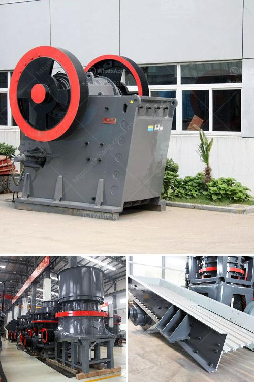

<h3>stamp mill foot for sale</h3>
Are you a history buff or a collector of rare artifacts? If so, you might be interested in the opportunity to own a piece of mining history – a stamp mill foot. Used in the late 1800s and early 1900s, stamp mills were an efficient tool for extracting valuable metals from ore. Now, one of these stamp mill feet is up for sale, offering a unique opportunity for those interested in mining history to own a piece of the past.

A stamp mill foot, also known as a mortar box, was an integral part of the stamp mill process. This large wooden box was used to hold heavy iron stamps that would crush rocks and extract ore. As the stamps were lifted and dropped onto the rocks, the foot absorbed the impact, allowing the stamps to efficiently crush the ore and separate valuable minerals.

The stamp mill foot up for sale is in remarkable condition, considering its age and historical significance. Made from sturdy timber, it has withstood the test of time, serving as a witness to the mining boom that shaped America's growth during the late 19th and early 20th centuries. With its sizeable dimensions, the stamp mill foot measures approximately 5 feet in length, providing a tangible representation of the immense power and industry present in the mining operations of the past.

Owning a stamp mill foot offers a range of opportunities for collectors and history enthusiasts. Firstly, it serves as a tangible link to the rich history of mining, transporting owners back to an era when the industry was a driving force behind the growth of towns and cities across the nation. Displayed in a home, office, or museum, the presence of a stamp mill foot commands attention and sparks conversations about the remarkable achievements and challenges faced by those who toiled in the mines.

Furthermore, owning a stamp mill foot can enhance any collection of mining-related artifacts. Whether you already possess mining tools, photos, or documents, the acquisition of a stamp mill foot broadens your collection's scope and significance. It adds depth to any display, allowing viewers to appreciate the mechanical ingenuity and strength required to extract valuable minerals from the earth.

For those passionate about preserving history, a stamp mill foot presents an opportunity to safeguard a relic of America's industrial past. By owning and caring for such an artifact, you become a custodian of history, ensuring that future generations can learn from and be inspired by the achievements of our forebears.

While the sale of a stamp mill foot may not attract mainstream attention, for collectors and history enthusiasts, it represents an extraordinary opportunity. With its strong ties to mining history, tangible presence, and potential for enhancing collections, owning a stamp mill foot is an investment in the preservation of our heritage. So, if you're fascinated by the lure of the past, consider acquiring this unique artifact and let the stamp mill foot become a powerful symbol of our industrial heritage.
<h3>Contact us</h3><ul><li><strong>Whatsapp:&nbsp;<a href="https://wa.me/8613661969651">+8613661969651</a></strong></li><li><a href="https://swt.shibang-china.com/?git&amp;zhl&amp;stamp mill foot for sale"><strong>Online Service(chat now)</strong></a></li></ul><h3>Related</h3><ul><li><a href='gold screening machines south africa.md'>gold screening machines south africa</a></li><li><a href='crusher processing plant malaysia.md'>crusher processing plant malaysia</a></li><li><a href='used crushers for sale in usa.md'>used crushers for sale in usa</a></li><li><a href='mini stone crusher machine in finland.md'>mini stone crusher machine in finland</a></li><li><a href='cement plant in assam.md'>cement plant in assam</a></li></ul>