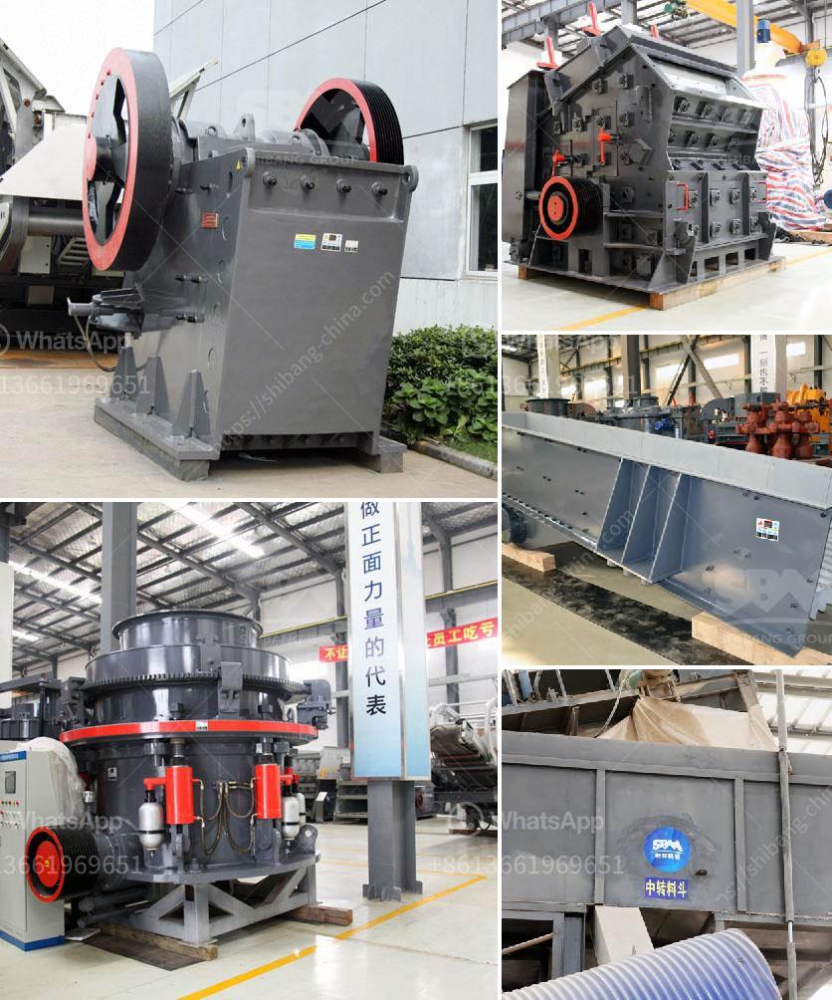

<h3>stamp mill manufactures in south africa</h3>
Stamp mill manufactures in South Africa have been pioneers in the development of mining and ore processing technologies. These advancements have contributed greatly to the prosperity of the nation's mining industry. For over a century, stamp mills have been used to crush ore into fine particles, allowing valuable minerals to be extracted. This process has played a fundamental role in South Africa's rich mining history.

Stamp mills were first used in the late 1800s for silver and gold mining. Initially, they were powered by waterwheels, but soon steam engines were utilized for increased efficiency. These large machines used heavy steel stamps to crush and grind rocks, facilitating the extraction of minerals. The crushed ore was then processed using mercury or cyanide to separate the precious metals from the remaining rock.

In South Africa, the Witwatersrand Basin is renowned for its rich gold deposits. The stamp mills played a vital role in extracting gold and other minerals from the ore. Many stamp mills were located in areas where gold was concentrated, conveniently close to the mines. This allowed for efficient transportation of the ore to the stamp mills for processing.

Stamp mill manufactures in South Africa have continuously improved the design and efficiency of their machines over the years. Today, modern stamp mills consist of large steel cylinders with heavy steel stamps. These stamps are raised and dropped repeatedly onto the ore, crushing it into smaller particles. The crushed ore is then further processed to separate the valuable minerals.

Despite the advancements of modern mining technology, stamp mills are still used in certain areas of South Africa. Small-scale miners, who lack access to the latest processing equipment, rely on stamp mills to extract ore and recover gold and other minerals. This traditional method has proven to be effective in these regions.

In conclusion, stamp mill manufactures in South Africa have played a significant role in the country's mining industry. These machines have revolutionized ore processing, making it more efficient and enabling the extraction of valuable minerals. Though modern technologies have replaced stamp mills in many areas, they continue to be vital for small-scale miners. Stamp mills are a part of South Africa's mining heritage and will remain valuable tools for extracting minerals well into the future.
<h3>Contact us</h3><ul><li><strong>Whatsapp:&nbsp;<a href="https://wa.me/8613661969651">+8613661969651</a></strong></li><li><a href="https://swt.shibang-china.com/?git&amp;zhl&amp;stamp mill manufactures in south africa"><strong>Online Service(chat now)</strong></a></li></ul><h3>Related</h3><ul><li><a href='crushing machines of compostable material.md'>crushing machines of compostable material</a></li><li><a href='cement plant maintenance manual pdf.md'>cement plant maintenance manual pdf</a></li><li><a href='used stone crushers for sale in accra.md'>used stone crushers for sale in accra</a></li><li><a href='sand washing plant cost in india.md'>sand washing plant cost in india</a></li><li><a href='conventional stone crushers in peru.md'>conventional stone crushers in peru</a></li></ul>