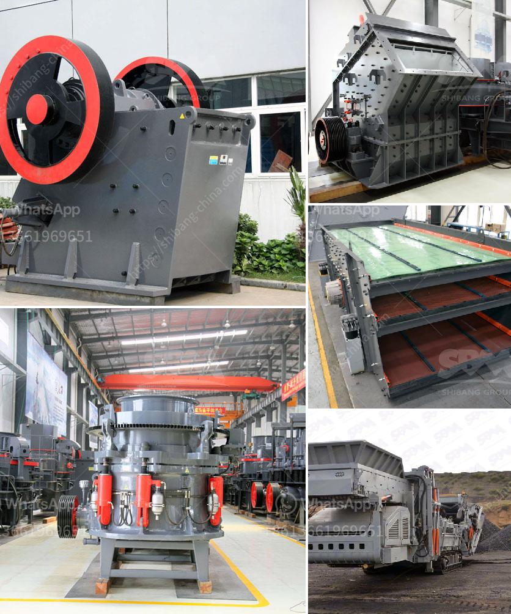

<h3>stearic acid coating machine for calcium carbonate</h3>
Calcium carbonate is widely used in various industries, such as plastics, rubber, papermaking, and construction materials, due to its excellent physical and chemical properties. However, its applicability and performance can be further enhanced by coating it with stearic acid. This process, known as surface modification, can be efficiently and precisely done using a stearic acid coating machine.

Stearic acid is a long-chain fatty acid widely found in natural fats and oils. It possesses numerous desirable features, such as low melting point, high chemical stability, and strong hydrophobicity. When combined with calcium carbonate, stearic acid can form a protective layer on the particle surface, resulting in improved dispersion, reduced agglomeration, and enhanced wettability.

One of the key advantages of employing a stearic acid coating machine is its ability to ensure consistent and uniform coating. The machine utilizes advanced technology to disperse stearic acid evenly on the calcium carbonate particles, preventing clumping and achieving a smooth surface. This not only enhances the appearance of the coated particles but also maximizes their functional performance.

In terms of dispersion, the stearic acid coating machine plays a crucial role in reducing the inter-particle friction between calcium carbonate particles. This friction can often lead to poor dispersion and agglomeration, negatively impacting the flowability and quality of the final product. The machine ensures that a thin but effective stearic acid layer is uniformly distributed, reducing the surface energy and enhancing the dispersibility of the coated particles.

Another significant advantage of using a stearic acid coating machine is the improvement in wettability. In many applications, calcium carbonate needs to be mixed with liquid or melted materials. However, due to its inherent hydrophobic nature, calcium carbonate tends to repel water and other polar solvents. The stearic acid coating machine addresses this issue by creating a hydrophobic barrier on the calcium carbonate particles, improving their compatibility and dispersibility in various liquid media.

Moreover, the stearic acid coating machine also enhances the thermal stability and chemical resistance of coated calcium carbonate particles. The stearic acid layer acts as a protective shield, minimizing the direct contact of the calcium carbonate with external elements. This, in turn, contributes to the optimized performance and prolonged lifespan of the coated particles.

In conclusion, the stearic acid coating machine for calcium carbonate offers numerous benefits and improvements to the powder properties. By uniformly applying a thin layer of stearic acid onto the particles' surface, the machine enhances dispersibility, reduces agglomeration, improves wettability, and enhances the thermal and chemical stability of the coated particles. Industries utilizing calcium carbonate can significantly benefit from incorporating a stearic acid coating machine into their production processes, resulting in higher quality products and improved overall performance.
<h3>Contact us</h3><ul><li><strong>Whatsapp:&nbsp;<a href="https://wa.me/8613661969651">+8613661969651</a></strong></li><li><a href="https://swt.shibang-china.com/?git&amp;zhl&amp;stearic acid coating machine for calcium carbonate"><strong>Online Service(chat now)</strong></a></li></ul><h3>Related</h3><ul><li><a href='mobile crushing plant price.md'>mobile crushing plant price</a></li><li><a href='gypsum manufacturing equipment.md'>gypsum manufacturing equipment</a></li><li><a href='ball mill outpot capicity 180 tph.md'>ball mill outpot capicity 180 tph</a></li><li><a href='best crushers for manufactured sand.md'>best crushers for manufactured sand</a></li><li><a href='enquiry about crusher.md'>enquiry about crusher</a></li></ul>