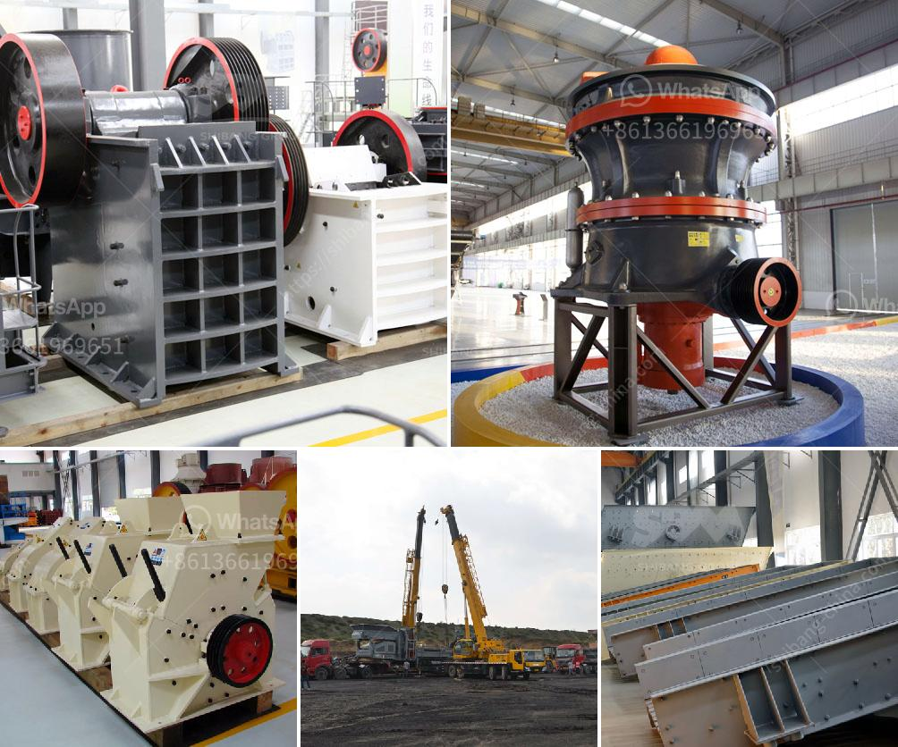

<h3>steel slag cement manufacture process ppt</h3>
Steel slag cement is a type of cement produced from the by-products of the steel manufacturing industry. This cement is made by blending ground granulated blast furnace slag with ordinary Portland cement to improve its properties and durability. The manufacture process of steel slag cement involves several steps and is explained below:

1. Obtaining steel slag: The first step in the process is to obtain steel slag, which is a by-product generated during the production of steel. This slag is composed of various impurities and non-metallic compounds that need to be processed before being used in cement manufacturing.

2. Crushing and grinding: The steel slag is crushed and ground into a fine powder. This process helps to increase the surface area of the slag, which improves its reactivity when mixed with cementitious materials.

3. Blending with Portland cement: The ground slag is then mixed with ordinary Portland cement in a specific ratio. The addition of slag enhances the cement's properties, such as strength, workability, and resistance to chemical attack.

4. Fineness and quality control: The blended slag cement undergoes fineness testing to ensure that it meets the desired particle size distribution. This is done by sieving the cement powder through different mesh sizes. Quality control measures, such as checking the chemical composition and setting time, are also carried out to ensure the final product meets the required standards.

5. Packaging and storage: After the manufacturing process, the steel slag cement is packaged in bags or bulk containers for transportation and storage. Proper packaging is essential to protect the cement from moisture and external factors that may affect its quality.

In conclusion, the manufacture process of steel slag cement involves obtaining steel slag, crushing and grinding it to a fine powder, blending it with Portland cement, testing and controlling its quality, and finally packaging it for distribution. This eco-friendly cement blend offers various advantages, including improved durability, reduced carbon emissions, and cost-effectiveness.
<h3>Contact us</h3><ul><li><strong>Whatsapp:&nbsp;<a href="https://wa.me/8613661969651">+8613661969651</a></strong></li><li><a href="https://swt.shibang-china.com/?git&amp;zhl&amp;steel slag cement manufacture process ppt"><strong>Online Service(chat now)</strong></a></li></ul><h3>Related</h3><ul><li><a href='cheap gravel crusher.md'>cheap gravel crusher</a></li><li><a href='gypsum making machine.md'>gypsum making machine</a></li><li><a href='mill ore grind size passing 200 mesh.md'>mill ore grind size passing 200 mesh</a></li><li><a href='250tph capacity of stone crusher.md'>250tph capacity of stone crusher</a></li><li><a href='harga sewa beli stone crusher kapasitas 30 ton per jam.md'>harga sewa beli stone crusher kapasitas 30 ton per jam</a></li></ul>