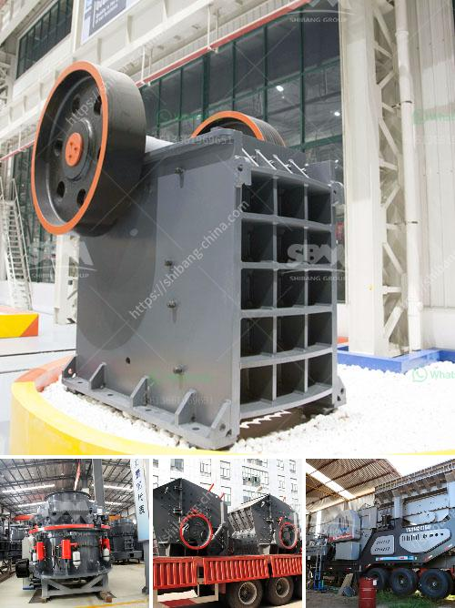

<h3>stne crusher for sale south africa</h3>
The stone crusher machine is broadly used in mining,metallurgy,development materials,highway,railway,water conservancy and chemical industries for crushing several resources with compression power under 350Mpa. Find out More of this Equiment

The granite has high hardness and homogeneous structure which is the key of stone with the longest mining history and one of the most commonly used rocks in construction material, road construction, and building industries. Granite stone crushers from SBM have great strength and can handle larger block sizes in the crushing process.

Limestone grinding line is a crucial part in limestone powder manufacturing process. Zenith supplies comprehensive limestone crushing, screening, grinding plant for the contractors and final users of limestone ore. There are two main stages in mineral production process, which include 
<h3>Contact us</h3><ul><li><strong>Whatsapp:&nbsp;<a href="https://wa.me/8613661969651">+8613661969651</a></strong></li><li><a href="https://swt.shibang-china.com/?git&amp;zhl&amp;stne crusher for sale south africa"><strong>Online Service(chat now)</strong></a></li></ul><h3>Related</h3><ul><li><a href='komatsu crusher in japan for sale.md'>komatsu crusher in japan for sale</a></li><li><a href='gypsum production plant suppliers in pakistan.md'>gypsum production plant suppliers in pakistan</a></li><li><a href='allis chalmers 54 x 74 gyratory crusher.md'>allis chalmers 54 x 74 gyratory crusher</a></li><li><a href='costs of ball mills.md'>costs of ball mills</a></li><li><a href='marble stone grinder mill.md'>marble stone grinder mill</a></li></ul>