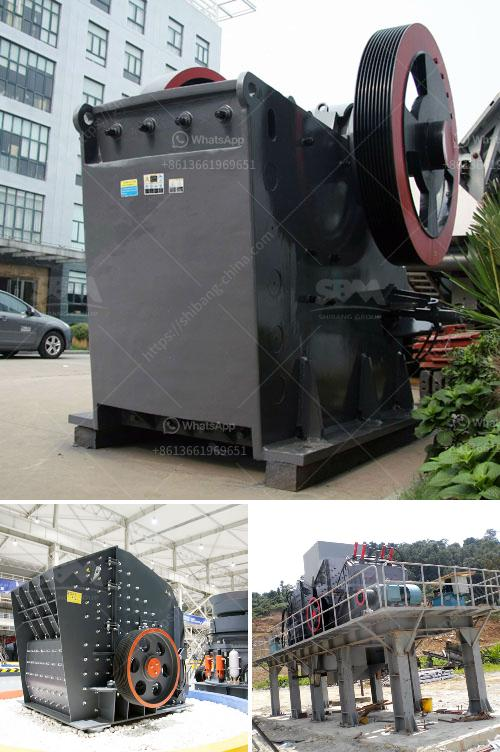

<h3>stone ball mill suppler kenya</h3>
Kenya is one of the resource-rich countries in Africa, which is located in eastern Africa. It is bordered by Ethiopia to the north, Somalia to the east, Tanzania to the south, Uganda to the west, and Sudan to the northwest. With a population of over 52 million people, Kenya has a diverse economy that includes agriculture, manufacturing, and services.

In recent years, Kenya has been experiencing rapid industrialization, which has led to an increased demand for construction materials such as stone. Stone is widely used in the construction sector for purposes such as building houses, roads, and bridges. To meet this growing demand, there is a need for stone processing equipment.

One essential equipment in stone processing is the stone ball mill. It is used to grind and crush stones into powder form, which can be used in various construction applications. The stone ball mill is especially suitable for large-scale stone processing plants.

When choosing a stone ball mill supplier in Kenya, it is essential to consider several factors. First and foremost, the supplier should have a solid reputation in the industry. They should have a track record of supplying high-quality stone ball mills to satisfied customers. Customer reviews and testimonials can provide valuable insights into the supplier's reputation.

Secondly, the supplier should offer a range of stone ball mills that can meet different production needs. Different stone processing plants may have different production capacities and requirements. Therefore, it is crucial to find a supplier that can provide stone ball mills of various sizes and capacities.

Price is another crucial factor to consider when choosing a stone ball mill supplier. The price should be reasonable and competitive compared to other suppliers in the market. However, it is also important not to compromise on quality for the sake of a lower price. The supplier should offer a balance between affordability and quality.

Additionally, the supplier should provide excellent after-sales service. Stone ball mills are complex machines that require regular maintenance and occasional repairs. A reliable supplier should offer technical support and assistance when needed. They should also provide spare parts and offer prompt and efficient repair services.

Furthermore, the supplier should have a clear delivery and payment policy. It is essential to clarify the delivery timeline and ensure that the supplier can meet the specified deadlines. As for payment, transparent payment terms should be discussed and agreed upon to avoid any misunderstandings or conflicts.

In conclusion, choosing the right stone ball mill supplier in Kenya is crucial for efficient stone processing operations. The supplier should have a solid reputation, offer a range of stone ball mills, provide competitive pricing, excellent after-sales service, and have clear delivery and payment policies. By considering these factors, stone processing plants in Kenya can find a reliable and trustworthy supplier to meet their stone ball mill needs.
<h3>Contact us</h3><ul><li><strong>Whatsapp:&nbsp;<a href="https://wa.me/8613661969651">+8613661969651</a></strong></li><li><a href="https://swt.shibang-china.com/?git&amp;zhl&amp;stone ball mill suppler kenya"><strong>Online Service(chat now)</strong></a></li></ul><h3>Related</h3><ul><li><a href='chrome concentrate wash plant for sale.md'>chrome concentrate wash plant for sale</a></li><li><a href='stone crushing production line.md'>stone crushing production line</a></li><li><a href='cost of hammer mill.md'>cost of hammer mill</a></li><li><a href='iron crushing equipment price.md'>iron crushing equipment price</a></li><li><a href='small sand washing machine.md'>small sand washing machine</a></li></ul>