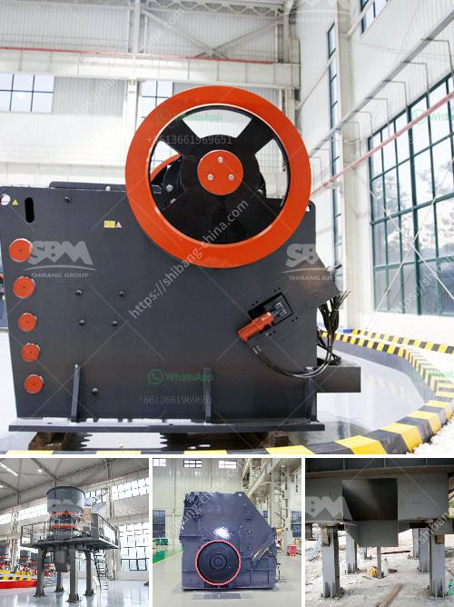

<h3>stone crashers price in south africa</h3>
When it comes to construction projects, one of the key components is always the material used. And when it comes to building structures, stone holds a special place due to its durability, versatility, and aesthetic appeal. However, with the vast array of stones available in the market, it is essential to have a clear understanding of stone crashers' prices in South Africa.

Stone crashers, also known as stone crushers or rock crushers, are machines designed to break down large rocks into smaller, more manageable sizes for construction purposes. They achieve this by utilizing a combination of mechanical force and compression, reducing the stone's size and making it easier to transport and use.

The price of stone crashers in South Africa can vary significantly based on multiple factors. Some of these factors include the type of stone crasher, the capacity or power consumed by the machine, and the brand or manufacturer.

The type of stone crasher you choose will depend on the specific requirements of your project. For instance, if you are in need of a primary stone crasher that can handle large rocks, a jaw crusher would be a suitable option. On the other hand, if you require finer crushed stones for later stages of construction, a cone crusher might be more appropriate.

Capacity or power consumed is another crucial factor that influences the price of stone crashers. In general, a higher capacity machine will cost more due to its ability to process larger quantities of stones. For example, a machine with a capacity of 100 tons per hour would be more expensive compared to a similar machine with a capacity of 50 tons per hour.

The brand or manufacturer also plays a significant role in determining the price. Well-established and renowned brands tend to have higher prices due to their reputation for producing reliable and high-quality stone crashers. Additionally, they often provide comprehensive after-sales services, such as maintenance and spare parts availability, which can be beneficial in the long run.

As for the actual prices, stone crashers in South Africa can range anywhere from R10,000 to R5 million or more, depending on the specifications mentioned above. It is crucial to gather quotes from different suppliers and compare prices to ensure you get the best value for your money.

In addition to the initial purchase cost, it is essential to consider operational expenses when budgeting for stone crasher prices. These expenses include electricity or fuel costs, maintenance, and the frequency of spare parts replacements. Opting for energy-efficient machines or those with lower maintenance requirements can help reduce these operational expenses.

Lastly, it is always recommended to consult with professionals or experts in the stone crushing industry. They can provide valuable advice and guidance, ensuring that you make an informed decision when purchasing a stone crasher. Their expertise can also help you negotiate better prices or identify potential discounts or promotions.

In conclusion, when it comes to buying stone crashers in South Africa, it is crucial to consider factors such as type, capacity, brand, and operational expenses. The price range for stone crashers varies greatly based on these factors, and it is advisable to gather quotes from different suppliers to find the best option for your construction project. Consulting with industry professionals is also highly recommended to ensure a well-informed decision and a successful construction endeavor.
<h3>Contact us</h3><ul><li><strong>Whatsapp:&nbsp;<a href="https://wa.me/8613661969651">+8613661969651</a></strong></li><li><a href="https://swt.shibang-china.com/?git&amp;zhl&amp;stone crashers price in south africa"><strong>Online Service(chat now)</strong></a></li></ul><h3>Related</h3><ul><li><a href='conveyor belt kazakhstan.md'>conveyor belt kazakhstan</a></li><li><a href='limestone crusher kenya.md'>limestone crusher kenya</a></li><li><a href='small quarry crusher for sale.md'>small quarry crusher for sale</a></li><li><a href='sand wash plant for sale in india.md'>sand wash plant for sale in india</a></li><li><a href='vertical roller mill in taiwan.md'>vertical roller mill in taiwan</a></li></ul>