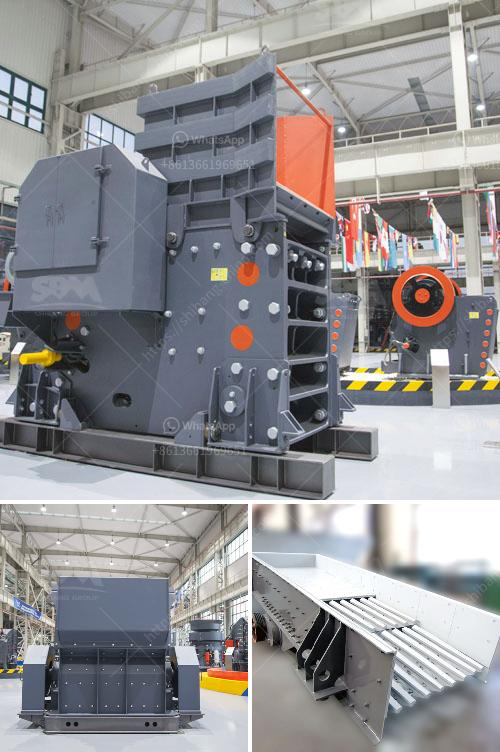

<h3>stone crosser companys at india</h3>
India is experiencing an unprecedented boom in infrastructure and construction projects. To meet the demands of this ever-growing industry, the need for efficient and reliable stone crosser companies has become paramount. These companies play a crucial role in the extraction, processing, and transportation of stones, which form the backbone of any construction project.

Stone crosser companies in India are involved in various activities, such as quarrying, cutting, and polishing of stones. They utilize state-of-the-art technology to ensure high-quality products and timely delivery to their clients. With their expertise and experience, these companies are able to efficiently handle large-scale projects, providing a cost-effective solution.

One of the key advantages of stone crosser companies in India is the abundant availability of natural stones in the country. India is blessed with a rich variety of stones, including marble, granite, sandstone, and limestone, among others. These stones are not only aesthetically pleasing but also durable and long-lasting, making them highly sought after in the construction industry worldwide.

Moreover, stone crosser companies in India are committed to sustainable practices. They employ environmentally friendly methods in their operations, ensuring minimal impact on the surrounding ecosystem. This includes efficient use of water, reclamation of mined-out areas, and proper waste management, thus setting an example for responsible mining practices.

Additionally, these companies are known for their skilled and trained workforce. They employ technicians, engineers, and geologists who possess extensive knowledge and expertise in stone extraction and processing techniques. This ensures that the stones are extracted with precision and processed to meet the desired specifications.

The stone crosser industry in India has witnessed significant growth over the years, contributing to the country's economic development. It has created employment opportunities, especially in rural areas where stone quarries are located. These companies have also played a role in empowering local communities by providing them with training and education on sustainable mining practices.

In conclusion, stone crosser companies in India have revolutionized the construction industry by providing a reliable supply of high-quality stones. With their advanced technology, commitment to sustainability, and skilled workforce, they are well-equipped to meet the ever-increasing demands of the industry. As India continues to embark on ambitious infrastructure projects, these companies will play a vital role in shaping the country's construction landscape.
<h3>Contact us</h3><ul><li><strong>Whatsapp:&nbsp;<a href="https://wa.me/8613661969651">+8613661969651</a></strong></li><li><a href="https://swt.shibang-china.com/?git&amp;zhl&amp;stone crosser companys at india"><strong>Online Service(chat now)</strong></a></li></ul><h3>Related</h3><ul><li><a href='bentonite processing.md'>bentonite processing</a></li><li><a href='puzzolana 200 tph cone crusher plant price.md'>puzzolana 200 tph cone crusher plant price</a></li><li><a href='quartz manufacturing plant in tamilnadu.md'>quartz manufacturing plant in tamilnadu</a></li><li><a href='jaw crusher tanzania.md'>jaw crusher tanzania</a></li><li><a href='stone crusher made in greece.md'>stone crusher made in greece</a></li></ul>