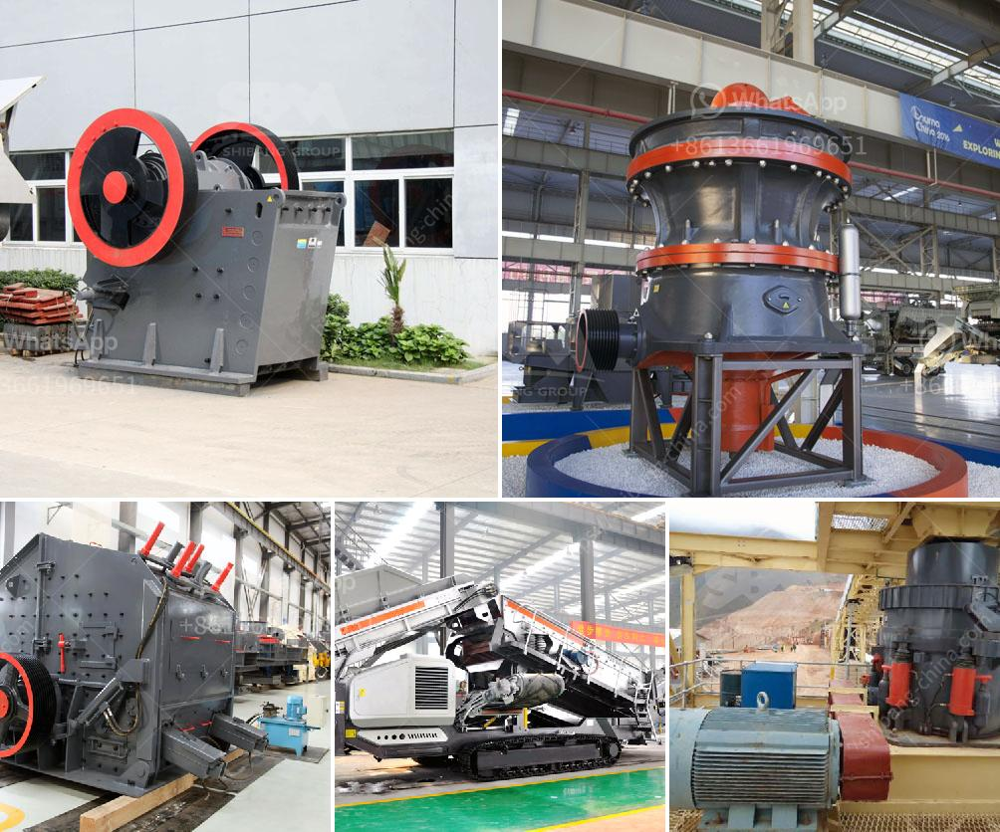

<h3>stone crush plant 4tph</h3>
A stone crush plant, also known as a stone crushing plant, is a renowned industry that operates on a large-scale basis. It enables the production of aggregates, sand, and many other materials required for various construction projects. This type of plant is equipped with multiple crushing machines of different specifications to produce the desired quantity and quality of materials.

At a capacity of 4tph, a stone crush plant effectively meets the demands of small to medium-sized construction projects. It serves as a pivotal component in the construction industry, as it helps in transforming large rocks into smaller sizes that can be used as gravel, sand, or even concrete aggregates. The plant operates by feeding the raw materials into the crushing machines, which then break them down into smaller sizes for further use.

One of the most important advantages of a stone crush plant is its cost-effective nature. The use of crushing machines allows for a significant reduction in transportation costs, as the raw materials can be directly sourced from nearby quarries. Additionally, the plant's centralized location ensures that the materials can be easily distributed to multiple construction sites.

Furthermore, a stone crush plant plays a critical role in sustainable development. By reusing materials from demolished structures, the plant helps in reducing waste and conserving natural resources. It minimizes the need for new raw materials, thereby contributing to environmental preservation.

Moreover, the stone crush plant facilitates economic growth by creating employment opportunities. It requires a skilled workforce for its operation and maintenance. Additionally, the plant generates income for the region by supplying construction materials to various industries.

In conclusion, a stone crush plant with a capacity of 4tph is an essential facility in the construction industry. It effectively transforms large rocks into smaller sizes, enabling the production of essential materials required for construction projects. This plant enables cost-effective operations, promotes sustainability, and contributes to the economic development of the region.
<h3>Contact us</h3><ul><li><strong>Whatsapp:&nbsp;<a href="https://wa.me/8613661969651">+8613661969651</a></strong></li><li><a href="https://swt.shibang-china.com/?git&amp;zhl&amp;stone crush plant 4tph"><strong>Online Service(chat now)</strong></a></li></ul><h3>Related</h3><ul><li><a href='iron crusher manufacturer.md'>iron crusher manufacturer</a></li><li><a href='iron ore processing machine.md'>iron ore processing machine</a></li><li><a href='stone crusher plates in south africa.md'>stone crusher plates in south africa</a></li><li><a href='cost of hammer mill.md'>cost of hammer mill</a></li><li><a href='limestone crushing plant input and output size.md'>limestone crushing plant input and output size</a></li></ul>