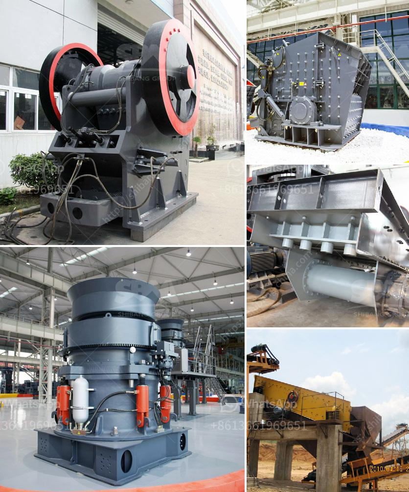

<h3>stone crush rate in islamabad</h3>
The capital city of Pakistan, Islamabad, is renowned for its stunning architecture, modern infrastructure, and well-planned urban development. As the city continues to grow, the construction industry is thriving at an unprecedented pace, driving the demand for raw materials like stone crush. In this article, we will explore the stone crush rate in Islamabad and shed light on the factors influencing this crucial element of construction.

Stone crush, also known as crushed stone or aggregate, is a key component used in various stages of construction, including the production of concrete, asphalt, and other building materials. Primarily sourced from quarries, it is the end product of mechanically crushing large rocks, boulders, or gravel.

The stone crush rate in Islamabad fluctuates due to several factors, including demand, transportation costs, and the availability of raw materials. Additionally, factors such as stone quality, distance from the quarry, and quarrying regulations play a crucial role in determining the rate.

Islamabad's robust construction industry generates substantial demand for stone crush. It is used in a wide range of projects, from residential buildings to commercial complexes and infrastructure development. As the demand for construction materials rises, so does the demand for stone crush.

The transportation costs associated with bringing stone crush from quarries located outside of Islamabad significantly impact the stone crush rate in the city. The farther the quarry, the higher the transportation costs, which subsequently affects the final cost of stone crush in Islamabad.

The availability of raw materials has a direct correlation with the stone crush rate. If quarries in and around Islamabad can readily supply the required quantity of stone crush, the rates are likely to remain stable. However, if there is a shortage or limited supply, the rates may witness an upward trend due to increased competition and higher demand.

The quality of stone crush is another crucial factor that influences the rate in Islamabad. High-quality stone crush is comparatively costlier, as it undergoes several processes to adhere to the required specifications. The quality of stone crush determines its durability, strength, and effectiveness in construction projects, making it an essential consideration for buyers.

Stone crush rates in Islamabad are also influenced by the distance between the city and the quarry. If the quarry is located nearby, the transportation costs decrease, resulting in a lower rate for stone crush. Conversely, if the quarry is considerably far, the costs increase, leading to a potential hike in the rates in order to compensate for the transportation expenses.

Government regulations and policies regarding quarrying operations can significantly impact the stone crush rate in Islamabad. If strict regulations are imposed on quarrying activities, it can restrict the availability of raw materials and potentially increase costs. Conversely, a well-regulated industry can ensure a stable supply and reasonable rates.

Stone crush is a crucial component in the construction industry, and its rate in Islamabad is subject to various factors such as demand, transportation costs, availability of raw materials, stone quality, distance from the quarry, and quarrying regulations. As the capital city continues to develop, it is vital for the construction industry and government bodies to work cohesively towards ensuring a stable supply and reasonable stone crush rates, ensuring sustainable growth and development in Islamabad.
<h3>Contact us</h3><ul><li><strong>Whatsapp:&nbsp;<a href="https://wa.me/8613661969651">+8613661969651</a></strong></li><li><a href="https://swt.shibang-china.com/?git&amp;zhl&amp;stone crush rate in islamabad"><strong>Online Service(chat now)</strong></a></li></ul><h3>Related</h3><ul><li><a href='dry grinding rod mill.md'>dry grinding rod mill</a></li><li><a href='manufacturer of balls of ball mill in india.md'>manufacturer of balls of ball mill in india</a></li><li><a href='500mm vertical mill stones price.md'>500mm vertical mill stones price</a></li><li><a href='granite crusher machines.md'>granite crusher machines</a></li><li><a href='jaw crusher refurbished.md'>jaw crusher refurbished</a></li></ul>