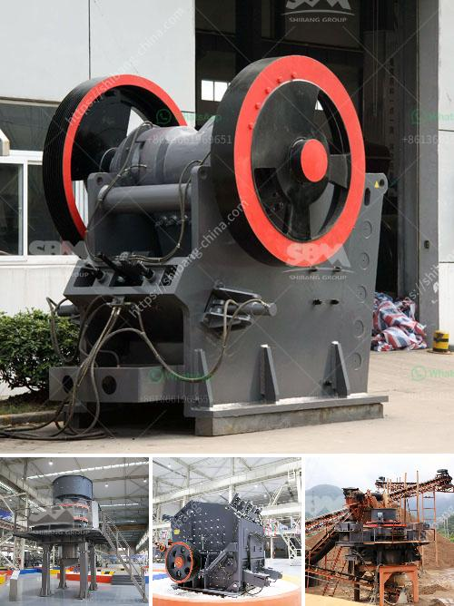

<h3>stone crusher buatan indonesia</h3>
Stone crusher buatan indonesia adalah mesin yang digunakan dalam proses penghancuran batu dengan menggunakan tenaga mesin. Dalam hal ini, mesin stone crusher buatan indonesia sangat mempermudah para pengusaha dalam melakukan bisnis batu karena dengan menggunakan mesin ini, mereka dapat menghancurkan batu dengan cepat dan mudah.

Mesin stone crusher buatan indonesia memiliki beberapa jenis mesin yang dapat dipilih oleh para pengusaha, tergantung pada jenis batu yang akan dihancurkan. Beberapa jenis mesin stone crusher antara lain jaw crusher, impact crusher, cone crusher, dan hammer crusher. Setiap jenis mesin memiliki fungsi dan cara kerja yang berbeda-beda, sehingga para pengusaha harus memilih mesin yang sesuai dengan kebutuhan mereka.

Jaw crusher adalah jenis mesin stone crusher yang paling umum digunakan. Mesin ini digunakan untuk menghancurkan batu dengan cara menghimpitnya antara dua lempengan baja. Jaw crusher dapat menghancurkan batu dengan ukuran maksimal sekitar 1.000 mm. Mesin ini sangat ideal digunakan untuk menghancurkan batu-batu besar dan keras.

Selain jaw crusher, mesin stone crusher buatan indonesia juga memiliki jenis mesin lain yang tidak kalah efektifnya. Misalnya, impact crusher adalah jenis mesin yang menggunakan energi kinetik untuk menghancurkan batu. Mesin ini sangat cocok untuk menghancurkan batu-batu dengan kekerasan sedang hingga tinggi. Selain itu, hammer crusher adalah jenis mesin yang menggunakan palu untuk menghancurkan batu. Mesin ini sangat cocok digunakan untuk menghancurkan batu-batu dengan ukuran kecil hingga sedang.

Mesin stone crusher buatan indonesia tidak hanya digunakan untuk menghancurkan batu, tetapi juga dapat digunakan untuk menghasilkan batu split yang kemudian dapat dijual kepada pihak lain. Batu split adalah hasil dari proses penghancuran batu menggunakan mesin stone crusher. Batu split memiliki ukuran tertentu sesuai dengan kebutuhan pelanggan. Oleh karena itu, proses penghancuran batu menggunakan mesin stone crusher buatan indonesia dapat menjadi bisnis yang menguntungkan.

Mesin stone crusher buatan indonesia juga memiliki keunggulan dalam hal kualitas dan harga. Mesin ini terbuat dari bahan berkualitas sehingga sangat tahan lama dan dapat digunakan untuk jangka waktu yang lama. Selain itu, harga mesin stone crusher buatan indonesia juga lebih terjangkau dibandingkan dengan mesin-mesin buatan luar negeri. Hal ini tentu memberikan keuntungan bagi para pengusaha yang ingin memulai bisnis batu.

Dalam era globalisasi ini, mesin stone crusher buatan indonesia juga dapat menjadi produk ekspor yang dapat membantu meningkatkan pendapatan negara. Pasar luar negeri sangat potensial untuk mesin ini, karena negara-negara lain juga membutuhkan mesin untuk menghancurkan batu. Oleh karena itu, pemerintah dan pengusaha di Indonesia perlu mendukung serta mempromosikan mesin stone crusher buatan indonesia agar dapat bersaing di pasar global.

Dalam kesimpulannya, mesin stone crusher buatan indonesia adalah mesin yang sangat berguna dalam proses penghancuran batu. Mesin ini tidak hanya dapat mempermudah para pengusaha dalam menjalankan bisnis batu, tetapi juga dapat meningkatkan pendapatan negara melalui ekspor. Oleh karena itu, pemerintah dan pengusaha di Indonesia perlu bekerja sama untuk memajukan industri mesin stone crusher buatan Indonesia.
<h3>Contact us</h3><ul><li><strong>Whatsapp:&nbsp;<a href="https://wa.me/8613661969651">+8613661969651</a></strong></li><li><a href="https://swt.shibang-china.com/?git&amp;zhl&amp;stone crusher buatan indonesia"><strong>Online Service(chat now)</strong></a></li></ul><h3>Related</h3><ul><li><a href='small sand washing machine.md'>small sand washing machine</a></li><li><a href='gold mining equipment suppliers.md'>gold mining equipment suppliers</a></li><li><a href='fly ash introduction in cement ball mill.md'>fly ash introduction in cement ball mill</a></li><li><a href='used portable stone crushers for sale ontario.md'>used portable stone crushers for sale ontario</a></li><li><a href='suppliers of coveyor belting in durban.md'>suppliers of coveyor belting in durban</a></li></ul>