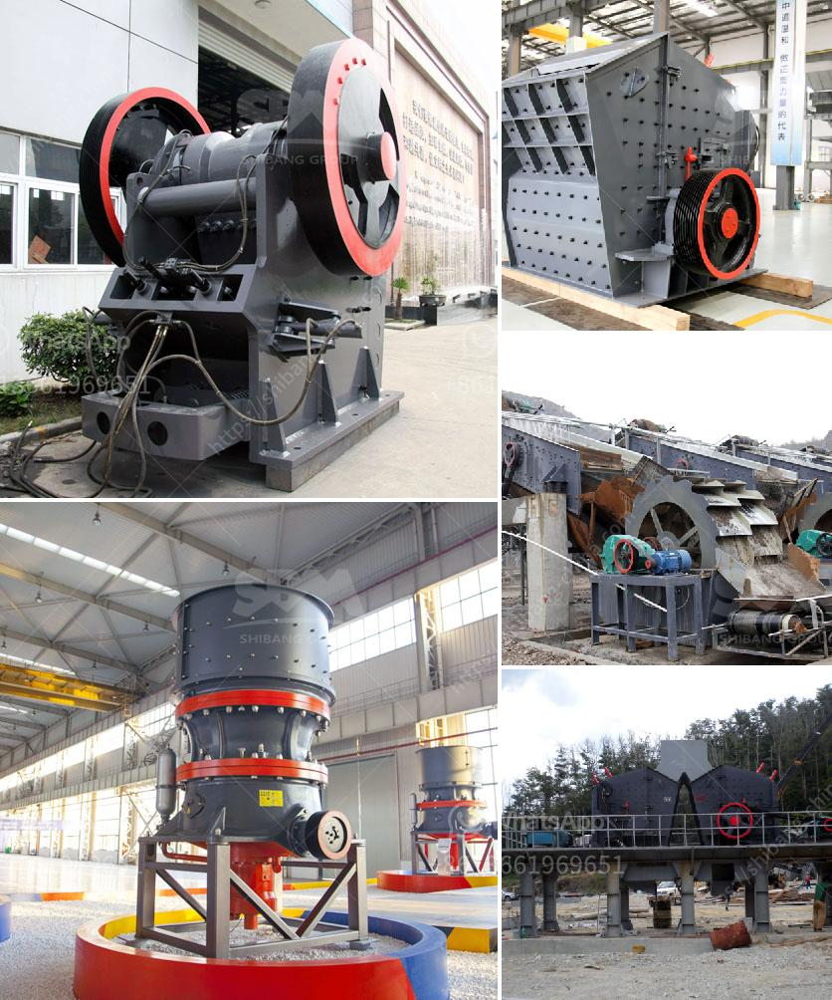

<h3>stone crusher for gold mining in south africa</h3>
Stone crusher is the main used mining equipment in South Africa mineral industry. Gold ore crushing plant machine will help to process the raw gold ore into high economic value products. South Africa General Introduction: South Africa is Africa's first largest economy country, and the national has a high standard of living in the whole Africa. South Africa's economy is relative stability compared to other African countries. South Africa's finance, legal, communications, energy, transport develop very well, and it has complete hardware infrastructure and the stock market. Gold, diamond production occupies first around the world. South Africa is one of the five big mining countries in the world. The mineral mining, manufacturing, and agriculture are three economy pillar industries. Deep ore mining technology is in a leading position in the world. So, South Africa is extremely rich in minerals and it is a large world producer of gold, diamond, and chrome, manganese, coal, tin, gold, uranium, copper, silver, magnetite, vanadium, and titanium. 

The proven reserves of gold in South Africa are estimated to be about 33.5 tons. Nearly 40% of the world’s total gold reserves are found in South Africa. Gold mining in South Africa, over the years, has been a major contributor to the economy and the establishment of the nation's infrastructure. New mines, such as the Burnstone Mine, 80km south-east of Johannesburg with an estimated value of ZAR 3, 5 billion, continue to open. Typical of gold mining in South Africa, the project is estimated to have a lifespan of 25 years. The opening of other gold mining projects, such as the R1 billion Doornkop South Reef Mine expected to deliver 82.8 tonnes of gold within a 20-year period adds to the idea that gold mining in South Africa is still a viable and lucrative industry.

Gold mining in South Africa typically involves methods such as panning, sluicing, dredging, hard rock mining, and by-product mining. For most effective gold mining in South Africa, the method used is hard rock mining, since reserves are typically fully encased in rock deep underground. The invention of industrial air cooling and air quality control systems saw gold mines reach unprecedented depths – the deepest being 3 900 meters. 

This called for machines with high horsepower and a higher operational capacity. Jaw crusher is the most common gold ore mining crushing equipment. Jaw crusher crushing ratio can reach 4-6. Therefore, jaw crusher is widely used for crushing all kinds of large size and high hardness materials. Jaw crusher simulates the movement of animals' two jaws. Movable jaw does periodic reciprocating motion, and sometimes separately from the fixed jaw plate, sometimes close. When moving, it turns and leaves the fixed jaw plate to break the big stone into small stones. The first crusher is often referred to as 'master' crusher. 

The longest and most rugged crusher is the jaw crusher. When feeding a jaw crusher, the material is poured into a crushing chamber with a jaw, which consists of a stationary and a movable plate. Crushing happens when the movable plate moves and compresses the material against the stationary plate. 

Lastly, the concrete block crusher plant could work individually or work together by combining flexibly aiming at coarse crushing and fine crushing. In addition to providing the flexibility of diverse configuration for the material delivery, unloading hopper can also supply power to the process system specifically.

In the process of the gold ore of coarse crushing, jaw crusher is mainly used as gold ore crusher. After coarse crushing process, you can get concentrated gold ore, more than 10 mm in diameter materials with standard CS series cone crusher and the screening machine. Gold ore crusher used in South Africa has also been used as a main crushing machine in gold ore crushing industry. Jaw crusher is the most common type of gold ore mining crushing equipment. Jaw crusher can reach four to six crushing ratio. Therefore, jaw crusher is widely used in crushing high hardness, medium-hard and soft rock, such as slag, construction materials, marble and other minerals. Gold ore mobile crusher is a new portable type gold stone crushing machine.

Gold ore mobile crusher can remove barriers broken place and situation and provide customers high efficiency, low capital projects factory. To the client, mobile crushing station is the best choice for South Africa gold mining line. In gold mining line, it involves read more...
<h3>Contact us</h3><ul><li><strong>Whatsapp:&nbsp;<a href="https://wa.me/8613661969651">+8613661969651</a></strong></li><li><a href="https://swt.shibang-china.com/?git&amp;zhl&amp;stone crusher for gold mining in south africa"><strong>Online Service(chat now)</strong></a></li></ul><h3>Related</h3><ul><li><a href='design calculation of jaw crusher pdf.md'>design calculation of jaw crusher pdf</a></li><li><a href='cannabis mechoire cannabis crusher in pakistan.md'>cannabis mechoire cannabis crusher in pakistan</a></li><li><a href='china coal washing plant.md'>china coal washing plant</a></li><li><a href='clay grinding mill machine price in china.md'>clay grinding mill machine price in china</a></li><li><a href='feldspar crusher cost.md'>feldspar crusher cost</a></li></ul>