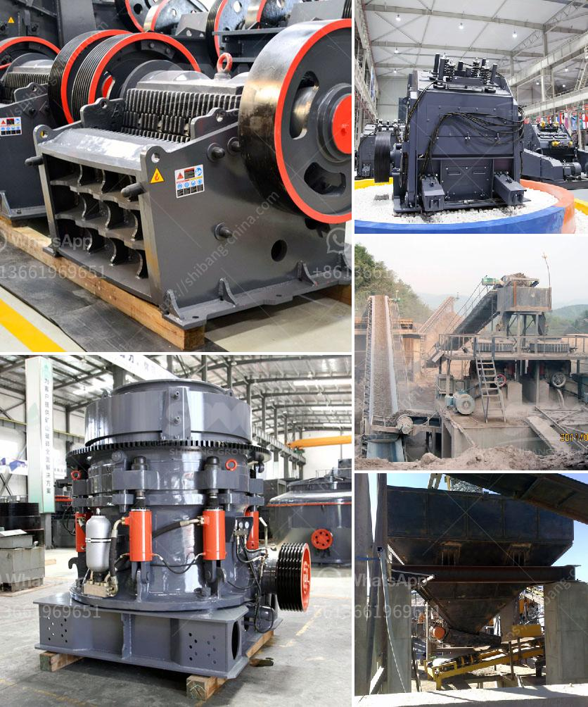

<h3>stone crusher for quarry</h3>
Stone crushing industry is an important industrial sector in the country engaged in producing crushed stone of various sizes depending upon the requirement which acts as raw material for various construction activities such as construction of roads, highways, bridges, buildings, canals etc. It is estimated that there are over 12,000 stone crusher units in India. The number is expected to grow further keeping in view the future plans for development of infrastructure of roads, canals and buildings that are required for overall development of the country.

In India, the Stone Crushing Industry sector is estimated to have an annual turnover of Rs. 5000 crore (equivalent to over US$ 1 billion) and is therefore an economically important sector. The sector is estimated to be providing direct employment to over 500,000 people engaged in various activities such as mining, crushing plant, transportation of mined stones and crushed products etc.

Stone crushing units are not stand alone crushing units, but stone mining is also associated with this activity; in fact stone mining is the primary and basic activity for the stone crushing units. Therefore this kind of industrial units need scrutiny while granting permission for environmental and mining operations, especially at the time of NOC (i.e. Consent to Establishment) stage. It should be analyzed in totality.

The mined stone is transported to the crusher sites by road through tractor trolleys or payloaders. The loaded trucks are either supplied directly from the quarry or from the distribution yard located in the vicinity of the quarry. After blasting, the crushed stone is trucked to the first crusher, from where it is sent on to the secondary process involving the use of cone crushers or impactors, which are used as secondary crushers. The crushed material is screened by a vibrating screen inclined at an angle of 15°20° with the horizontal to separate the desired product in different grades for further processing such as washing, sizing, etc.

Some stone crushing plants also include a screening process to separate the different sizes of crushed stone produced by the crushers. The large stones are subjected to an extra crushing process with the help of a primary crusher such as a jaw crusher. This process takes repeated until the large stone is crushed into smaller sized stone.

In summary, the stone crushing industry is a significant sector in India, which is contributing towards the economic development of the country. Stone crushers are vital for the construction industry as they help in improving the overall efficiency and efficacy of the infrastructure development projects. Key players operating in this industry include stone crushing equipment manufacturers, such as Terex Corporation, Sandvik AB, Metso Oyj, Komatsu Ltd., Astec Industries, IROCK Crusher, Thyssenkrupp, etc.
<h3>Contact us</h3><ul><li><strong>Whatsapp:&nbsp;<a href="https://wa.me/8613661969651">+8613661969651</a></strong></li><li><a href="https://swt.shibang-china.com/?git&amp;zhl&amp;stone crusher for quarry"><strong>Online Service(chat now)</strong></a></li></ul><h3>Related</h3><ul><li><a href='jaw crusher calculating.md'>jaw crusher calculating</a></li><li><a href='used gold mills for sale.md'>used gold mills for sale</a></li><li><a href='price for ball mills.md'>price for ball mills</a></li><li><a href='mobile gold processing plant 1 2 tph.md'>mobile gold processing plant 1 2 tph</a></li><li><a href='small capacity double roller crusher for sale.md'>small capacity double roller crusher for sale</a></li></ul>