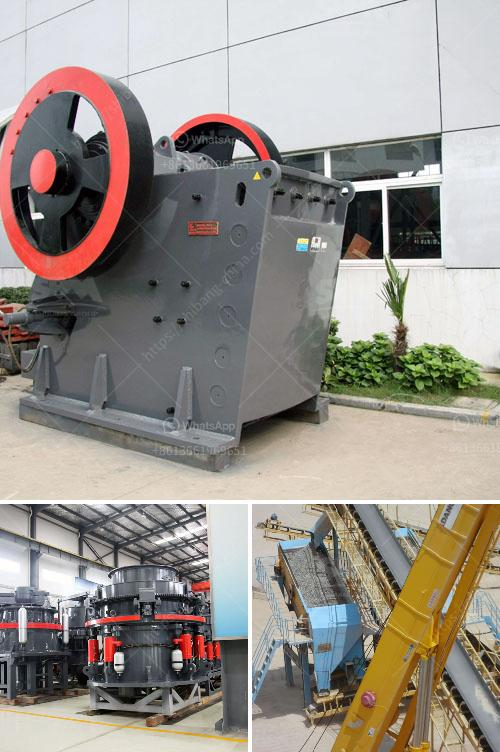

<h3>stone crusher for sale price in dubai</h3>
Stone crusher is one of the main equipment used in mining and quarrying industry, commonly used as a primary crusher. In stone crushing production line and sand making line, this machine is mainly used for crushing various materials with compression strength less than 320MPa into medium-sized grains.

There are different types of stone crusher for sale in Dubai with various applications. It includes jaw crusher, impact crusher, cone crusher, mobile crusher, sand making machine, and many more. The stone crusher prices in Dubai are different according to different types and capacity.

The production efficiency and operation cost of different types and models of stone crushers are different. For example, a jaw crusher is suitable for crushing large stones with relatively high hardness, while impact crusher is more suitable for crushing medium hardness stones with good discharging particle shape. Cone crusher is mainly used for crushing stones with medium hardness and high hardness.

In Dubai, there are many suppliers of stone crusher machines. To choose suppliers, we should consider not only the quality of the machines but also the service of the supplier. If the machines have high quality and stable performance, the supplier's service is good, and the market price is low, the stone crusher for sale will have a great profit.

The supplier's service is also an important aspect in the choice of a stone crusher supplier. It is better to choose a company with a strong after-sales service system. In addition, customers should also consider the comprehensive strength of the supplier, including the scale of the supplier, the reputation of the supplier, the price of the equipment, and the quality of the equipment. Only in this way can customers choose the best supplier and the most suitable stone crusher for sale in Dubai.

The stone crusher for sale in Dubai is welcomed by the local clients and this stone crusher has wide application in the construction industry. Stone crusher is ideally suitable for primary and secondary crushing. The highest anti-pressure strength of crushed material is 320MPa. It is widely used in mining, metallurgy, construction, highway, railroad, and chemistry industries and etc.

Many leading stone crusher supplier in Dubai offer you professional design and high-quality crushing plant in Dubai. The stone crusher equipment including vibrating feeder, jaw crusher for primary crushing, impact crusher for secondary crushing, cone crusher and VSI crusher for tertiary crushing.

There is also portable mobile stone crusher for sale with crushing capacity up to 600 tons per hour. It has a great crushing performance in the work of medium-size crushing, fine crushing, and super fine crushing. The crusher is widely used in the industries of metallurgy, building, road building, chemical and silicate.

In conclusion, stone crusher for sale in Dubai is welcomed by the local clients and this stone crusher is widely used in many industries, such as metallurgy, mining, chemical, cement, construction, fireproofing and ceramics industry. The cone crusher from China is suitable for both metallic minerals and non-metallic minerals, such as iron ore, nonferrous metal ore, limestone, quartzite, sandstone, pebble, and so on. If you want to get more detailed information you can contact us.
<h3>Contact us</h3><ul><li><strong>Whatsapp:&nbsp;<a href="https://wa.me/8613661969651">+8613661969651</a></strong></li><li><a href="https://swt.shibang-china.com/?git&amp;zhl&amp;stone crusher for sale price in dubai"><strong>Online Service(chat now)</strong></a></li></ul><h3>Related</h3><ul><li><a href='second hand mobile crushers and screens south africa.md'>second hand mobile crushers and screens south africa</a></li><li><a href='mobile stone crusher price ph.md'>mobile stone crusher price ph</a></li><li><a href='stone crusher plant in punjab.md'>stone crusher plant in punjab</a></li><li><a href='silica quartz grinding mill 400 mash.md'>silica quartz grinding mill 400 mash</a></li><li><a href='small jaw crusher.md'>small jaw crusher</a></li></ul>