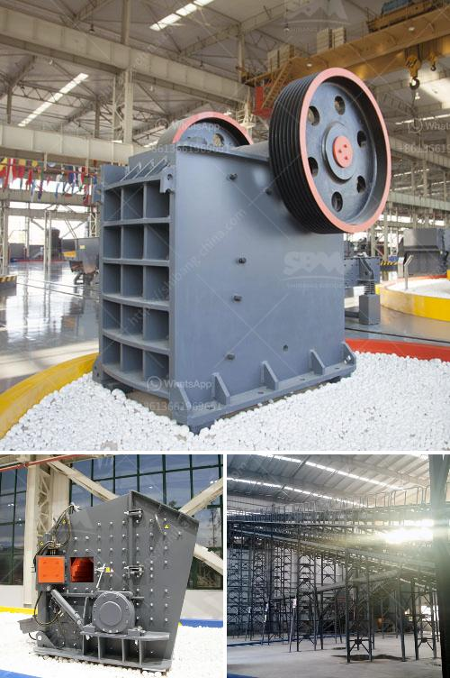

<h3>stone crusher in cameroon</h3>
Stone crusher, also called rock crusher, is used for crushing stones and rocks as an efficient crushing equipment. It is mainly used for crushing various stones and large rocks, such as limestone, granite, basalt, river gravel, etc. In the field of construction waste treatment, stone crusher is mainly used for the crushing and processing of materials such as construction waste. As an indispensable equipment in the infrastructure construction industry, stone crusher has greatly promoted the development of the Cameroonian construction industry.

Stone crusher in Cameroon plays a great role in the mining industry. It is mainly used in metallurgical, chemical, building materials, hydropower and other fields. As we all know, the exploitation of natural resources will cause environmental damage, especially when large-scale mining operations occur. Stone crusher can effectively crush and recycle the construction waste, which not only improves the environment, but also creates economic benefits for Cameroon.

Cameroon is rich in mineral resources, such as iron ore, gold ore, bauxite, diamonds, etc. There are many small quarries and mines in the country, which require professional stone crushing equipment to crush and process these materials. Stone crusher has become an indispensable equipment in these industries. With the development of infrastructure construction in Cameroon, the demand for stone crusher is increasing, which promotes the development of stone crusher manufacturers and creates a good market environment.

In conclusion, stone crusher plays a vital role in the development of Cameroon's mining industry. It not only promotes the development of the construction industry, but also protects the environment and creates economic benefits. As the demand for stone crusher continues to increase, more and more manufacturers are entering this industry. It is believed that the stone crusher industry in Cameroon will continue to develop and contribute to the country's economic growth.
<h3>Contact us</h3><ul><li><strong>Whatsapp:&nbsp;<a href="https://wa.me/8613661969651">+8613661969651</a></strong></li><li><a href="https://swt.shibang-china.com/?git&amp;zhl&amp;stone crusher in cameroon"><strong>Online Service(chat now)</strong></a></li></ul><h3>Related</h3><ul><li><a href='cost of conveyor belt system for coal loading.md'>cost of conveyor belt system for coal loading</a></li><li><a href='used concrete crushers uk.md'>used concrete crushers uk</a></li><li><a href='clay processing techniques.md'>clay processing techniques</a></li><li><a href='calcium carbonate rock crusher.md'>calcium carbonate rock crusher</a></li><li><a href='copper oxide concentrate processing machines.md'>copper oxide concentrate processing machines</a></li></ul>