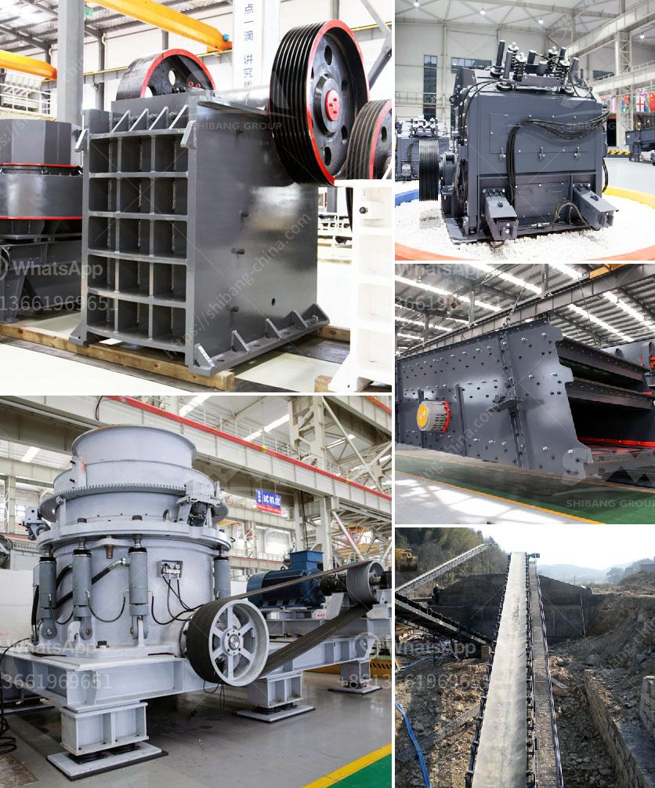

<h3>stone crusher in inda or parkistan</h3>
Stone crushing industry is a dominant but still environmentally unorganized sector in Pakistan. Its different operations cause significant environmental impacts including air and noise pollution in the vicinity as well as vibration effects, which affect the productivity of the workers. As for this particular topic, numerous stone crushers in the region are located near streams and rivers, which makes for convenient transportation and access to raw materials.

Stone crushers utilize hundreds of laborers in small-scale and large-scale employees producing crushed stone for various purposes, such as making concrete, building roads, and providing materials for infrastructure projects in Pakistan. Stone crushing industry is an important industrial sector in the country and it plays an increasingly important role in the development of Pakistan's economic. The stone crushing industry in India has been growing rapidly due to increasing demand from the construction industry and the present emphasis on developing the country's infrastructure.

According to a report by the World Bank in 2012, over 12,000 stone crushing units are operating in India, which provides direct employment to around 500,000 individuals engaged in various activities such as mining, crushing, and transportation. Artisanal and small-scale mining (ASM) is a significant source of income for millions of people globally, including in areas of high poverty and marginalization. However, it is well-known that these activities also have negative social and environmental impacts.

In Pakistan, workers in stone crushing industry are mainly exposed to the detrimental occupational environment nearby. The main health effects are on the respiratory system, as crystalline silica (quartz) accumulates in the lungs, leading to the development of silicosis, a fatal lung disease. In addition, the massive dust emissions generated by the stone crushing process create dangerous conditions for the workers and the local population.

Moreover, unregulated and unscientific stone crushing operations even generate a horrible sound that can cause unbearable noise pollution, which is a nuisance to the nearby residents. Additionally, the vibrations generated by stone crushers create a hazardous environment for people living in close proximity to these operations. The vibration limits specified in various standards and recommendations are not followed, leading to adverse impacts on the workers' health and discomfort for the surrounding communities.

The government of Pakistan and India should take urgent measures to address these issues. Strict regulations and policies should be implemented to control and mitigate the environmental impacts caused by stone crushing industry. Authorities should also conduct regular inspections to enforce compliance with these regulations.

Proper awareness campaigns should be conducted to educate workers about the risks associated with their occupation and how they can protect themselves. Adequate safety measures should be provided, including the provision of personal protective equipment and regular health check-ups for workers.

Furthermore, community engagement should be an integral part of addressing the concerns of people living near stone crushing operations. Open dialogues and consultations with affected communities will help to address their grievances and develop sustainable solutions.

In conclusion, the stone crushing industry is an important sector in both Pakistan and India, which produces raw material for various construction activities. However, it also contributes to air and noise pollution, leading to significant health risks for the workers and the surrounding community. Government entities, stakeholders, and the general public should work together to develop and implement effective strategies to mitigate the adverse environmental and health impacts caused by the stone crushing industry.
<h3>Contact us</h3><ul><li><strong>Whatsapp:&nbsp;<a href="https://wa.me/8613661969651">+8613661969651</a></strong></li><li><a href="https://swt.shibang-china.com/?git&amp;zhl&amp;stone crusher in inda or parkistan"><strong>Online Service(chat now)</strong></a></li></ul><h3>Related</h3><ul><li><a href='quote for stone crusher.md'>quote for stone crusher</a></li><li><a href='limestone grinding mill unit.md'>limestone grinding mill unit</a></li><li><a href='cyanide processing plants for sale usa.md'>cyanide processing plants for sale usa</a></li><li><a href='bentonite clay crusher for sale.md'>bentonite clay crusher for sale</a></li><li><a href='carbon black pulverizer.md'>carbon black pulverizer</a></li></ul>