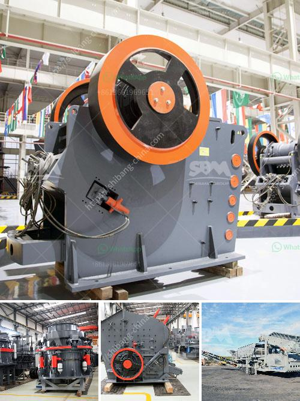

<h3>stone crusher in philippines</h3>
Stone crusher in Philippines is used for crushing limestone, marble, bentonite, clays, feldspar, phosphate rock for aggregate, sand gravel production. Mobile stone crusher for sale in Philippines

Mobile stone crusher for sale in Philippines 2012-12-21 08:28:25 – liming mobile stone crusher plant is designed with the inner strength and outer durability to …

rock grinding mills in the philippines. mills philippines grinding used rock crushers for sale in the philippines mill grinding machine in used rock crushers for sale in the philippines mill grinding machine in Machine Tool is a leading provider of used machine tools in Singapore, Malaysia, Get Price; Food Grinderss for the Best Price in Malaysia Lazada

Mar 13, 2021 · Gold Trommel Wash Plant For Sale. Dewo machinery can provides complete set of crushing and screening line, including Hydraulic Cone Crusher, Jaw Crusher, Impact Crusher, Vertical Shaft Impact Crusher (Sand Making Machine), fixed and movable rock crushing line, but also provides turnkey project for cement production line, ore beneficiation production line and drying production line

coconut shell grinder machine for sale philippines. coconut shell portable grinder machine india Portable Coconut Grinder machine Philippines. . ball mill for coconut shell; Contact Us. Tel: . Stone Crusher Machine for grinding coconut shell grinding machine phi

Mobile Crusher For Sale In Philippines, Cone Crusher Supplier . Besides the mobile crusher, jaw crusher and cone crusher Business Opportunities for sale: Zambales & Central Luzon, Philippines Houses for sale, real estate promotions, business opportunities Sto Domingo Nueva Ecija three (3) adjacent lots in HIGHWAY LOCATION near Quarry

Application for Quarry Permit MANDATORY REQUIREMENTS – Five (5) sets _____; 2) duly accomplished application form (MGB Form 8-4); and ... is already imposed upon the 5th year of the permit following the rate ... on sand and gravel, crushed stone. MGB-III-10 - Briefing for "Veterinary Scientists in Quarry Sites" (922) (Republic of the

The cracker powder unit mainly used for crackers, Like triangle, square, round cracker, to make biscuit surface hole bigger. Semi automatic,can use separately or combination with cracker machine in line.400kg/h- 800 kg/h output. Parameter: Model:FLM-600 (With super cooler) Grain size:3-10um；Production capacity:400-800kg/h；...zhengyuan hammer mill.Index of /agri-07 rubble-hdates aaspdesign.org Review; Download Links: Size: N/A: Rank:

Mineral Crushing Plant Suppliers In Derby. Mineral stone crushing plant manufacturers in u k mineral crushing plant manufacturer in uk mineral stone crushing plant manufacturers mineral crushing plant manufacturer in uk crushing amp screening garriock bros industry you need equipment that gives your company the edge over the competition get price and support online mineral crushing plant

7. A method of sorting rock from a rock-crushing plant into piles of different sizes comprising: conveying the rock impinging the rock against an array of spaced stationary impact members to produce impaction fractures of the rock; grading the rock impaction fractures according to size by passing the rock flow through an array of spaced stationary impact members of different sizes to isolate

usa grinding mill for quartz grains, process crusher. usa grinding mill for quartz grains 181 Views. The liming is the professional mining equipments manufacturer in the …

Indonesia stone crusher. 989 likes · 16 talking about this · 5 were here. china jaw crusher,cone crusher,impact crusher,sand making machine sale. Jump to. Sections of this page. Accessibility Help. Press alt + / to open this menu. ... 50-800tph stone crushing plant need more tech datails: whatsapp+8613803716624

Business listings of Cone Crusher manufacturers, suppliers and exporters in Faridabad, कोन क्रशर विक्रेता, फरीदाबाद, Haryana along with their contact details & address. Find here Cone Crusher, suppliers, manufacturers, wholesalers, traders with Cone Crusher prices for buying

The grinding medium should provide maximum performance, minimum wear rate and highest grinding transfer to cost ratio (Jankovic, Wills, & Dikmen, 2016). It is important to predict the rate of mill

Foretec Oy is specialising in drilling and blasting. We provide a variety of services to quarries, civil construction companies and forestry with four types of drilling and blasting machines. The company has a fully equipped and modernised SQS audited workshop with efficient maintenance services for Foretec SPT, EC Drill, Douglass Rivett, Schramm/Christensen, Casagrande C6, Manitou and Hydco drilling and …

Aug 16, 2020 · "Jaw Crusher Market 2020 Global Industry Research report presents an in-depth analysis of the Jaw Crusher market size, growth, share, segments, manufacturers, and technologies, key trends

200 tph stone crusher plant rwanda. 100 tph mobile crusher in india for sale The sand making machines are of high efficiency and high performance crusher low in maintenance and low operating 100200 tph mobilefor rockcobblenonore and so produced by 100 200 tph mobile stone processing line meet the national standard of sand used in construction

"gold mining equipment" in South Africa 56 Ads for "gold mining equipment" in South Africa. Other ways to browse. Popular : room to rent. house to rent. flat to rent. bmw. ps4. job. bmw e30. house for sale. fridge for sale. polo. vr6. quad bike. ps5. cottage to rent. couch. land cruiser. cars under r30000. house for rent. playstation 4. xbox one

best selling lead flotation machine in africabest selling lead flotation machine in africa.Flotationis widely used for roughing, concentrating and reverseflotationof nonferrous metals that include copper,lead,zinc, nickel and molybdenum, ferrous metal and nonmetallic minerals.it is a high technological enterprise that integrated research

Autoclaved Aerated Concrete Crushing System The fineness, concentration and uniformity of raw materials will directly affect the strength and quality of your AAC blocks.; AAC Block Line Batching, Pouring Section When batching for autoclaved aerated concrete, to ensure that the strength of AAC block or panel conforms to the requirements for a designed formula

Search through the results in Crushers advertised in South Africa on Junk Mail. ... Crushers Sheffield Hammer Crusher and Impact Crushers from R85 000. Germiston Yesterday. Contact Advertiser ... As a GIANT fan of the Roco products, we decided to order their R9R Jaw Crusher. Being touted as one of the best in the industry

Calcium Carbonate, Talc, Mica, Dolomite, Quartz, Limestone, Coal etc. Our Product Fineness Range: 2500 Mesh. Our Production Capacity: Calcite Coated Powder 4800MT/Month. Calcite Uncoated Powder 3000MT/Month. Coated Calcite(Activated Calcium Carbonate) 3600MT/Month. Limestone Powder (Calcium Carbonate) 7200MT/Month
<h3>Contact us</h3><ul><li><strong>Whatsapp:&nbsp;<a href="https://wa.me/8613661969651">+8613661969651</a></strong></li><li><a href="https://swt.shibang-china.com/?git&amp;zhl&amp;stone crusher in philippines"><strong>Online Service(chat now)</strong></a></li></ul><h3>Related</h3><ul><li><a href='ball mill bekas surabayajn.md'>ball mill bekas surabayajn</a></li><li><a href='list of equipments needed to start gold mining.md'>list of equipments needed to start gold mining</a></li><li><a href='list of sponge iron factories in hospet.md'>list of sponge iron factories in hospet</a></li><li><a href='granite crusher machines.md'>granite crusher machines</a></li><li><a href='china coal mill grinder manufacturers china.md'>china coal mill grinder manufacturers china</a></li></ul>