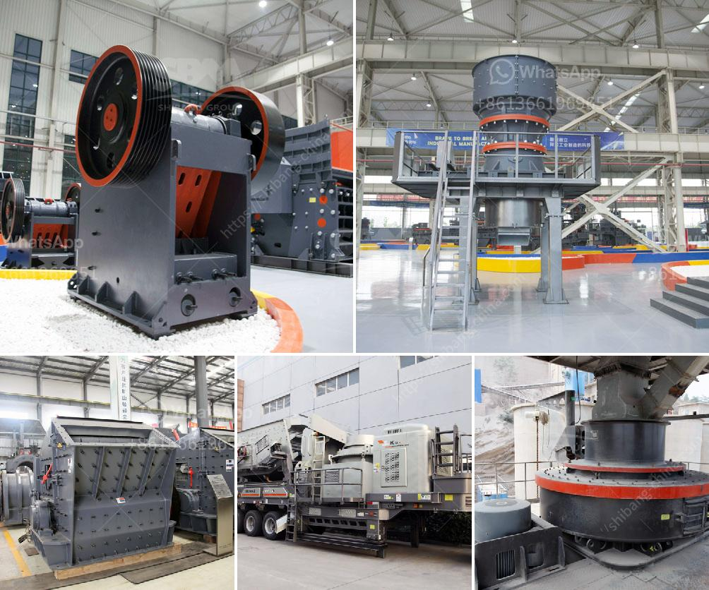

<h3>stone crusher machine 120 tonne per hour</h3>
Stone crusher machine plays an important role in the stone production line, determines the final product quality and the production benefit. So choose a good crusher is particularly important. Through this stone crushing pant project report, to give you some advice on how to select suitable crushing machine.

There are a variety of crushers in the market , but if you want to choose the right machine for your stone production line, you should consider the following factors:

The first factor to consider when choosing a crushing machine is the nature of the material you will be crushing. Different types of stone have different hardness levels. Therefore, the crusher needs to be selected according to the type and hardness of the material to be crushed.

The production capacity requirement is also a primary factor to consider when selecting crushing machines. The specification of the machine will determine the output capacity that it can produce.

The operation costs include the electricity cost, maintenance and wearing parts cost, feeding and transportation cost, labor cost, etc. Therefore, you need to take all these factors into consideration before purchasing a stone crusher machine.

Considering the above factors, it is important to choose a reliable machine with what you need. The following factors can also affect the crusher selection for stone crushing production line:

The choice of crusher type and model depends on the density, hardness, and output of the material to be crushed. Jaw crusher and impact crusher are widely used in the mining, smelting, building materials, highways, railways, water conservancy, and chemical industries. They have the advantages of large crushing ratio, uniform particle size, simple structure, reliable work, easy maintenance, and low operating cost.

The range of equipment configuration is related to the characteristics of the stone production line, the output, and the application of the finished products. Different equipment combinations can meet different production requirements.

With the increasing concern for environmental protection, it is necessary to choose a stone crusher machine with low pollution to achieve the goal of green production.

In conclusion, stone crusher machine is suitable for crushing stone, iron ore, and other minerals. Based on its outstanding performance in the mining industry, it is widely used in the mining, metallurgical, construction, road construction, chemical, silicate, and other industries. If you are interested in our stone crusher machine, please contact us for more information. We will provide you with professional advice and solutions.
<h3>Contact us</h3><ul><li><strong>Whatsapp:&nbsp;<a href="https://wa.me/8613661969651">+8613661969651</a></strong></li><li><a href="https://swt.shibang-china.com/?git&amp;zhl&amp;stone crusher machine 120 tonne per hour"><strong>Online Service(chat now)</strong></a></li></ul><h3>Related</h3><ul><li><a href='silica sand production line stone crusher machine.md'>silica sand production line stone crusher machine</a></li><li><a href='cone crusher mobile uk.md'>cone crusher mobile uk</a></li><li><a href='georgia cement mini plant.md'>georgia cement mini plant</a></li><li><a href='coal mine wash plants mpumalanga south africa.md'>coal mine wash plants mpumalanga south africa</a></li><li><a href='cement plant in assam.md'>cement plant in assam</a></li></ul>