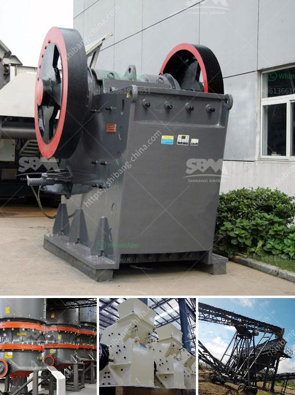

<h3>stone crusher machine manufacturer in india</h3>
India is an important market of stone crusher equipments in mining industry. To make a high efficiency development of mineral resources, stone crusher machine has take an important role in India mining industry. This facilitated the rise of the stone crusher machine manufacturer in India.

Now, there are many syone crusher manufacturers in India, the machines they sell are various,such as jaw crusher, impact crusher, cone crusher, hammer crusher and so on.These manufacturers can be broadly divided into the following categories.

The first category are particularly famous companies, who are international brands, have many years' mining experience. These well-known international brands have become technological innovation to improve the brand's comprehensive strength. However, because they are leaders in the accumulation of technology can be more forefront of technology and quality assurance, zenith crusher machine company give you the all-round service.Robo Sand Making Machinery Rates.

Artificial sand making machine Artificial sand & natural river sand Sand is widely used in highway construction, concrete making, etc. As the field of industry application gradually expanded, the gradual application of natural sand work more and failed to keep pace with the various sectors of modern world development needs. For the most part, machine-made sand is produced to meet the great needs. Here you can learn more about definition of machine-made sand and its wide applications.

According to the current situation, our company is actively exploring foreign markets, to provide customers with high quality brand and crusher machine, have excellent technical strength, and provide customers with satisfactory after-sales service, various problems that occur in the production process within 24 hours to accept, research solutions.

India's infrastructure is constantly being upgraded and developed. The basic construction projects such as country roads, urban roads and buildings can be built, the demand for stone crusher machine including related products such as pipes, wire, cables and so on is increasing year by year. Machines are in the most popular infrastructure projects, and they are indispensable for economic development.

To promote the better development of the infrastructure projects and the mining industry, government will offer some fiscal incentives for the manufacturers, who do research and develop new products and technologies. In order to make India’s mining industry become better and better, many manufacturers are continually investing in R&D. As a professional stone crusher machine manufacturer in India, SBM can provide numerous stone crusher machines, like hydraulic cone crusher, impact crusher, vertical shaft impact crusher, hydraulic portable crusher plant, etc. Our machines are designed and developed by our skilled engineers and technicians with utmost precision. Our wide range of machines serve the purpose of all types of crushing applications.

To conclude, these are the major points related to the stone crusher machine manufacturer in India. To choose the right kind of machine for your requirements, it is essential to gather information about the crushing equipment. There are plenty of suppliers and manufacturers of stone crusher machines in India. Shiv Scientific Industries is one of them. It is highly acknowledged for delivering a flawless range of machines.
<h3>Contact us</h3><ul><li><strong>Whatsapp:&nbsp;<a href="https://wa.me/8613661969651">+8613661969651</a></strong></li><li><a href="https://swt.shibang-china.com/?git&amp;zhl&amp;stone crusher machine manufacturer in india"><strong>Online Service(chat now)</strong></a></li></ul><h3>Related</h3><ul><li><a href='mobile crushing plant price.md'>mobile crushing plant price</a></li><li><a href='jaw crusher of zenith.md'>jaw crusher of zenith</a></li><li><a href='rock crusher machine in malaysia.md'>rock crusher machine in malaysia</a></li><li><a href='jaw crushers prices in zimbabwe.md'>jaw crushers prices in zimbabwe</a></li><li><a href='hammer mill machine 20hp.md'>hammer mill machine 20hp</a></li></ul>