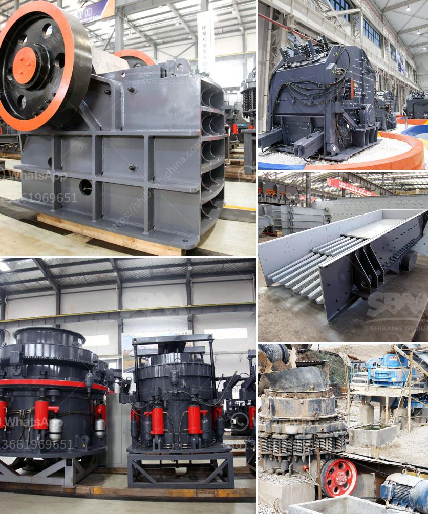

<h3>stone crusher machine pakistan</h3>
Stone Crusher Machine Pakistan is a valuable asset for mining and industrial purposes, with potential for excavating large amounts of raw materials that would otherwise be lost or overlooked. The stone crushing industry has a substantial contribution to the construction industry and provides employment opportunities for thousands of people.

In Pakistan, stone crushing machines are mostly used for limestone mining and crushing plant. The machines produced by the renowned manufacturers such as Atlas Copco, Parker, and Mascus are capable of crushing granite, marble, basalt, limestone, quartz, and other materials into various sizes and shapes.

The stone crusher machine Pakistan is preferred by various industries such as mining, metallurgy, building materials, highway, railway, water conservancy, chemical, etc. It is used to crush large, medium, and small-sized stones and ores into finer particles. The machine consists of a frame, an eccentric shaft, a large pulley, flywheel, moving jaw, side guard plate, toggle plate, toggle backseat, adjusting screw, a return spring, a fixed jaw plate, and a movable jaw plate.

Stone crushing machines in Pakistan are energy-efficient and easy to operate. The machines are equipped with advanced features that enhance their functionality and performance. They are widely used in the primary, secondary, and tertiary crushing stages. The crushing capacity ranges from 50 to 1000 tons per hour, making it suitable for various applications.

The stone crusher machine Pakistan is available in stationary, portable, and mobile models to meet the diverse needs of customers. It can be operated independently or in conjunction with other machines to form a complete crushing and screening system. The mobile version is a convenient option for site-to-site transportation and can be easily moved around within the mining or construction site.

In conclusion, the stone crusher machine Pakistan is a vital investment opportunity that offers lucrative returns for its users. It is versatile, efficient, and durable, making it an essential tool for any mining or construction project. Pakistan, with its vast natural resources, can benefit greatly from the usage and expansion of this industry. Moreover, the stone crushing industry can become an important contributor to Pakistan's economy by providing employment opportunities and driving forward various infrastructural developments.
<h3>Contact us</h3><ul><li><strong>Whatsapp:&nbsp;<a href="https://wa.me/8613661969651">+8613661969651</a></strong></li><li><a href="https://swt.shibang-china.com/?git&amp;zhl&amp;stone crusher machine pakistan"><strong>Online Service(chat now)</strong></a></li></ul><h3>Related</h3><ul><li><a href='conveyor belts in east africa.md'>conveyor belts in east africa</a></li><li><a href='quartz crusher plant.md'>quartz crusher plant</a></li><li><a href='cement manufacturing equipment pdf.md'>cement manufacturing equipment pdf</a></li><li><a href='rock crusher suppliers.md'>rock crusher suppliers</a></li><li><a href='harga vibrating screen.md'>harga vibrating screen</a></li></ul>