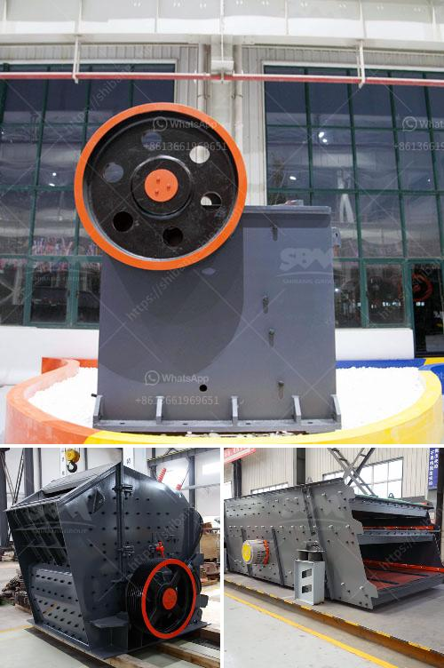

<h3>stone crusher machine price in ethiopia</h3>
The harsh economic situation in Ethiopia has been attributed to the significant growth of the construction sector, which has resulted in increased demands for construction materials such as sand, gravel, and crushed stones. This relentless demand for construction materials has prompted the need for efficient and reliable stone crushing machines that can enable seamless processing of rocks and stones into aggregates used in various construction projects.

The stone crusher machine manufacturing industry in Ethiopia is rapidly growing due to the increase in demand for aggregates used in construction material, road base, and asphalt pavements. These machines are applicable in quarries, mines, and recycling plants where raw materials such as rocks and stones are extracted and processed to produce aggregates suitable for specific construction applications.

The price of stone crusher machines in Ethiopia has been a popular topic for customers to consider while purchasing these machines. The tendency of purchasing stone crusher machines in recent years has been driven by the development of the mining industry, governments' stimulus policies, highway engineering, and various enterprises' investment.

Nowadays, with the advancement of technology, the performance of stone crusher machines has been continuously improved, and the price has become more and more competitive. The stone crushing machine price is determined by factors such as the production capacity, product quality, design, and manufacturer availability.

With the prices of raw materials fluctuating, economies of scale play a crucial role in providing competitive prices. However, due to the limited local resources, stone crusher machines found in various regions of Ethiopia are not designed equally. In order to ensure the crushing efficiency of hard rock materials, we customize our stone crusher plants according to the specific requirements of each customer.

Due to the promising economic future in Ethiopia, demand for construction machinery continues to grow. To cater to the increasing demands of contractors and developers, we have equipped our machines with the latest technology to deliver high-quality aggregates required for upcoming construction projects.

In conclusion, we can say that the cost of stone crusher machines in Ethiopia is low but the quality also remains low. On the other hand, the price of the stone crusher machines is also influenced by factors such as transportation costs, import/export policies, taxes, and duties. Therefore, customers should research carefully before purchasing stone crusher machines to ensure that they get the best value for money. Additionally, it is advisable to consider the after-sales service provided by the manufacturer to ensure the smooth operation of the machines and address any issues that may arise.
<h3>Contact us</h3><ul><li><strong>Whatsapp:&nbsp;<a href="https://wa.me/8613661969651">+8613661969651</a></strong></li><li><a href="https://swt.shibang-china.com/?git&amp;zhl&amp;stone crusher machine price in ethiopia"><strong>Online Service(chat now)</strong></a></li></ul><h3>Related</h3><ul><li><a href='stone crusher plant price.md'>stone crusher plant price</a></li><li><a href='stone crusher in philippines.md'>stone crusher in philippines</a></li><li><a href='hammer mill for sale philippines.md'>hammer mill for sale philippines</a></li><li><a href='sand crusher price.md'>sand crusher price</a></li><li><a href='300 tons per hour mobile crawler crusher price.md'>300 tons per hour mobile crawler crusher price</a></li></ul>