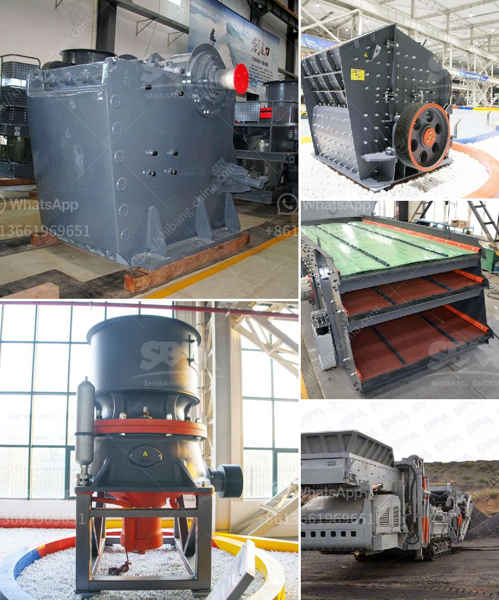

<h3>stone crusher machine price kenya</h3>
Stone crusher machine price in Kenya is also diverse. The stone crusher machine price in Kenya varies depending on the crusher type and specific crusher model. The crushing materials capacity and output size will also influence the stone crusher machine price. Zenith provides various types and models of stone crusher machines in Kenya for different scale crushing operations. Zenith produces large, medium and small scale stone crushers for the Kenya clients. Below is the detailed stone crusher machine price in Kenya analysis.

Application: Crushing of granite, basalt, limestone, rock, concrete, aggregate, gravel, dolomite, quartz and over 130 kinds of stones in mining, quarry, construction, road and other industries.

Zenith stone crushers are specifically designed to meet the unique needs of the natural stone counter top industry. Our rugged, reliable stone crushing machines offer exceptional performance and value. They are ideal for primary and secondary crushing applications in quarrying, mining, recycling, infrastructure and construction.

The complete stone crushing plant includes aw crusher, impact crusher, cone crusher, belt conveyor, and vibrating screen. about posho mill prices in kenya. Click & Chat Now manual stone crusher machine south africa | Crusher News

The price of stone crusher machine in Kenya has many influencing factors, such as the crusher type, jaw crusher, cone crusher, hammer crusher, impact crusher, etc. For these different types of crushers, the prices are not the same. In addition, the price of different types of stone crusher machines in Kenya is also different. Zenith sales managers understand that the price of sand and gravel in many regions of Kenya is about ten times higher than that in mainland China. The gravel crusher is usually used to crush gravel, basalt, limestone, quartz, stone, cobblestone, pebble, pumice, etc. The quality of the finished product after crushing completely meets the GB14685-2001 standard, which provides qualified aggregates for highways, railways, water conservancy, concrete batching plant and other industries.

In conclusion, the stone crusher machine price in Kenya varies in different models and capacity. However, the price indeed changes with the crusher type and specific crusher model. The above mentioned stone crusher machine price in Kenya will be used as a reference.
<h3>Contact us</h3><ul><li><strong>Whatsapp:&nbsp;<a href="https://wa.me/8613661969651">+8613661969651</a></strong></li><li><a href="https://swt.shibang-china.com/?git&amp;zhl&amp;stone crusher machine price kenya"><strong>Online Service(chat now)</strong></a></li></ul><h3>Related</h3><ul><li><a href='limestone ball mill machine.md'>limestone ball mill machine</a></li><li><a href='cement grinding plants.md'>cement grinding plants</a></li><li><a href='cost per ton quarry production.md'>cost per ton quarry production</a></li><li><a href='technical specs 400mm x 600mm jaw crusher.md'>technical specs 400mm x 600mm jaw crusher</a></li><li><a href='used portable crusher for sale south africa.md'>used portable crusher for sale south africa</a></li></ul>