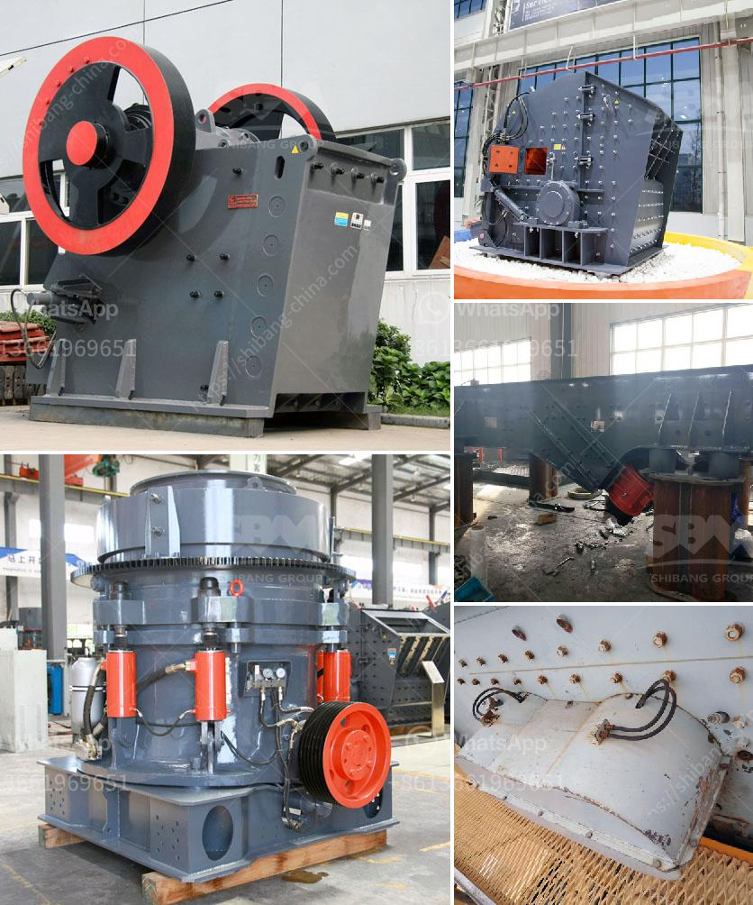

<h3>stone crusher machine prices</h3>
Stone crusher machines are used for crushing stones in various industries such as mining, construction, and recycling. With the rapid development of these industries, the demand for stone crusher machines is increasing at a significant pace. Stone crusher machines are now available in a variety of models and configurations, each designed for specific applications and prices can vary depending on the size, capacity, and features of each machine.

When it comes to stone crusher machine prices, it is important to understand the factors that influence the pricing. Different types, models, and sizes of stone crushers are available in the market, and prices can vary depending on factors such as the brand, model, and specifications of the machine. Additionally, the materials used in the construction of the machine and the technology utilized can also impact the price.

One of the primary factors that influence stone crusher machine prices is the brand. Brand awareness and reputation play a crucial role in the pricing of stone crushers. Some well-established brands have a higher price tag due to their reliability, performance, and after-sales support. These brands have a proven track record and are often considered a safer investment.

Another important factor that affects stone crusher machine prices is the type and model of the machine. Different types of stone crushers are designed to meet different requirements. Some machines are designed for smaller projects, while others are capable of handling larger tasks. Stone crusher machines can range in output capacities from 5 TPH to over 1000 TPH.

The price range of stone crusher machines can be broadly categorized into three categories, including budget-friendly, mid-range, and high-end machines. Budget-friendly machines are generally used for small-scale projects, while mid-range and high-end machines are commonly used for larger projects and heavy-duty applications.

The specifications and features of stone crusher machines also play a vital role in determining their prices. Machines with advanced technology, higher crushing capacity, and better automation are usually priced higher than basic models. Additional features such as electronic control systems, adjustable settings, and dust suppression can also impact the price.

Apart from the above factors, the location and availability of stone crusher machines can also affect their prices. Machines located in regions with high demand and limited supply can have higher prices due to increased competition. In contrast, areas with multiple suppliers and lower demand can have more competitive prices.

It is essential to research and compare prices from different suppliers to find the best value for your investment. Online platforms and directories can be used to compare prices, read reviews, and gather information about different stone crusher machine suppliers. It is also recommended to consult with experts or professionals in the industry to make an informed decision.

In conclusion, stone crusher machine prices can vary significantly depending on brand, type, model, specifications, and location. Factors such as brand reputation, machine specifications, and features, as well as availability and competition, all play a role in determining the prices. With the wide range of options available, it is important to research and compare before making a purchase to find the best stone crusher machine that suits your requirements and budget.
<h3>Contact us</h3><ul><li><strong>Whatsapp:&nbsp;<a href="https://wa.me/8613661969651">+8613661969651</a></strong></li><li><a href="https://swt.shibang-china.com/?git&amp;zhl&amp;stone crusher machine prices"><strong>Online Service(chat now)</strong></a></li></ul><h3>Related</h3><ul><li><a href='cement making machinery for whole cement plant.md'>cement making machinery for whole cement plant</a></li><li><a href='iron processing machine.md'>iron processing machine</a></li><li><a href='crushing machine 500 tons per hour size.md'>crushing machine 500 tons per hour size</a></li><li><a href='aggregate crusher supplier.md'>aggregate crusher supplier</a></li><li><a href='what is the cost of limestone crushing process.md'>what is the cost of limestone crushing process</a></li></ul>