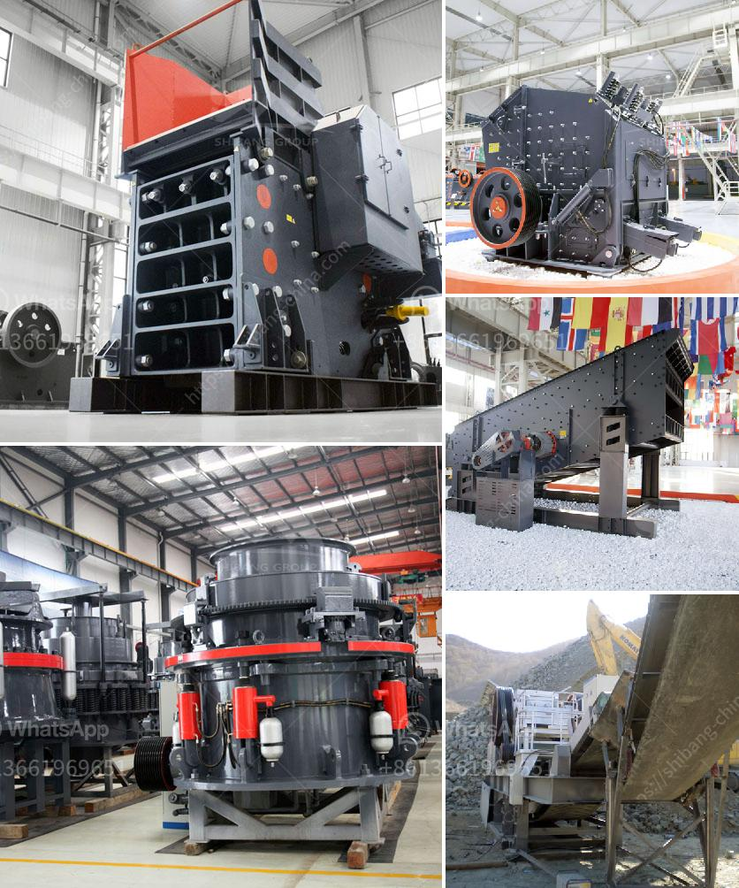

<h3>stone crusher machinery list in india</h3>
Stone crusher machinery in India is the largest and leading crusher manufacturer in China, with over 30 years experience. Since 1980s, they have been manufacturing and supplying a wide range of crushing, screening and washing plants to different industries such as mining, quarrying, aggregate, metallurgy, building material, mineral processing and chemical industry. They mainly crushes various types of stones and rocks, including limestone, granite, quartz, basalt, pebble, dolomite, sandstone, etc.

The stone crusher machinery is designed to provide maximum productivity and high reduction ratio. From large primary jaw crusher and impact crusher to cone crusher and VSI series for secondary or tertiary stone crushing, SBM can supply the right crusher as well as complete crushing plant to meet your material reduction requirements.

There are also different types of stone crusher machine setup across India according to geographical locations, production requirements, hardness and particle size. Typically, the stone crushing plant units having only one Jaw type crusher used as primary or secondary crusher along with one or maximum 2 screens are grouped as small stone crushers.

With the help of stone crusher machinery list in india, you can search from hundreds of stone crusher machinery manufacturers or suppliers in India. They provide different types of crusher machines for various purposes. Apart from the crusher industry, in terms of economic development, India has a wide range of applications in minerals such as mining machinery, chemical industry, construction waste disposal and refractory materials. India has been known for its mining industry, but mainly coal mining. It is obvious that coal needs to be used in the mining industry. So we need a coal crushing production line to further crush the coal to a certain size for better utilization. Therefore, coal crushing production line equipment is widely used and welcomed in India.
<h3>Contact us</h3><ul><li><strong>Whatsapp:&nbsp;<a href="https://wa.me/8613661969651">+8613661969651</a></strong></li><li><a href="https://swt.shibang-china.com/?git&amp;zhl&amp;stone crusher machinery list in india"><strong>Online Service(chat now)</strong></a></li></ul><h3>Related</h3><ul><li><a href='jaw crusher plates supplier philippines.md'>jaw crusher plates supplier philippines</a></li><li><a href='how to grind stone into fine powder.md'>how to grind stone into fine powder</a></li><li><a href='silica quartz grinding mill 400 mash.md'>silica quartz grinding mill 400 mash</a></li><li><a href='how to make a stone crusher.md'>how to make a stone crusher</a></li><li><a href='coal roller mill.md'>coal roller mill</a></li></ul>