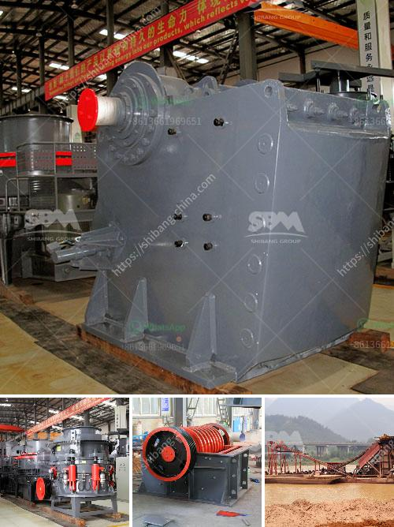

<h3>stone crusher made in greece</h3>
Stone crusher is a machine designed to reduce large rocks into smaller rocks, gravel, or rock dust. In ancient times, crushers were hand-held stones, where the weight of the stone provided a boost to muscle power, used against a stone anvil. Today, it is still used in many industries, such as construction and mining, to reduce the size of rocks and stones.

One of the oldest and most durable stone crusher machines is the jaw crusher. It has been widely used in primary crushing in various industries, such as mining, metallurgy, building materials, highway, railway, water conservancy, and chemical industries. The jaw crusher has a high crushing ratio, large feed opening, and even particle size.

Another type of crusher is the cone crusher. It is mainly used in secondary or tertiary crushing process in mining or quarrying applications. The cone crusher provides excellent reduction and product cubicity for the production of high-quality aggregate and sub-base materials.

Greece has a rich history in stone crushing, which dates back to ancient times. However, nowadays Greece is not a significant producer of stone crushers. That does not mean that Greek manufacturers do not exist, but they are not as well-known as those from other countries.

Greece still imports a significant amount of stone crushers from other countries. These machines are used in various applications, such as construction, mining, and recycling. The imported crushers offer excellent performance and durability, making them highly sought after in the Greek market.

In conclusion, stone crushers are an essential part of the construction and mining industry. Greece imports a considerable number of stone crushers due to their high demand. Although Greek manufacturers also produce stone crushers, they are not as well-known compared to those from other countries. However, with the increasing demand for infrastructure development and the government's focus on promoting local industries, it is expected that Greek manufacturers will become more recognized in the stone crusher market.
<h3>Contact us</h3><ul><li><strong>Whatsapp:&nbsp;<a href="https://wa.me/8613661969651">+8613661969651</a></strong></li><li><a href="https://swt.shibang-china.com/?git&amp;zhl&amp;stone crusher made in greece"><strong>Online Service(chat now)</strong></a></li></ul><h3>Related</h3><ul><li><a href='thailand granite quarry crusher.md'>thailand granite quarry crusher</a></li><li><a href='mineral hammer mill.md'>mineral hammer mill</a></li><li><a href='coal crusher machine manufacturer in india.md'>coal crusher machine manufacturer in india</a></li><li><a href='calcium carbonate rock crusher.md'>calcium carbonate rock crusher</a></li><li><a href='the roller grinding mill.md'>the roller grinding mill</a></li></ul>