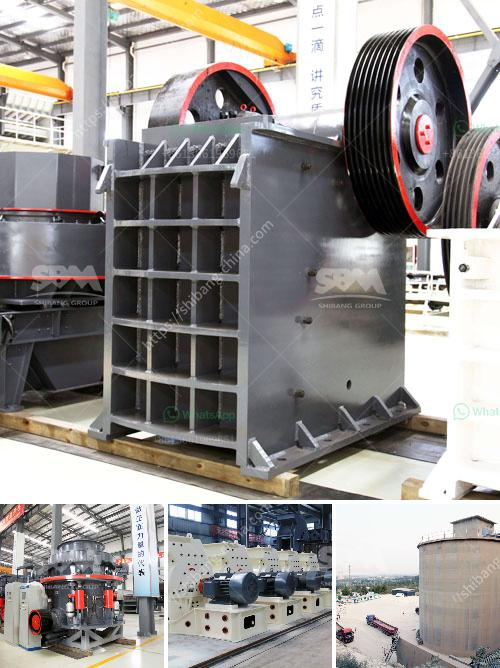

<h3>stone crusher of aar</h3>
The stone crusher of AAR is a machine designed to break down large rocks into smaller rocks, gravel or rock dust. With its powerful motor and rugged build, it is capable of handling even the toughest material, making it an essential piece of equipment for any construction site.

One of the key features of the stone crusher is its ability to crush any type of material. Whether it is granite, limestone, or even concrete, the machine can handle it with ease. This makes it a versatile tool that can be used for a wide range of projects, from building roads to constructing buildings.

Another advantage of the stone crusher is its efficiency. With its powerful motor, it can crush large quantities of material in a short amount of time, saving both time and labor. This makes it an ideal choice for contractors who need to complete their projects on time and within budget.

The stone crusher is also designed to be easy to maintain. With its robust construction and high-quality components, it is a machine that can withstand the rigors of heavy use. Regular maintenance and inspection ensure that the machine operates at maximum efficiency and minimizes downtime, ensuring continuous productivity on the job site.

In addition to its durability and efficiency, the stone crusher is also designed with safety in mind. It features a number of safety features, such as safety guards, emergency stop buttons, and a user-friendly control panel. This ensures that operators can work with peace of mind, knowing that they are protected from any potential hazards.

Moreover, the stone crusher of AAR is also environmentally friendly. It is designed to minimize dust and noise emissions, ensuring that it complies with the highest environmental standards. This makes it a sustainable option for construction projects, as it helps to reduce pollution and protect the surrounding environment.

In conclusion, the stone crusher of AAR is a powerful and versatile machine that is essential for any construction site. With its ability to crush a wide range of materials and its efficiency, it saves both time and labor, making it an ideal choice for contractors. Its durability, ease of maintenance, and safety features make it a reliable tool that can withstand heavy use and ensure continuous productivity. Furthermore, its environmentally friendly design makes it a sustainable option for construction projects. Whether it is for building roads, constructing buildings, or any other application, the stone crusher offers a reliable and efficient solution.
<h3>Contact us</h3><ul><li><strong>Whatsapp:&nbsp;<a href="https://wa.me/8613661969651">+8613661969651</a></strong></li><li><a href="https://swt.shibang-china.com/?git&amp;zhl&amp;stone crusher of aar"><strong>Online Service(chat now)</strong></a></li></ul><h3>Related</h3><ul><li><a href='stone crusher plant best granite stone crushers.md'>stone crusher plant best granite stone crushers</a></li><li><a href='bentonite processing.md'>bentonite processing</a></li><li><a href='dust control for crushing plants.md'>dust control for crushing plants</a></li><li><a href='how to start sand business in nigeria.md'>how to start sand business in nigeria</a></li><li><a href='philippines crusher equipment.md'>philippines crusher equipment</a></li></ul>