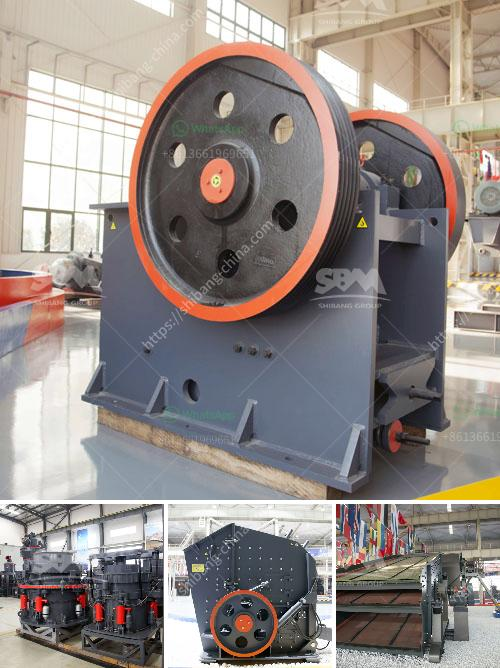

<h3>stone crusher plant best granite stone crushers</h3>
Stone crusher plant can crush limestone, granite, basalt and so on to product aggregates for ready mix concrete, building material, construction site and others. Various final product sizes are available with customizing crushing plant system solution.

The stone crushing plant has versatile application such as iron ore crushing plant, gold ore crusher plant, bauxite crushing plant, copper beneficial plant, nickel mining plant, manganese crushing plant, limestone crushing plant, feldspar crushing plant and so on. This crushing plant is widely used for crushing hard limestone, granite, basalt, gravel, metallurgic slag or artificial sand making for hydroelectric power, building material, highway, city construction, etc.

Different models of equipment are combined to meet different customers’ demands according to different craft requirements. The performance of the plant aims at reducing the wastage of the stone, increasing the crushing rate, and improving the production efficiency. The working process of the stone crusher plant is: stone material is evenly sent to jaw crusher for primary crushing through vibrating feeder, the crushed rock is conveyed by belt conveyor to cone crusher for further crushing; secondary crushed rock is conveyed by belt conveyor to vibrating screen for screening, rock with qualified particle size is conveyed by belt conveyor to finished product pile. Oversized rock is conveyed by belt conveyor to cone crusher for further crushing, while oversized rock is conveyed by belt conveyor to impact crusher for secondary crushing.

This stone crusher plant is mainly applied to medium or over-hard ores and stones, such as granite, iron ore, marble, etc. Its capacity can be 20-30 tons per hour, final aggregates size can be 0-10,10-20,20-30,30-40mm(changeable), primary jaw crusher is equipped with enhanced jaw plates and has high reduction ratio. Main frame and flywheels use thicker steel plate; We apply impact crusher as the secondary crusher. Water pipe or other washing equipment are equipped to clean the finished products.

Overall, this stone crusher plant proves to be efficient and reliable, providing a safe and productive working environment with excellent quarrying results. It is available with different configurations, ensuring its versatility for a wide range of applications. Whether for commercial use or for construction projects, owning a stone crusher plant is definitely the best choice for any quarry or mine owner.
<h3>Contact us</h3><ul><li><strong>Whatsapp:&nbsp;<a href="https://wa.me/8613661969651">+8613661969651</a></strong></li><li><a href="https://swt.shibang-china.com/?git&amp;zhl&amp;stone crusher plant best granite stone crushers"><strong>Online Service(chat now)</strong></a></li></ul><h3>Related</h3><ul><li><a href='vibration screen machine in pakistan.md'>vibration screen machine in pakistan</a></li><li><a href='mobile crusher tanzania.md'>mobile crusher tanzania</a></li><li><a href='stne crusher for sale south africa.md'>stne crusher for sale south africa</a></li><li><a href='rock crusher for sale philippines.md'>rock crusher for sale philippines</a></li><li><a href='used gold mills for sale.md'>used gold mills for sale</a></li></ul>