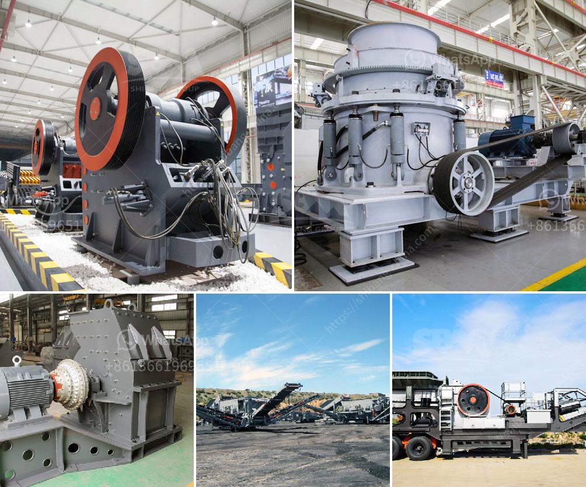

<h3>stone crusher plant cash receipt</h3>
A stone crusher plant, commonly known as a rock crusher plant, is a machine designed to crush various types of rocks into small, gravel, or dust particles. It can be used to process a variety of materials, such as granite, limestone, basalt, and sandstone, with high hardness levels.

Crushing plants are equipped with different crushing equipment, such as jaw crushers, cone crushers, impact crushers, and vibrating feeders, which are essential in the aggregate production process. These machines help break down the larger rocks into smaller, more manageable sizes, making them suitable for use in construction projects.

When purchasing a stone crusher plant, buyers usually receive a cash receipt from the seller as proof of the transaction. This receipt includes important information such as the total cost of the plant, payment method, date of purchase, and any additional terms and conditions agreed upon by both parties.

The cash receipt serves as an official document for both the buyer and the seller. For the buyer, it acts as proof of payment and ownership. It ensures that the purchased stone crusher plant has been fully paid for, reducing the risk of any legal or financial disputes in the future.

On the other hand, for sellers, the cash receipt can be used for accounting and record-keeping purposes. It helps them keep track of the payments received and provides evidence of the transaction. This is especially important for tax purposes and financial reporting, ensuring that proper documentation is maintained.

In conclusion, a stone crusher plant cash receipt is a crucial document in the purchase of a crushing plant. It serves as proof of payment and ownership, benefiting both the buyer and the seller. It also helps maintain accurate financial records, ensuring transparency and accountability in the business transaction.
<h3>Contact us</h3><ul><li><strong>Whatsapp:&nbsp;<a href="https://wa.me/8613661969651">+8613661969651</a></strong></li><li><a href="https://swt.shibang-china.com/?git&amp;zhl&amp;stone crusher plant cash receipt"><strong>Online Service(chat now)</strong></a></li></ul><h3>Related</h3><ul><li><a href='sand wash plant for sale in india.md'>sand wash plant for sale in india</a></li><li><a href='process of preparation of coal and asha.md'>process of preparation of coal and asha</a></li><li><a href='jaw and cone crusher suppliers in mokopane.md'>jaw and cone crusher suppliers in mokopane</a></li><li><a href='used crusher in tanzania.md'>used crusher in tanzania</a></li><li><a href='manufacturer of stone crusher.md'>manufacturer of stone crusher</a></li></ul>