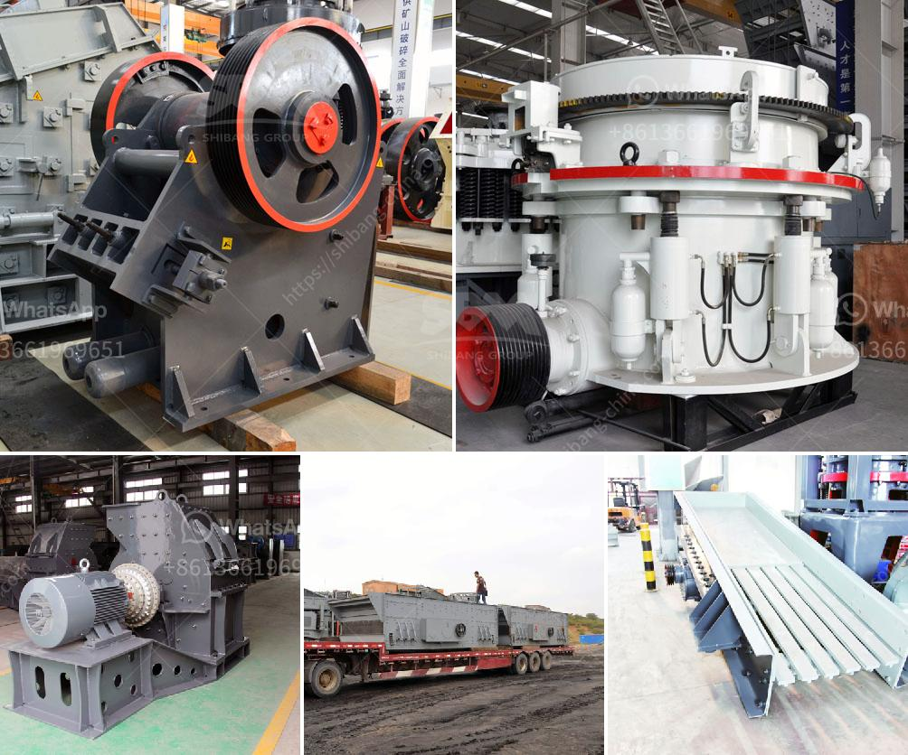

<h3>stone crusher plant for sale in saudi</h3>
Cement crusher plant for sale in saudi arabia is widely used in various materials processing of mining &construction industries, such as it is suit for crushing granite, marble, basalt, limestone, quartz, cobble, iron ore, copper ore, and some other mineral &rocks.

As a professional stone crusher plant designer and manufacturer, SBM not only can supply small scale stone crushing plant like 40 TPH capacity, we also can supply large scale stone crushing plant like 1000 TPH to our contractors and end users.

This unit stone crushing plant which consists of Jaw Crusher, Cone Crusher, VSI Crusher is widely adopted by companies in large road, bridge construction company, aggregate production plant, ore dressing plant and mineral benefication plant and so on.

Crushing equipment for sale by stone crusher plant manufacturer SBM with low cost and for sale price. In stone crusher plants, jaw crusher is used as primary crusher machine, when big stones are crushed smaller by the jaw crusher, they are transferred to impact crusher or cone crusher for secondary or tertiary crushing, then go through the stone shaping machine for getting cubic size. Then use screening machine to screen out the suitable building aggregates, while the unsuitable stones return to the crushing machine for re-crushing.

As for the selection of mobile stone crusher machine in Saudi Arabia, SBM Machinery can provide various kinds of options. As the single toggle crusher will achieve far higher capacities than the double toggle design, they are often used as a primary crusher. HJ series jaw crusher is widely used in various materials processing of mining &construction industries.

With the increasing development of stone mining industry, every year there are numerous stone crushing plant established in worldwide. In Saudi Arabia, stone crusher plant became more and more popular. Whether in the construction of urban areas or the development of blocks, stones are widely used. It can process various ores with a compressive strength not higher than 320MPa to a medium particle size at one time. It is often used for coarse crushing in fields such as road and railway construction.
<h3>Contact us</h3><ul><li><strong>Whatsapp:&nbsp;<a href="https://wa.me/8613661969651">+8613661969651</a></strong></li><li><a href="https://swt.shibang-china.com/?git&amp;zhl&amp;stone crusher plant for sale in saudi"><strong>Online Service(chat now)</strong></a></li></ul><h3>Related</h3><ul><li><a href='barite grinding equipment.md'>barite grinding equipment</a></li><li><a href='milling equipment ball mill.md'>milling equipment ball mill</a></li><li><a href='100tph wet grinding mill.md'>100tph wet grinding mill</a></li><li><a href='coal mill grinding roller.md'>coal mill grinding roller</a></li><li><a href='price of conveyor belts for soaps.md'>price of conveyor belts for soaps</a></li></ul>